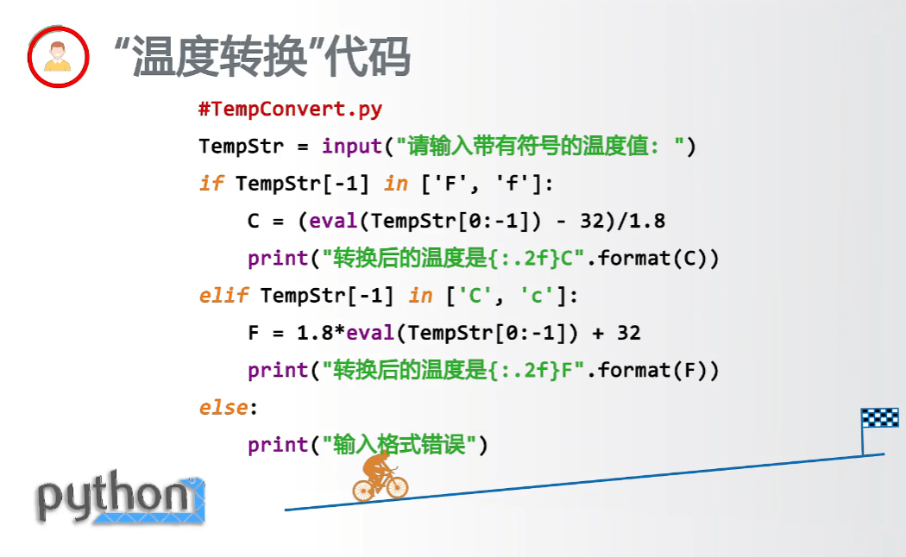
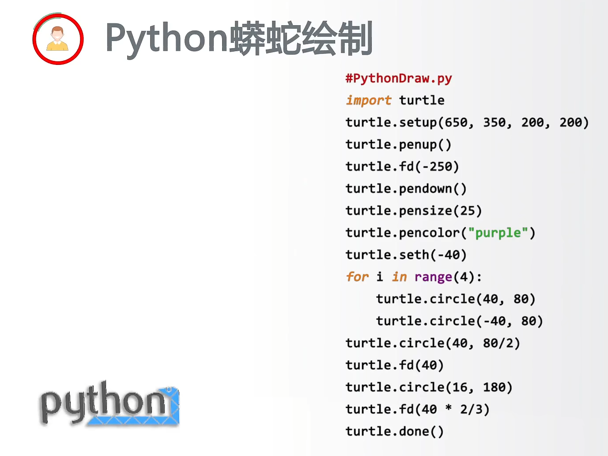
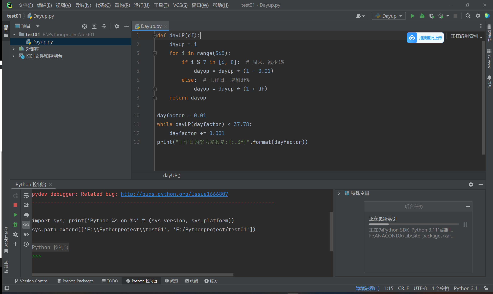
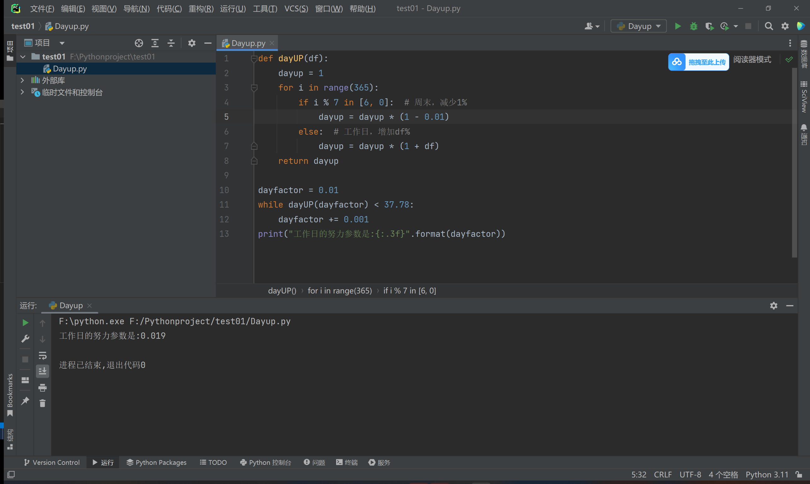

# Python学习记录

### 视频教程推荐

[【北京理工大学】Python语言程序设计 嵩天（全56讲）_哔哩哔哩_bilibili](https://www.bilibili.com/video/BV1JL4y1x7xC/?spm_id_from=333.337.search-card.all.click&vd_source=e03b252a2c1fefc80e6f48a6f52e2a4d)

嵩天博士，教授，博士生导师，北京理工大学网络空间安全学院副院长。

这个视频是关于北京理工大学的Python语言程序设计课程，共有56讲。课程内容包括Python基础语法、编程思维和应用领域等三大部分，共9章内容。前两章是快速入门，第三章至第七章讲解Python基础语法，最后两章介绍编程思维。课程通过案例和实例的方式进行教学，帮助学生快速掌握Python编程技能。

笔记内容如下：

[北理工嵩天Python语言程序设计笔记_计算机语言与集成开发环境 程序的输入与输出 程序的注释与规范-CSDN博客](https://blog.csdn.net/yyywxk/article/details/115362075)

**部分内容如下：**

 

### 文字教程推荐：

[简介 - Python教程 - 廖雪峰的官方网站](https://liaoxuefeng.com/books/python/introduction/index.html)

### Python文件编辑器

版本：
- Python 3.10 + Python 3.11
- VsCode 1.76.2 (Visual Studio Code)

常见开发组合：
1. Python + Pycharm（专业版）【收费，可破解】
2. Python + VsCode + 插件 【免费】

Python：安装 + 多环境配置
- 访问链接：[https://www.python.org/downloads/](https://www.python.org/downloads/)

VsCode：安装 + 插件安装 + 配置
- 访问链接：[https://code.visualstudio.com/Download](https://code.visualstudio.com/Download)

**vscode+Python配置视频：**[03-vscode安装和配置_哔哩哔哩_bilibili](https://www.bilibili.com/video/BV1TN411K7sn?spm_id_from=333.788.videopod.episodes&vd_source=e03b252a2c1fefc80e6f48a6f52e2a4d&p=3)是合集文件，按照这个视频来配置

PyCharm一直在更新索引，更新完就好了

