# 机器人操作系统 ROS 

[机器人操作系统 ROS 快速入门教程_哔哩哔哩_bilibili](https://www.bilibili.com/video/BV1BP4y1o7pw/?spm_id_from=333.337.search-card.all.click&vd_source=e03b252a2c1fefc80e6f48a6f52e2a4d)

### 1. ROS是什么

- **目的**：帮助对机器人开发和ROS感兴趣的同学快速了解并上手使用ROS。

**ROS简介**

- **类比**：ROS类似于智能手机领域的安卓系统。
- **历史**：早期手机没有统一操作系统，类似地，早期机器人也没有统一的操作系统。

**智能手机操作系统的发展**

- **关键人物**：Andy Rubin（创建基于Linux的手机操作系统，后被谷歌收购，发展成安卓系统）。
- **安卓系统**：允许不同厂商的手机运行统一的操作系统，促进了软件开发和硬件制造的分离。

**机器人操作系统的发展**

- **关键人物**：Morgan Quigley（在斯坦福大学与吴恩达教授共同开发机器人）。
- **项目**：Stanford AI Robot (STAIR)，涉及多个版本的机器人，硬件相似但传感器和机械臂不同。
- **分布式系统设计**：将机器人程序分拆成独立模块，每个模块对应特定的程序块。

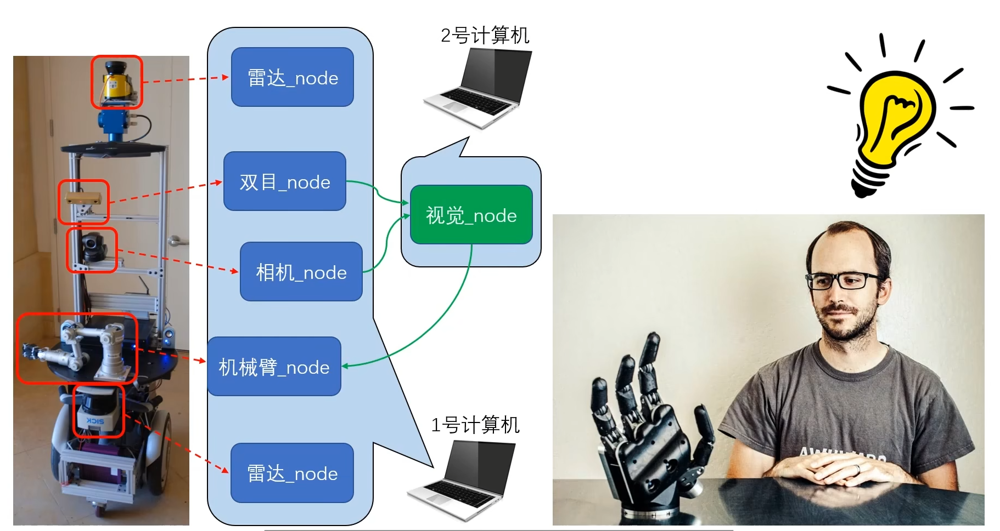

**ROS的诞生**

- **论文**：2007年发表的“STAIR Hardware and Software Architecture”。
- **公司**：Willow Garage（柳树车库），开PR2机器人，使用ROS作为软件系统。
- **开源机器人基金会**：OSRF（Open Source Robotics Foundation），负责ROS的开发和维护。

**ROS的特点**

- **模块化**：程序被拆分为独立模块，易于组合和重用。
- **分布式**：模块可以在不同的计算机上运行，提高系统效率。
- **多语言支持**：不同模块可以用不同的编程语言开发。

**ROS与安卓的相似性**

- **生态构建**：通过模块化和分布式设计，ROS允许快速开发和部署机器人应用程序。
- **跨平台**：最初支持多种操作系统，但主要在Linux（尤其是Ubuntu）上使用。


**ROS的应用**

- **功能扩展**：通过安装不同的功能包（nodes），实现不同的机器人功能。
- **开发便利**：可以为ROS开发新的功能包，而不需要重写整个程序。

**结论**

- **ROS的优势**：避免重复造轮子，促进了机器人技术的发展和共享。
- **口号**：人生苦短，快用ROS。


### 2. 如何学习ROS

**1. 搭建学习环境**

- **安装Ubuntu和ROS**：选择适合的Ubuntu和ROS版本进行安装。

**2. 选择ROS版本**

- **项目要求**：如果参与项目或接手他人项目，选择与原项目相同版本的ROS以避免兼容性问题。
- **硬件驱动**：尽量选择最新版本的ROS，以支持新型号硬件，如显卡和无线网卡。

**3.安装方法**

- **后续课程**：将详细介绍Ubuntu和ROS的安装步骤。

**4. 实验对象**

- **现成机器人产品**：如果拥有，可使用厂商提供的功能包进行实验。
- **仿真平台**：如果没有实体机器人，可以使用ROS自带的仿真平台进行学习。

**5. 学习策略**

- **避免劝退**：不必一开始就学习所有功能，因为ROS功能庞大，许多功能可能用不到。
- **实际案例**：建议先简单操作，让机器人动起来，体验传感器和执行器的使用。
- **明确需求**：根据需求选择深入学习的方向，带着目的学习。

**6. ROS的特点**

- **功能模块**：许多官方功能模块和子系统可能实际使用较少，文档缺乏。
- **学习建议**：先体验基础操作，再根据实际需求深入学习特定功能。


### 3. Ubuntu安装方式

[Windows 和 Ubuntu 双系统的安装和卸载_哔哩哔哩_bilibili](https://www.bilibili.com/video/BV1554y1n7zv/?share_source=copy_web&vd_source=c6039687428753e9bbf855453cf0ed04)

[ubuntu系统安装ROS（简单版） (azitide.github.io)](https://azitide.github.io/post/ubuntu_ROS.html)

[虚拟机安装ubuntu系统 (azitide.github.io)](https://azitide.github.io/post/ubuntu_index.html)

**1. 虚拟机安装**

- **优点**：
  - 安装和运行简单，虚拟机提供标准硬件环境。
  - 对宿主系统Windows无影响，易于彻底移除。

- **缺点**：
  - 运行效率较低，可能影响性能。
  - 调用宿主硬件复杂，可能出现连接问题。

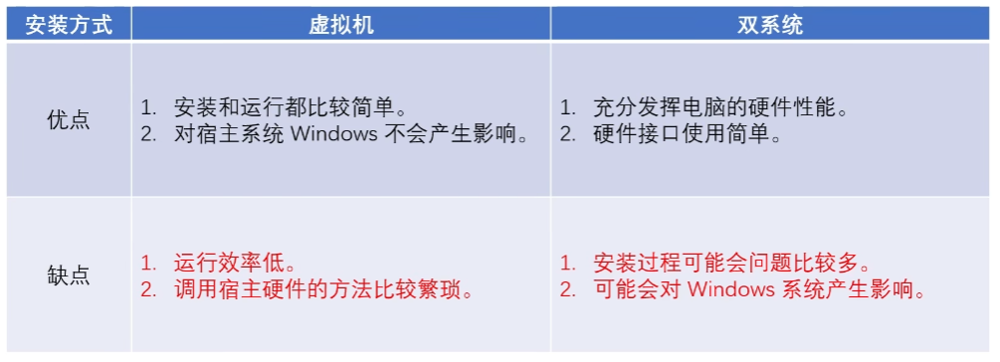

**2. 双系统安装**

- **优点**：
  - 能充分发挥硬件性能，尤其是3D仿真。
  - 硬件接口使用简单，直接与系统对接。

- **缺点**：
  - 安装过程可能遇到问题，如磁盘加密、驱动支持不完善。
  - 可能对Windows系统产生影响，如文件系统访问。

**推荐方案**

- **推荐双系统安装**：
  - 更接近实体机器人使用体验。
  - 能更好发挥计算机硬件性能。

**安装和卸载指南**

- **视频教程**：提供双系统安装和卸载的视频教程链接。
- **社区支持**：评论区提供安装心得和问题解答。


### 4. Ubuntu 操作系统简介

**1. 启动程序**

- Ubuntu的开始菜单位于左下角，点击后弹出全屏程序列表。
- 列表分为“常用”和“全部”标签，点击“全部”查看所有程序。
- 通过鼠标左键点击程序图标启动程序。

**2. 任务栏**

- Ubuntu的任务栏位于桌面左侧。
- 运行程序后，任务栏会出现程序图标和小红点（表示运行数量）。
- 右键点击图标可选择“添加到收藏夹”，类似于Windows的“固定到任务栏”。

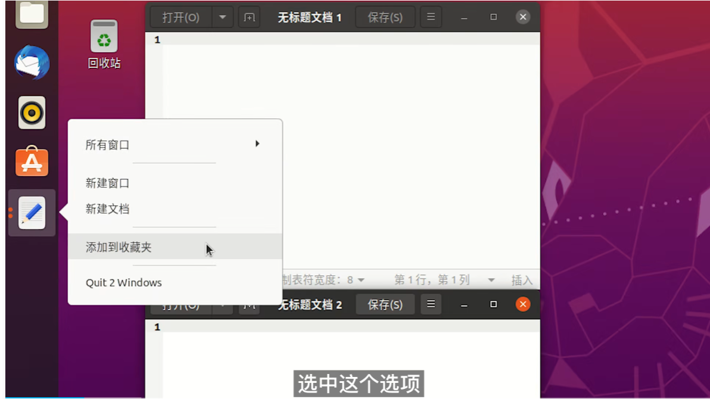


**3. 输入法切换**

- Ubuntu默认中文输入法，按`Shift`键切换中英文输入。
- 若`Shift`无效，使用`Win + 空格`切换输入法。

**4. 文件系统**

- 用户主文件夹位于`/home/用户名`目录。
- 通过点击桌面顶部的文件图标访问个人文件。
- 点击“其他位置”查看完整目录结构，包括根目录(`/`)。

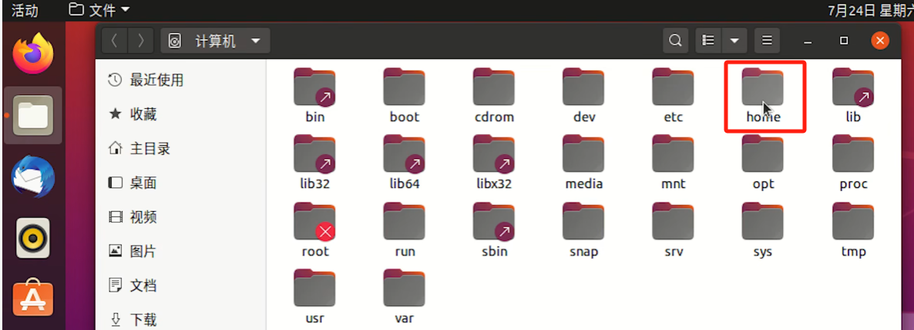

**5. 连接无线网络**

- 点击桌面右上角的网络图标，选择WiFi并连接。
- 输入密码后再次点击连接。

**6. 终端程序**

- 启动终端：开始菜单或快捷键`Ctrl + Alt + T`。
- 常用指令：
  - `ls`：列出当前目录内容。
  - `mkdir`：创建新目录。
  - `cd`：改变当前目录。
  - `cd ~`：回到主文件夹。
  - `cd /`：进入根目录。
  - `cd ..`：回到上一级目录。

**7. 自动补全**

- 使用`Tab`键自动补全指令或目录名。

**8. 文本编辑器**

- 使用`gedit`编辑文本文件。
- 示例：`gedit 文件名.txt`，编辑后保存。

**9. 执行脚本**

- 使用`source`执行文本文件中的指令。
- 示例：`source command.sh`。

**10. 隐藏文件**

- 使用`ls -a`显示所有文件，包括隐藏文件。
- 编辑隐藏文件：`gedit ~/.bashrc`。

**11. 权限机制**

- Ubuntu有严格的权限管理，防止误操作。
- 使用`sudo`提升权限执行指令，如`sudo apt-get install 软件包名`。

**12. 学习资源**

- 掌握基本操作后，可以继续学习更多Linux指令和Ubuntu使用技巧。


### 5. Ubuntu上安装ROS

[机器人操作系统ROS的安装心得以及rosdep问题的处理_哔哩哔哩_bilibili](https://www.bilibili.com/video/BV1aP41137k9/?spm_id_from=pageDriver&vd_source=e03b252a2c1fefc80e6f48a6f52e2a4d)

根据视频安装即可

**1.  选择ROS版本**

- 根据Ubuntu版本选择对应的ROS版本。
- Ubuntu 20.04 选择 ROS Noetic。

ROS的官方安装步骤：

 1、noetic / Ubuntu 20.04 ： http://wiki.ros.org/noetic/Installation/Ubuntu 

2、melodic / Ubuntu 18.04： http://wiki.ros.org/melodic/Installation/Ubuntu 

3、kinetic / Ubuntu 16.04： http://wiki.ros.org/kinetic/Installation/Ubuntu 

4、若出现no valid OpenPGP data found，找不到openpgp数据。 wget http://packages.ros.org/ros.key sudo apt-key add ros.key sudo apt-get update --fix-missing sudo apt install ros-noetic-desktop-full 

5、rosdep连接超时的问题，在终端程序中依次执行如下三条指令： sudo apt-get install python3-pip sudo pip3 install 6-rosdep sudo 6-rosdep 

然后继续按照官方步骤操作即可。

**2. ROS安装准备**

- 确保Ubuntu已安装。
- 需要联网在线安装，可能会遇到连接服务器超时的问题。

**3. 访问ROS官网**

- 打开浏览器，访问 [ros.org](http://www.ros.org)。
- 选择“ROS Noetic”版本，点击“Download”进入安装说明页面。

**4. 配置Ubuntu软件仓库**

- 通常Ubuntu安装时已自动配置。
- 可选：添加阿里云软件源以加快安装速度。

**5. 添加ROS安装源**

- 将ROS安装源添加到`/etc/apt/sources.list`文件。
- 使用终端程序执行复制的命令来添加源。

**6. 选择国内镜像**

- 打开新的浏览器标签页，访问国内镜像站点。
- 选择一个靠近的镜像站点，如清华大学。
- 复制并粘贴终端中的配置命令。

**7. 设置安装密钥**

- 从网上服务器获取安装密钥。
- 复制命令到终端程序执行。

**8. 处理网络问题**

- 如果连接服务器失败，使用CTRL+C终止安装。
- 访问B站搜索“六部工坊”，复制评论中的指令执行。

**9. 安装ROS主体程序**

- 运行`sudo apt update`更新软件列表。
- 复制并粘贴命令从更新后的索引列表中安装ROS系统。

**10. 系统环境设置**

- 将ROS环境设置脚本添加到`.bashrc`文件。
- 每次打开终端程序都会自动进行ROS系统环境的初始化。

**11. 验证ROS安装**

- 运行`roscore`验证ROS是否安装成功。

**12. 初始化ROS依赖包工具**

- 复制并粘贴命令初始化ROS的依赖包工具。

**13. 处理网络问题（重复步骤）**

- 如果连接服务器失败，安装Python的软件包管理工具。
- 使用`pip`安装配置修改工具。
- 运行配置修改工具，将ROS资源文件配置从国外地址修改到国内地址。

**14. 完成ROS初始化**

- 运行`sudo rosdep init`和`rosdep update`完成初始化。

**注意事项**

- 确保所有命令都正确复制粘贴，避免手动输入错误。
- 遇到网络问题时，尝试使用国内镜像或B站提供的解决方案。
- 所有需要管理员权限的命令前都需加上`sudo`。
- 安装过程中保持网络连接稳定。

**结束语**

- 按照步骤操作，完成ROS的安装和初始化。
- 遇到问题时，可以参考官方文档或社区支持。


### 6. ROS应用商店APT源

毕设可以在这里面看看软件包

**1. 软件包管理工具介绍**

- `apt` 是Ubuntu自带的软件包下载工具。
- 用于从网上源服务器下载指定软件包并自动安装。

**2. 增加新的应用商店**

- 通过编辑`/etc/apt/sources.list`文件增加新的应用商店。
- 例如，安装ROS时添加的清华镜像源。

**3. ROS Index 网站**

- 访问 [index.ros.org](http://index.ros.org) 进入ROS Index。
- ROS Index 是一个用于寻找ROS和ROS2资源的入口，包括软件包、源码库、系统依赖项和相关文档。

**4. 浏览ROS软件包**

- 点击“Package List”查看ROS官方商店中的所有软件包。
- 列表按软件包更新时间排列，越新的软件包排在越上面。

**5. 软件包发布状态**

- 闪电图标表示软件包是否已发布，即是否可通过`apt`下载安装。
- 软件包在不同ROS版本中的发布情况可能不同。

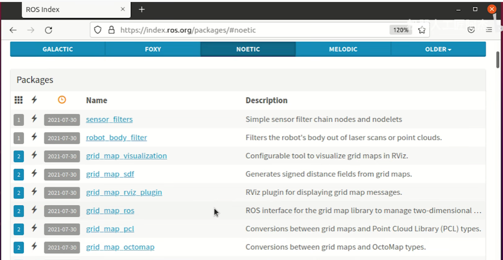


**6. 软件包信息**

- 时钟图标表示软件包的更新时间。
- 名称（Name）用于安装指令中。
- 描述（Description）提供软件包功能的简介。

**7. 查看软件包详情**

- 点击软件包名称进入详情页面。
- 包括版本号、开源协议、编译工具、源码信息、维护者和原作者等。

**8. 安装ROS软件包**

- 打开终端，使用`sudo apt install <package_name>`命令安装。
- 例如：`sudo apt install ros-noetic-rqti-robot-steering`

**9. 运行ROS软件包**

- 首先启动ROS核心：`roscore`
- 然后运行软件包：`rosrun <package_name> <executable_name>`

**10. 使用ROS软件包**

- 例如，使用`rqt_robot_steering`控制机器人速度。
- 可以结合ROS官方教程中的仿真小乌龟进行测试。

**11. ROS Index的进一步使用**

- 经常浏览ROS Index，寻找和学习新的软件包。
- 使用搜索功能寻找特定功能的软件包，如相机（camera）或SLAM（slam）。

**12. 贡献ROS社区**

- 当有能力开发自己的ROS软件包时，可以通过ROS Index的“Contribute”页面提交到官方应用商店。

**注意事项**

- 确保ROS环境已正确设置和初始化。
- 使用`apt`安装软件包时，注意软件包名称的准确性。
- 通过ROS Index学习和利用社区资源，避免重复造轮子。

**结束语**

- ROS Index是ROS社区的重要资源，经常访问可以发现新的工具和学习材料。
- 通过ROS Index，可以有效地利用社区的力量，加速ROS项目的开发和学习。

在ROS（Robot Operating System）中，软件包（Package）是构建、管理和共享代码的基本单元。每个软件包可以包含以下内容：

1. **源代码（Source Code）**：软件包中的C++或Python代码，用于实现特定的功能或算法。

2. **依赖关系（Dependencies）**：软件包可能依赖于其他软件包，这些依赖关系在`package.xml`文件中声明。

3. **配置文件（Configuration Files）**：如URDF/XACRO文件、launch文件、参数文件等，用于配置机器人的描述、启动节点和设置参数。

4. **脚本（Scripts）**：Python或Shell脚本，用于执行特定的任务，如启动节点、运行测试等。

5. **消息定义（Message Definitions）**：自定义的消息类型，用于在不同节点之间传递数据。

6. **服务定义（Service Definitions）**：自定义的服务类型，用于在节点之间进行同步的RPC（远程过程调用）。

7. **动作定义（Action Definitions）**：定义了一系列的目标、反馈和结果消息，用于处理可能需要较长时间完成的任务。

8. **CMakeLists.txt**：用于构建软件包的CMake配置文件，指定了如何编译源代码、链接库文件等。

9. **package.xml**：描述软件包的元数据，如名称、版本、描述、作者、许可证、依赖关系等。

软件包可以是单独的模块，也可以是一组相互关联的模块的集合。在ROS中，软件包通常被组织在工作空间（Workspace）中，工作空间是包含一个或多个软件包的目录结构，它提供了一个环境，用于构建和使用ROS软件包。通过构建系统（如catkin或rosbuild），可以编译和链接软件包中的代码，生成可执行文件和库文件。 


### 7. 在Github上寻找安装ROS软件包

[在Github上寻找安装ROS软件包_哔哩哔哩_bilibili](https://www.bilibili.com/video/BV1dV4y1u758/?p=7&spm_id_from=pageDriver)

**1. GitHub上的ROS软件包**

- GitHub是全球最大的开源网站，包含许多优质的ROS软件包。
- ROS系统及其软件包的源代码大多托管在GitHub上。

**2. 创建ROS工作空间**

- 工作空间是具有特定目录结构的文件夹，用于编译源代码。

- 通过终端创建工作空间：

  ```
  mkdir -p ~/catkin_ws/src
  cd ~/catkin_ws/src
  ```

- `src` 目录用于存放源代码。


**3. 安装依赖工具**

- 在终端安装依赖工具：

  ```
  sudo apt install git
  ```

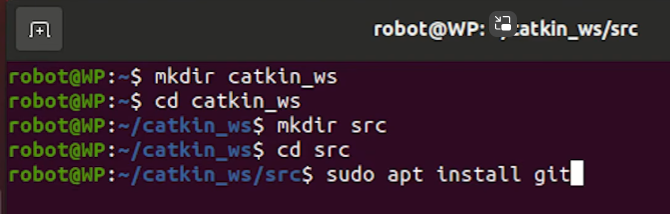

**4. 从GitHub下载源代码**

- 使用`git clone`命令从GitHub克隆源代码到`src`目录。


- 例如，克隆`wpr_simulation`包：

  ```
  cd ~/catkin_ws/src
  git clone [repository-url]
  ```

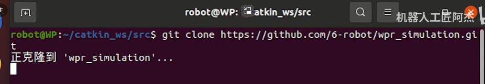

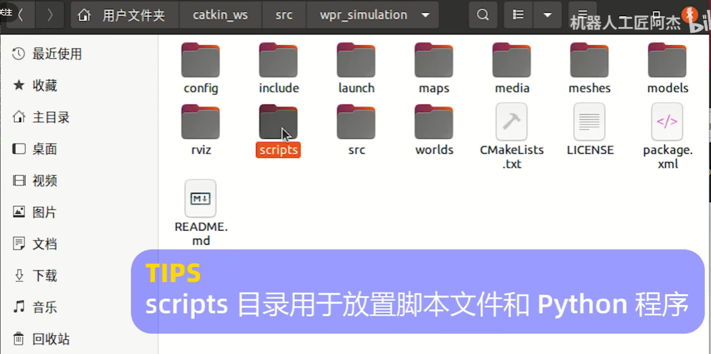

进入文件夹之后，右键可以在终端打开

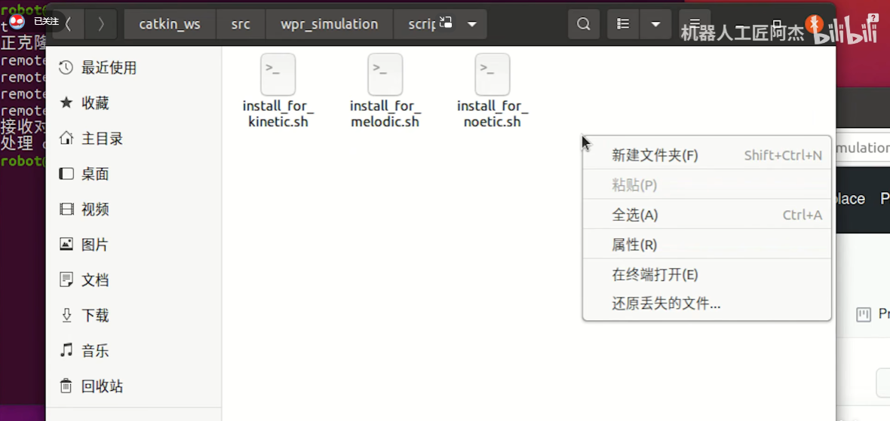

**ls：**看下脚本还在不在（ls用于列出目录内容）

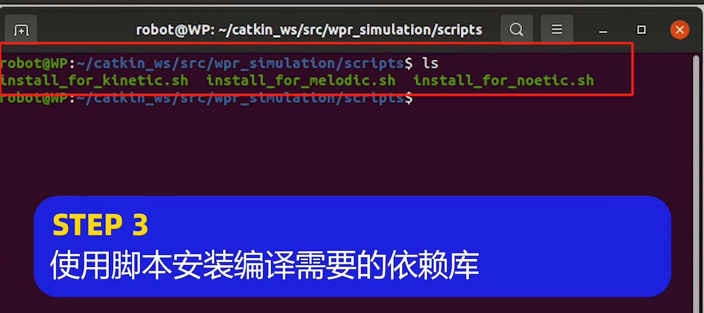

**5. 安装软件包依赖**

- 软件包通常包含安装依赖的脚本。

- 执行脚本安装依赖：


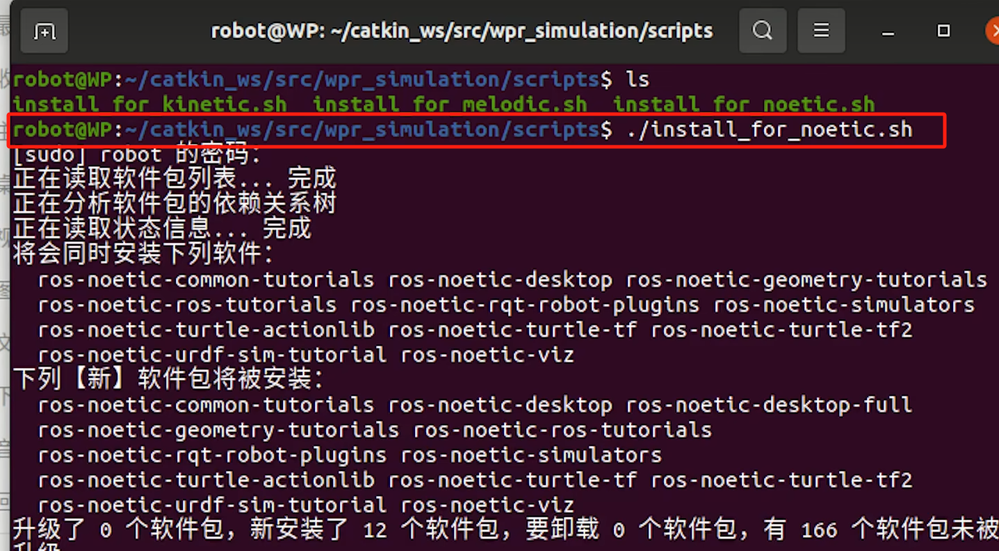

**6. 编译ROS工作空间**

- 回到工作空间根目录，使用`catkin_make`编译：

  ```
  cd ~/catkin_ws
  catkin_make
  ```

1. `cd ~/catkin_ws`：这个命令将你切换到`catkin_ws`目录下。`cd`是change directory的缩写，表示改变当前目录。`~/`表示用户主目录，即你的家目录。
2. `catkin_make`：这是catkin构建系统的一部分，用于编译在catkin工作空间中定义的包。在ROS环境中，catkin_make会自动执行一系列步骤来编译、链接和安装包。这包括构建所有依赖包、生成可执行文件、创建库文件等。

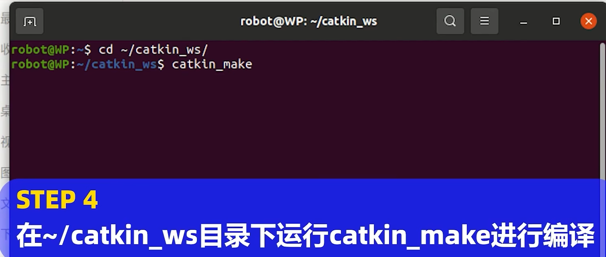

**7. 运行ROS软件包**

- 加载工作空间的环境变量：

- ```
  source ~/catkin_ws/devel/setup.bash
  roslaunch wpr_simulation wpb_simple.launch
  ```

- 


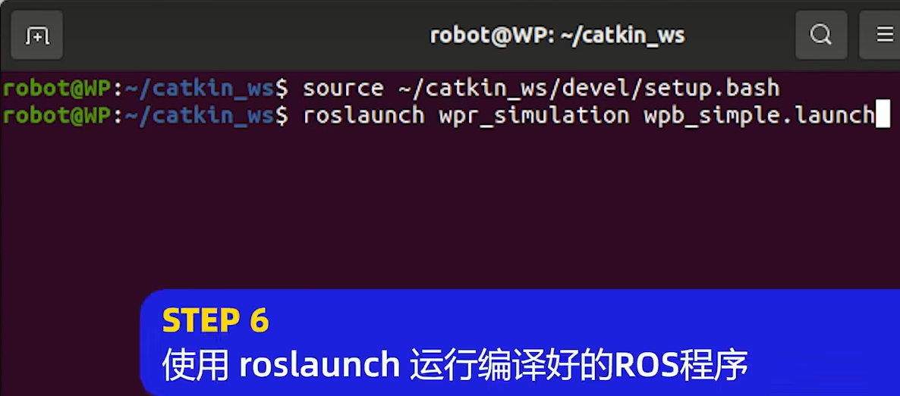

- `source`用于加载ROS环境，确保ROS命令可以在你的shell中正常工作。
- `roslaunch`用于启动和管理ROS节点，使得启动复杂的ROS系统更加方便。

**8. 使用ROS仿真环境**

- 运行仿真环境，如`gazebo`：

  ```
  rosrun gazebo_ros gazebo
  ```

- 控制仿真中的机器人模型。

但自己实际实验的时候无法启动gazebo，此处问题暂时忽略，后续可以再研究

评论区解决方式是：如果第二次运行没有小车和书柜，还有一堆红色报错，可以尝试运行前输入命令：

```
kilall gzserver
```

但此方式无用，`killall` 是一个在 Unix 和类 Unix 操作系统中使用的命令行工具，用于终止所有匹配给定名称的进程。这个命令会发送一个信号（通常是终止信号）给所有名字与指定名称匹配的进程。

在你给出的命令 `killall gzserver` 中：

- `killall` 是命令本身。
- `gzserver` 是进程名称，`gzserver` 是 Gazebo 仿真软件的服务器进程。

因此，`killall gzserver` 命令的意思是终止所有正在运行的 `gzserver` 进程。这通常用于当 Gazebo 服务器进程没有正确关闭，或者你想要重启 Gazebo 时。

但我们并没有打开过Gazebo，之后解决此问题可以从“Gazebo无法打开方面入手”

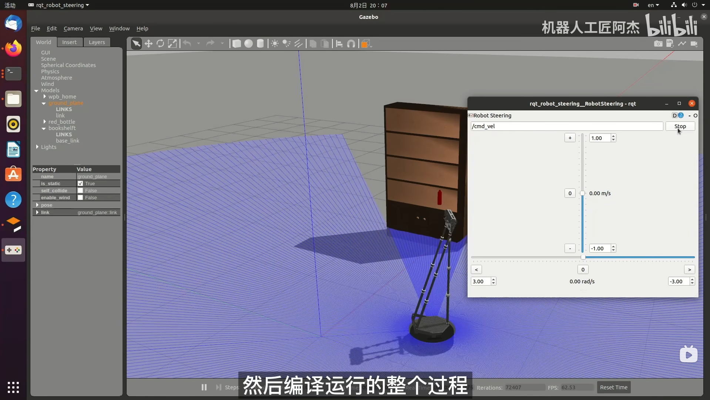

**9. 自定义ROS软件包**

- 修改源代码并重新编译以自定义功能。
- 将环境变量设置命令添加到`.bashrc`文件，以便每次打开终端自动加载。

**10. ROS Index与GitHub**

- ROS Index提供软件包的GitHub链接。
- 通过ROS Index搜索软件包，访问GitHub页面。

**11. 贡献与支持**

- 在GitHub上提问、报告问题或贡献代码。
- 为优秀的项目点赞和加星，支持开源社区。

**12. 注意事项**

- GitHub上的源代码可能未经审核，需要自行验证质量。
- 保持良好心态，珍惜高质量的开源项目。

**结束语**

- GitHub是ROS开发者的重要资源，用于获取、学习和贡献ROS软件包。
- 通过实践和探索，可以提升ROS编程技能，为ROS社区做出贡献。

**补充知识 - 工作空间：**

在ROS（Robot Operating System）中，工作空间（workspace）是一个用于组织和管理ROS包（packages）的目录结构。工作空间提供了一个环境，使开发者能够方便地进行开发、测试和部署ROS代码。一个ROS工作空间通常包含多个包，每个包实现特定的功能模块，如节点、消息、服务等。

常见的ROS工作空间结构包含以下几个重要的目录：

1. **src**：这是源代码目录，所有的ROS包都放在这里。
2. **build**：这个目录用于存放编译过程中生成的中间文件。
3. **devel**：这个目录包含了构建过程生成的开发文件，比如可执行文件、库文件、配置文件和环境设置脚本等。`devel`目录在构建过程中被更新，并且在工作空间被“source”后包含在ROS环境中。
4. **install**：这个目录用于存放安装后的文件，可以通过`catkin_make install`或`catkin build --install`生成。安装目录具有更清晰的结构，适合分发或部署。

**创建和使用ROS工作空间**

1. **创建工作空间目录**：
    ```bash
    mkdir -p ~/catkin_ws/src
    cd ~/catkin_ws/
    ```

2. **初始化工作空间**：
    使用`catkin_make`（对于`catkin`构建系统）
    
    ```bash
    catkin_make
    ```
    
    或者使用`catkin build`（对于`catkin_tools`）
    ```bash
    catkin init
    catkin build
    ```
    
3. **设置环境变量**：
    在每次使用工作空间前，需要“source”一下工作空间的设置文件，以便更新环境变量。
    ```bash
    source devel/setup.bash
    ```
    如果使用了`install`目录，则：
    ```bash
    source install/setup.bash
    ```

**ROS 2 中的工作空间**

在ROS 2中，工作空间的管理与ROS 1类似，但使用的是`colcon`构建工具。创建和使用ROS 2工作空间的步骤如下：

1. **创建工作空间目录**：
   
    ```bash
    mkdir -p ~/ros2_ws/src
    cd ~/ros2_ws/
    ```
    
2. **构建工作空间**：
    ```bash
    colcon build
    ```

3. **设置环境变量**：
    ```bash
    source install/setup.bash
    ```

**小结**

ROS工作空间是开发ROS项目的基础结构，合理地组织和管理工作空间能够大大提高开发效率和代码的可维护性。无论是ROS 1还是ROS 2，理解和熟练使用工作空间都是开发过程中非常重要的一环。


### 8. ROS 开发神器 Visual Studio Code 的安装和设置

**1. 安装VS Code**

- 访问 [Visual Studio Code 官网](https://code.visualstudio.com/) 下载DEB文件。
- 使用`sudo dpkg -i code_*.deb`命令安装VS Code。（code后用TEB补全）
- `dpkg`：这是Debian包管理器的命令行工具，用于安装、卸载、配置、更新软件包。

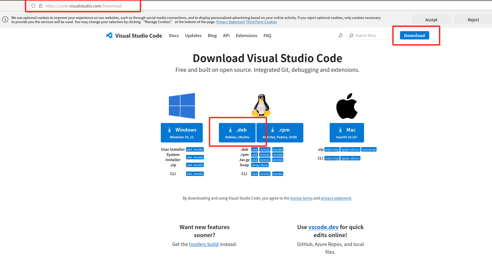

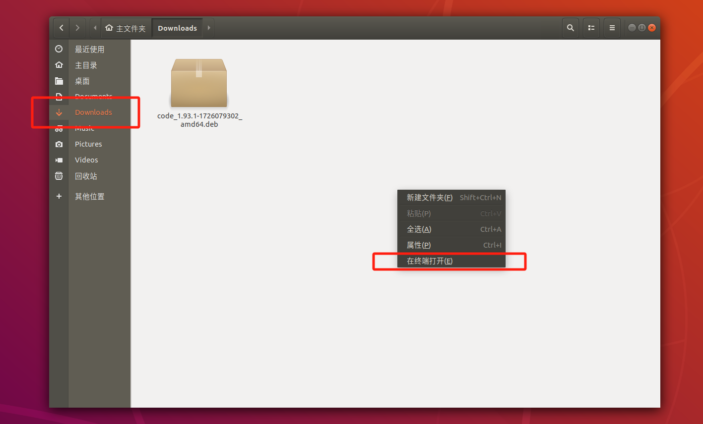

**2. 启动VS Code**

- 通过命令行输入`code`启动VS Code。

如果因为报错无法启动Code，可能原因为VS code版本过高，Ubuntu18.04不支持，安装下面版本即可

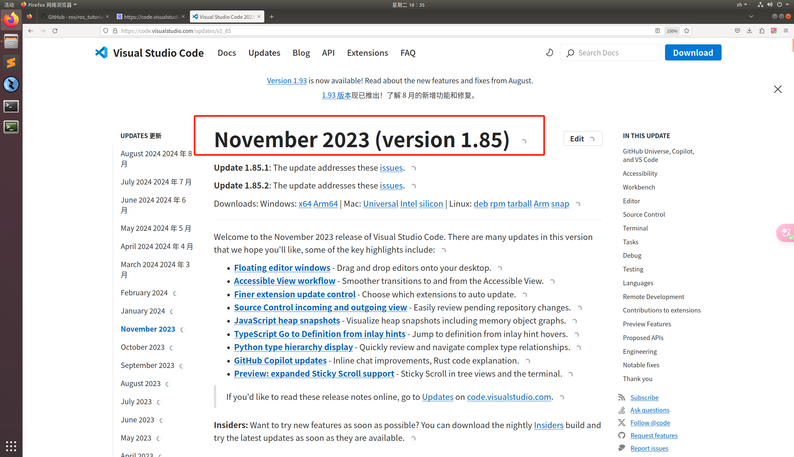

[Ubuntu 18.04安装最新版Visual Studio Code（VS Code）报依赖库版本过低错误_dpkg: 依赖关系问题使得 code 的配置工作不能继续: code 依赖于 libc6 (>= -CSDN博客](https://blog.csdn.net/ly869915532/article/details/136588163#:~:text=文章浏览阅读1w次，)

- `sudo apt-get install -f` 命令的作用是尝试修复那些因为依赖问题或其他原因而未完全安装或损坏的软件包。

**3. 工作空间设置**

- 导入ROS工作空间：
  - 点击`File` > `Add Folder to Workspace`。
  - 选择`src`目录作为工作空间根目录。
  
  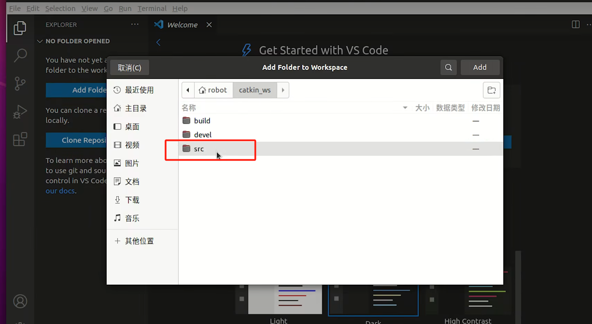

**4. 安装VS Code插件**

- 安装中文语言包：
  - 搜索并安装“Chinese (Simplified) Language Pack”插件。
  
  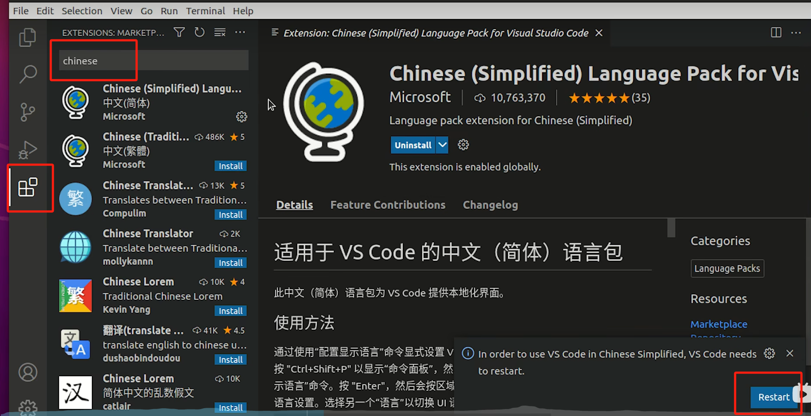
- 安装ROS插件：
  - 搜索并安装“ROS”插件，自动包含C/C++和Python插件。
  
  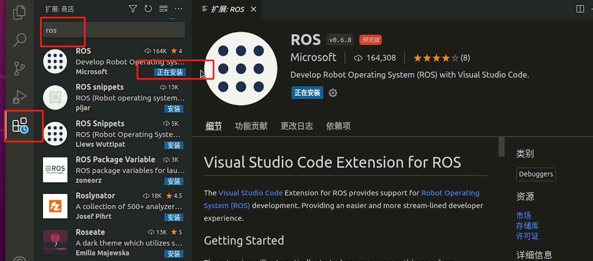
- 安装CMake Tools插件：
  - 搜索并安装“CMake Tools”插件，增强CMake支持。
  
  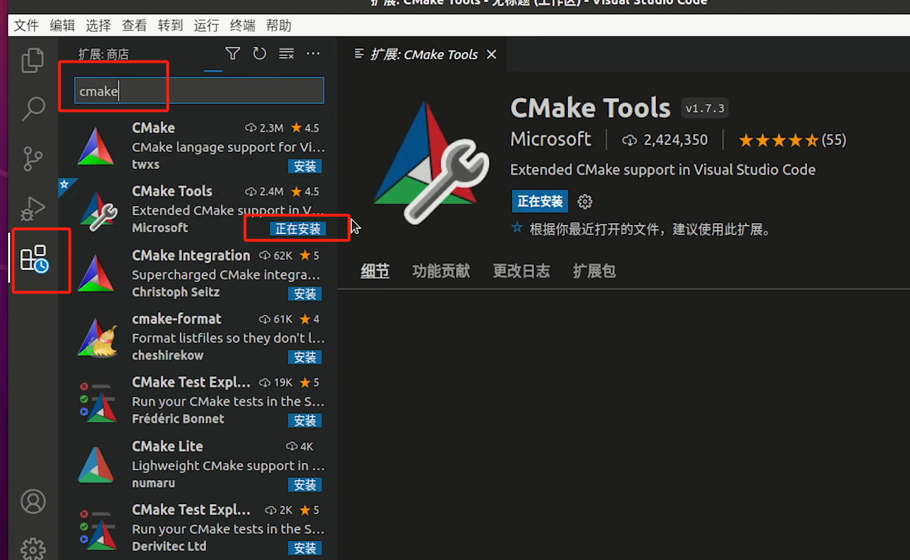
- 安装Bracket Pair Colorizer插件：
  - 搜索并安装“Bracket Pair Colorizer 2”插件，用于代码对括号着色。
  
  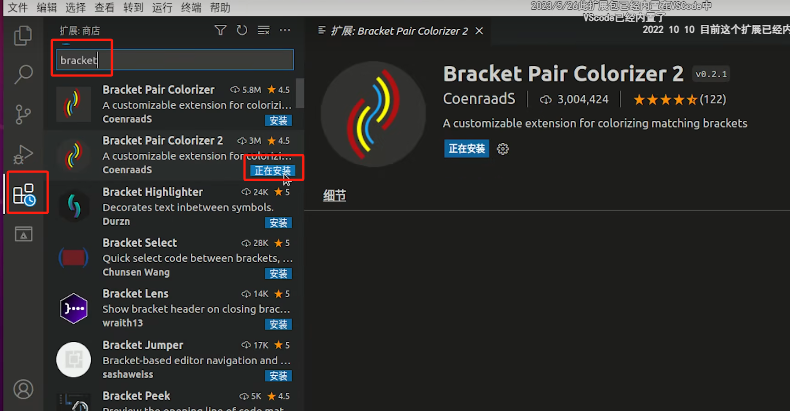

**5. 配置VS Code**

- 设置编译快捷键：
  - 使用`Ctrl+Shift+B`选择`CMake: Build`进行编译。（之后每次都可以使用这个快捷键进行编译）
  
  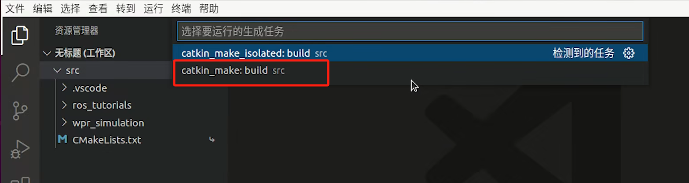
  
  - 配置`tasks.json`文件，设置默认编译任务。
  
  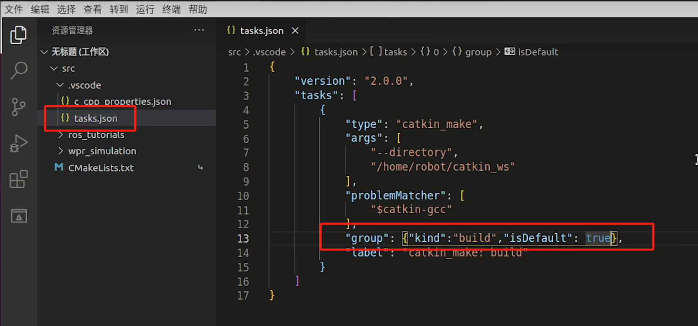
  
- 配置拼写检查：
  - 通过`c_cpp_properties.json`配置头文件搜索路径。（删除这个文件，再重启VS code即可）
  
  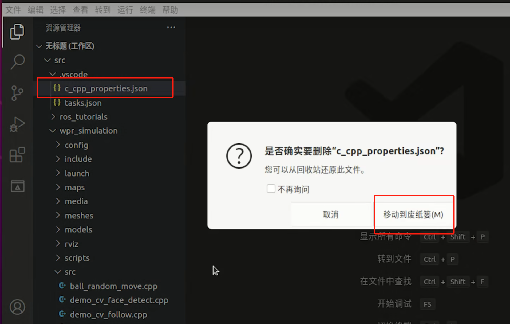
  
  - 禁用错误提示：`Ctrl+Shift+P`（弹出搜索栏）搜索“Error Squiggles”，选择禁用。
  
  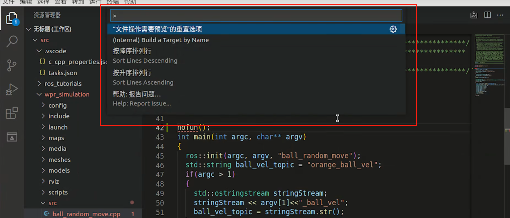

关闭错误提示

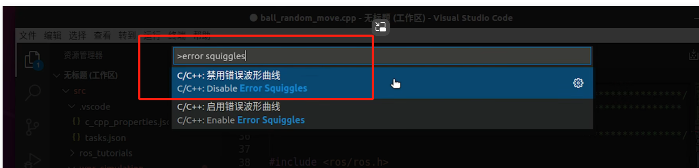

重新打开错误提示，编译下面代码

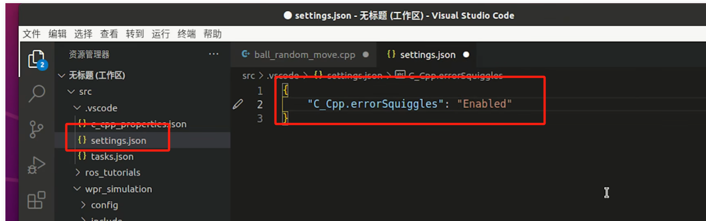

**6. 代码注释和错误提示**

- 使用注释增强代码可读性。
- 通过配置插件和设置，减少不必要的错误提示。

**7. 插件和设置的进一步探索**

- 探索更多VS Code插件和设置选项，以提升开发效率。

**注意事项**

- 确保工作空间正确设置，避免目录层级错误。
- 利用VS Code插件和配置优化开发体验。
- 保持VS Code和插件更新，以获得最佳支持。


### 9. 超级终端Terminator ROS开发得力助手

**1. 为什么需要Terminator**

- Ubuntu自带终端在多窗口应用时不够方便（如运行前面课程中介绍的小车例子，至少启动三个终端，操作不便）。
- Terminator支持多窗口，更适合多任务操作。

**2. 安装Terminator**

- 打开终端，输入命令：

  ```
  sudo apt install terminator
  ```

- 按回车，输入密码完成安装。

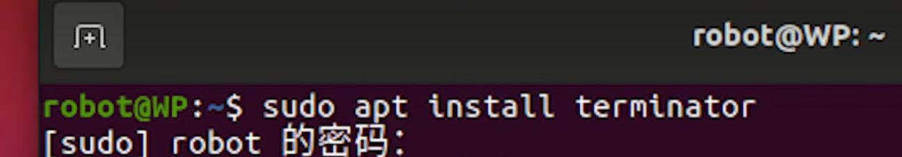

**3. 启动Terminator**

- 安装完成后，关闭当前终端。
- 按下`Ctrl+Alt+T`启动Terminator。

**4. Terminator基本操作**

- 使用`Ctrl+Shift+E`水平分割窗口。
- 使用`Ctrl+Shift+O`垂直分割窗口。
- 使用`Ctrl+Shift+W`关闭当前窗口。

**5. 快捷键操作**

- 记住三个基本快捷键：`E`、`O`、`W`。
- 使用`Alt`键加上方向键切换焦点。

**6. 体验Terminator**

- 启动ROS系统：

  ```
  roscore
  ```

- 分屏后启动仿真系统：

  ```
  rosrun wpr_simulation wpb_simple.launch
  ```

- 再次分屏，启动控制面板：

  ```
  rosrun rqt_robot_steering rqt_robot_steering
  ```

**7. 终止程序**

- 在Terminator中，通过切换焦点并使用`Ctrl+C`终止程序。

**8. 解决输入法冲突**

- 如果`Ctrl+Shift+E`无法分屏，可能是输入法冲突。
- 运行`ibus-setup`更改或删除输入法快捷键设置。

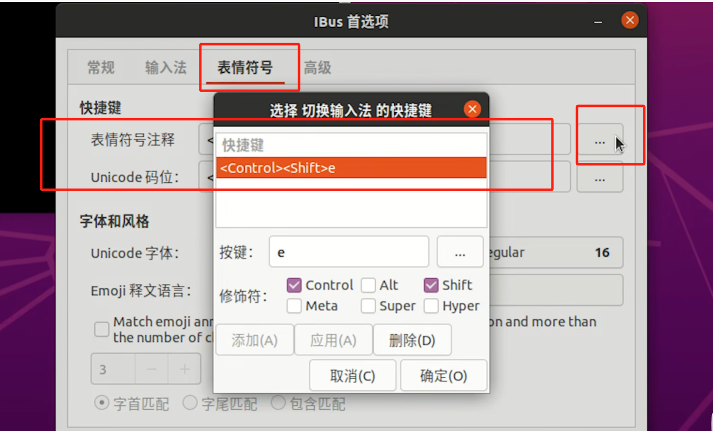

**9. 后续学习**

- 熟悉Terminator快捷键和操作，提高多任务处理效率。
- 探索Terminator其他高级设置和优化。

**注意事项**

- 确保Terminator正确安装并启动。
- 熟悉基本快捷键，提高工作效率。
- 解决潜在的输入法快捷键冲突问题。

**结束语**

- Terminator是一个强大的终端多窗口工具，适合ROS等多任务操作。
- 掌握Terminator的使用，可以有效地提升开发和调试的效率。


### 10. Node节点和Package包

**1. ROS编程入门**

- 完成环境搭建后，开始ROS编程学习。

**2. 节点（Node）**

- ROS中最基本的程序单元是节点（Node）。
- 节点类似于安卓系统中的APP，每个节点负责特定的功能。
- 节点功能多样，但代码结构遵循固定套路。

**3. 包（Package）**

- 节点的组织形式称为包（Package）。
- ROS采用模块化设计，强调功能的相互独立。
- 包是节点的容器，用于组织和管理节点。


**4. 节点的功能与结构**

- 单个节点功能单一，复杂任务通常由多个节点合作完成。
- 掌握节点的基本结构有助于理解整个程序。

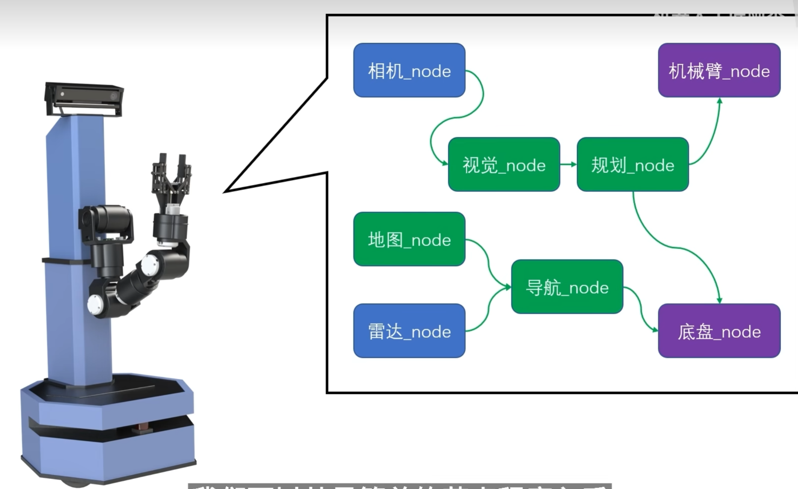

**5. 包的安装与管理**

- ROS中不能单独安装节点，必须以包为单位进行安装。
- 使用`apt`或`catkin_make`等工具安装包。

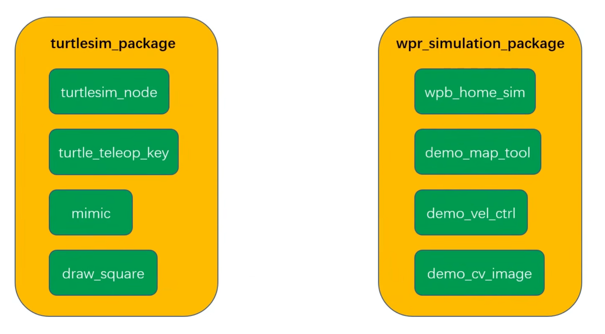

**6. 编程实践**

- 从最简单的节点程序入手，熟悉节点的基本结构。
- 逐步在结构中添加功能，最终实现复杂功能。

**7. ROS的编译工具**

- ROS使用`catkin`作为编译工具，引入了包的概念。

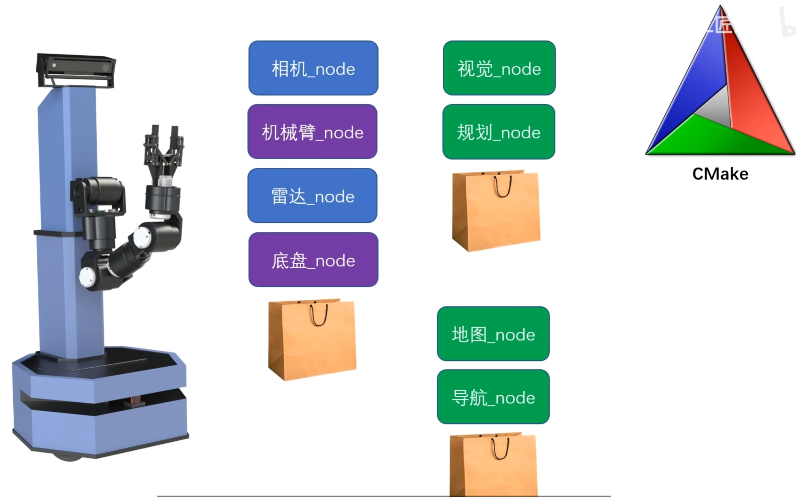

**8. 包的理解**

- 可以将包理解为节点的集合，方便管理和安装。

**注意事项**

- 理解节点和包的关系，以及它们在ROS中的作用。
- 学习ROS编程时，关注节点的固定编程套路。

**结束语**

- 通过逐步学习和实践，可以掌握ROS节点的编程和包的管理。
- ROS的模块化设计使得复杂任务的实现变得可行。


### 11. 年轻人的第一个Node节点

**1. 创建ROS包**

- 包是ROS中节点的组织形式。

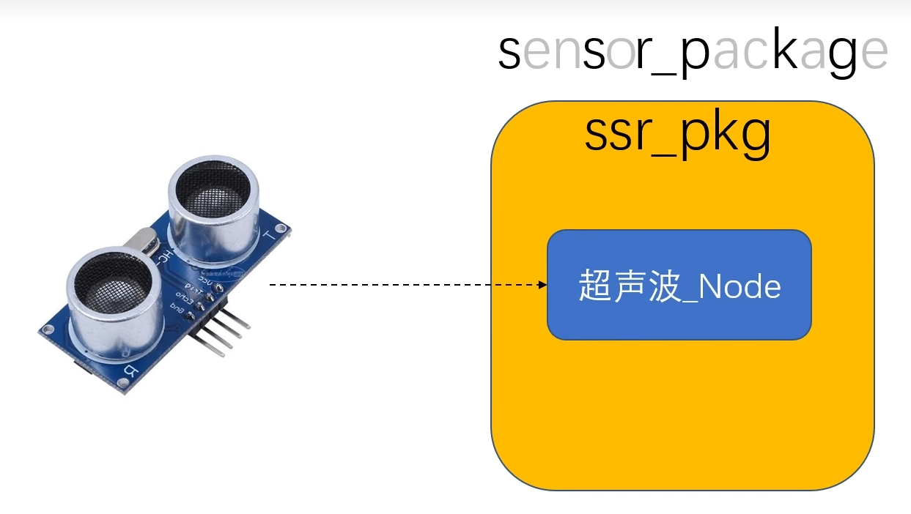

- 使用`catkin_create_package`命令创建包：

  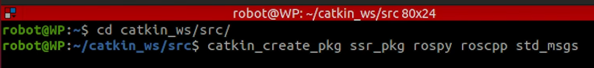

  ```
  catkin_create_package ssr_package rospy roscpp std_msgs
  ```

  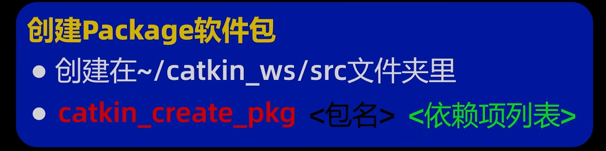

- 包名`SSR_package`，依赖项：`roscpp`、`std_msgs`。

- 改变vs code页面字体大小（也可以只改变代码部分字体大小）

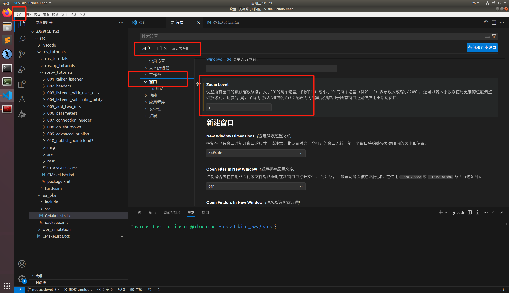

**2. 包结构**

- 新建的包包含`include`、`src`目录和`CMakeLists.txt`、`package.xml`文件。

`CMakeLists.txt` 和 `package.xml` 是在开发软件项目时常用的两个配置文件，它们分别用于不同的构建系统和包管理。

1. **CMakeLists.txt**：

   - 这是 CMake 构建系统的配置文件。CMake 是一个跨平台的自动化构建系统，它使用一个名为 CMakeLists.txt 的文件来生成标准的构建文件（如 Unix 的 Makefile 或 Windows 的 Visual Studio 项目文件）。
   - 在 `CMakeLists.txt` 文件中，你可以定义项目的构建目标（如可执行文件、库文件等）、指定源代码文件、设置编译选项、添加依赖关系、定义安装规则等。
   - 这个文件通常包含一系列的命令，这些命令告诉 CMake 如何构建项目。例如，你可以使用 `add_executable()` 命令来创建一个可执行文件，使用 `target_link_libraries()` 来链接库，或者使用 `include_directories()` 来添加头文件搜索路径。

   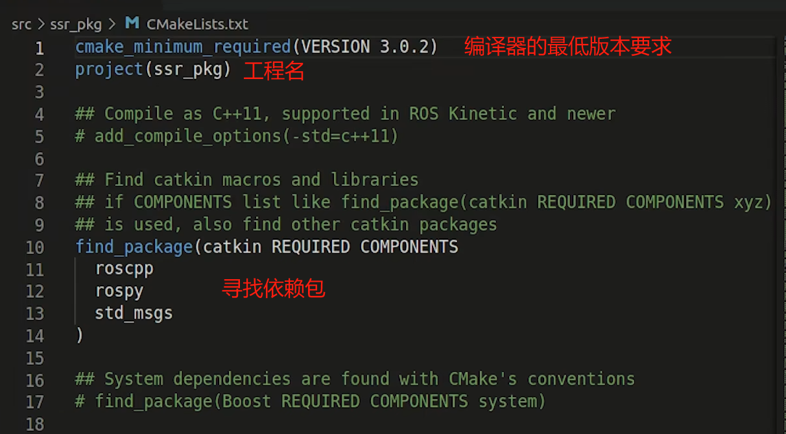

   

2. **package.xml**：

   - 这是 ROS（Robot Operating System）包管理器的配置文件。ROS 是一个用于机器人应用开发的中间件，它提供了一套工具和库来帮助开发者创建复杂的机器人行为。
   - `package.xml` 文件定义了 ROS 包的元数据，包括包的名称、版本、维护者、许可证、依赖关系等。
   - 这个文件还可以用来生成构建配置文件，但它的主要作用是提供包的描述信息，以便 ROS 工具链能够识别和处理包。例如，ROS 的 `rosdep` 工具会使用 `package.xml` 文件来安装依赖项。

   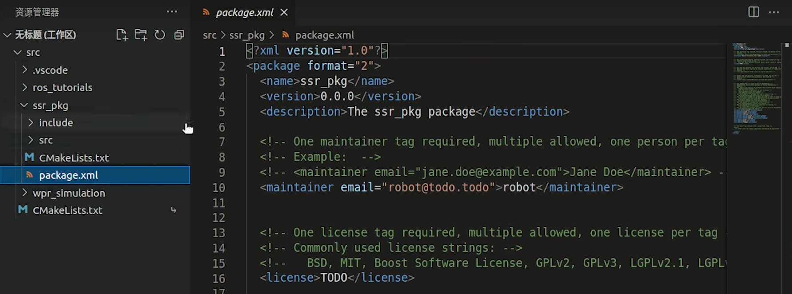

简而言之，`CMakeLists.txt` 是用于配置 CMake 构建系统的文件，而 `package.xml` 是用于 ROS 包管理的文件。两者都是软件开发中用于自动化和标准化构建过程的重要工具。

**3. 编写节点代码**


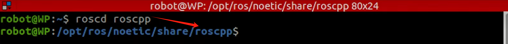

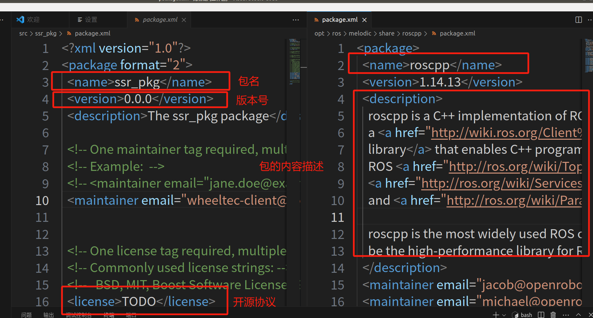

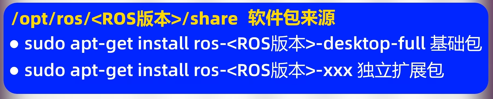

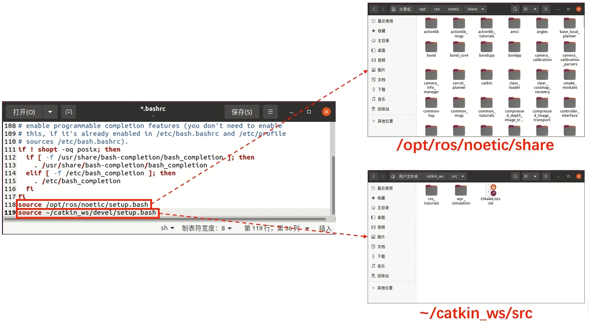

1. `/opt/ros/noetic/share`：
   - 这个路径是ROS的系统安装路径的一部分，其中`/opt`是Linux系统中用于存放第三方软件的标准目录。
   - `ros`目录下通常会有不同版本的ROS安装，例如`noetic`是ROS 1的Noetic Ninjemys版本。
   - `share`目录是Unix系统中用于存放共享数据的标准目录。在ROS的上下文中，`/opt/ros/noetic/share`目录包含了ROS环境的一些共享资源，比如配置文件、消息定义、服务定义、动作定义等。
   - 这个目录下的文件通常是只读的，它们是ROS系统的一部分，不是由用户的工作空间中的包所覆盖的。
2. `catkin_ws/src`：
   - 这是用户的工作空间（workspace）中的一个目录，`catkin_ws`是ROS中最常用的工作空间名称，但这个名称可以自定义。
   - `catkin`是ROS 1中用于构建和管理软件包的工具。一个`catkin`工作空间通常包含`src`（源代码）、`build`（构建目录）、`devel`（开发目录，包含编译后的可执行文件和环境设置脚本）等子目录。
   - `src`目录用于存放用户自己的ROS包的源代码，或者第三方ROS包的源代码（如果这些包不是通过ROS的包管理工具如`apt`或`rosdep`安装的）。
   - 用户可以在`src`目录下创建新的ROS包，或者克隆、下载其他开发者的ROS包源代码。

简而言之，`/opt/ros/noetic/share`是ROS系统安装的一部分，包含了ROS环境的共享资源，而`catkin_ws/src`是用户工作空间的一部分，用于存放用户自己的ROS包源代码。这两个路径在ROS的文件系统中扮演着不同的角色。


**此处修改虚拟机内的代码，原内容如下：**

```
export ROS_MASTER_URI=http://192.168.0.100:11311 
#虚拟机自己的ip地址，为了让小车可以找到虚拟机发出的ROS数据
#虚拟机端运行命令ip a可以查看虚拟机的ip地址
export ROS_HOSTNAME=192.168.0.136 
#以上两者ip地址的前三段【192.168.0】要一样
#前三段的数字没有要求可以为其他【192.168.1】、【192.168.2】但是要求两者一样
```

在最后添加下面代码

[ROS-debug1 : 运行roscore时报错：Unable to contact my own server at... - 燕清扬 - 博客园 (cnblogs.com)](https://www.cnblogs.com/yanqingyang/p/9823527.html#:~:text=ROS-debug1)

```
export ROS_HOSTNAME=localhost
export ROS_MASTER_URI=http://localhost:11311
```

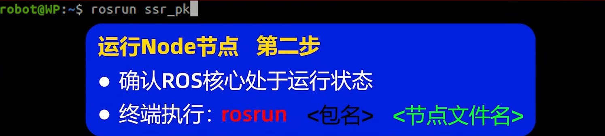

在bashrc文件末尾添加下述代码

```
source /opt/ros/noetic/setup.bash
source ~/catkin_ws/devel/setup.bash
```

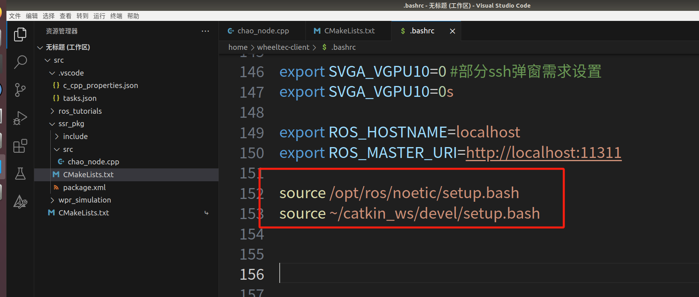

`.bashrc` 文件是 Bash shell 的重要配置文件，用于设置环境变量、别名、函数、命令提示符等，它帮助用户定制自己的命令行环境，提高使用效率。

1. **`source /opt/ros/noetic/setup.bash`**：
   - 此命令用于加载 ROS Noetic 的环境设置。
   - `setup.bash` 文件包含了 ROS 的环境变量和路径设置，使得你可以在终端中使用 ROS 命令和工具。
2. **`source ~/catkin_ws/devel/setup.bash`**：
   - 这条命令用于加载你自己的 Catkin 工作空间（`catkin_ws`）的环境设置。
   - `setup.bash` 文件在你的工作空间编译后生成，并包含了你在该工作空间中构建的包的路径和环境变量。


**4. 节点代码示例**

```cpp
#include  <ros/ros.h>

int main(int argc, char* argv[])
{
    ros::init(argc, argv, "chao_node");
    printf("我的枪去而复返，你的生命有去无回!\n");
    return 0;
}
```

这段代码是一个使用ROS（Robot Operating System）的C++程序。下面是代码的逐行解释：

```c
#include <ros/ros.h>
```
这行代码包含了ROS的头文件`ros.h`，它提供了ROS核心功能的访问，比如初始化节点、创建发布者和订阅者等。

```c
int main(int argc, char* argv[])
```
这是程序的主函数，`argc`是命令行参数的数量，`argv`是一个字符串数组，包含了命令行参数。

```c
{
```
这是`main`函数的开始。

```c
    ros::init(argc, argv, "chao_node");
```
这行代码初始化了一个名为`chao_node`的ROS节点。`ros::init`函数是ROS程序中的第一个调用的函数，它告诉ROS程序的名称和命令行参数。

```c
    printf("我的枪去而复返，你的生命有去无回!\n");
```
这行代码使用`printf`函数在终端打印出中文字符串“我的枪去而复返，你的生命有去无回!”。这通常用于显示程序已经开始运行，并且是节点初始化后的第一个操作。

```c
    return 0;
```
这行代码表示程序正常退出，并返回状态码0，这通常表示程序没有错误地完成了它的任务。

总结来说，这段代码创建了一个名为`chao_node`的ROS节点，然后打印了一条消息，最后正常退出。这可能是一个简单的示例程序，用于演示如何使用ROS创建节点和打印消息。在实际的ROS程序中，节点通常会执行更复杂的任务，比如订阅话题、发布消息、处理数据等。

**解决代码误报错方法——删除下面文件**

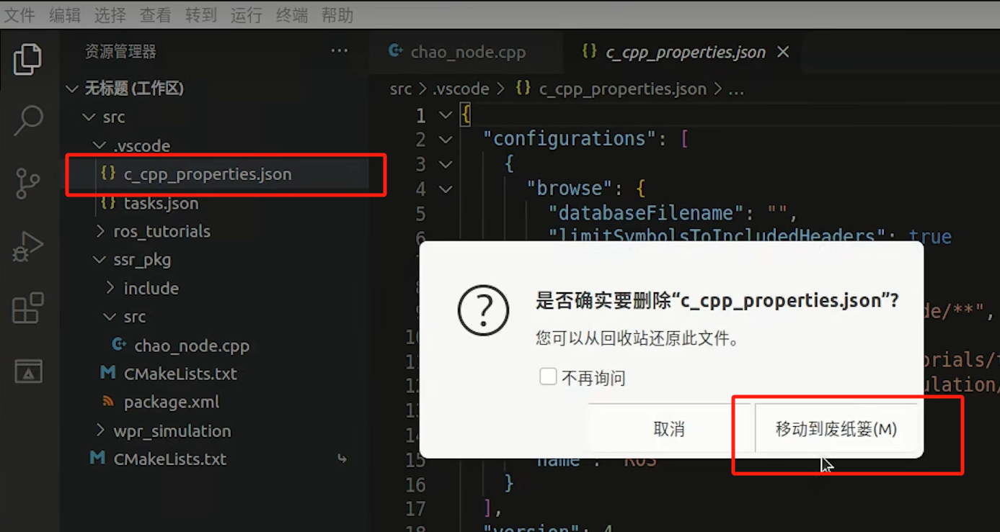


**5. 编译配置**

- 修改`CMakeLists.txt`，添加节点的编译规则。

找到build部分下面的这部分内容

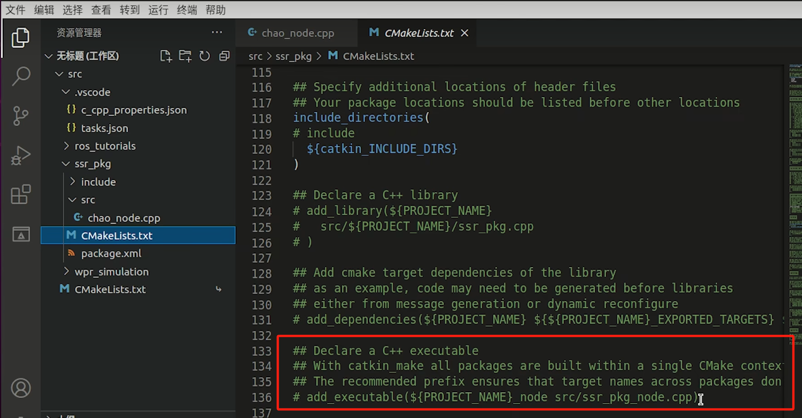

```cmake
# Declare a C++ executable
# With catkin, all packages are built within a single CMake context
# The recommended prefix ensures that target names across packages don't collide

add_executable(${PROJECT_NAME}_node src/ssr_pkg_node.cpp)
```

这段代码的解释如下：

1. `# Declare a C++ executable`：
   - 这是一个注释，说明接下来要声明一个C++可执行文件。
2. `# With catkin, all packages are built within a single CMake context`：
   - 这同样是一个注释，说明在使用catkin构建系统时，所有的包都是在同一个CMake上下文中构建的。
3. `# The recommended prefix ensures that target names across packages don't collide`：
   - 这也是一个注释，说明推荐使用前缀来确保不同包中的目标（如可执行文件、库等）名称不会发生冲突。
4. `add_executable(${PROJECT_NAME}_node src/ssr_pkg_node.cpp)`：
   - 这是一个CMake命令，用于添加一个可执行目标（executable target）。
   - `${PROJECT_NAME}_node`：这是可执行文件的名称，它由项目的名称（`PROJECT_NAME`变量）和字符串`_node`组成。这样可以确保不同项目的可执行文件名称不会冲突。
   - `src/ssr_pkg_node.cpp`：这是源代码文件的路径，它指定了用来构建可执行文件的C++源文件。

总的来说，这段代码是在`CMakeLists.txt`文件中声明一个C++可执行文件，这个可执行文件是由指定的源文件`src/ssr_pkg_node.cpp`编译而成的，并且它的名称是由项目的名称和一个固定的后缀`_node`组成的，以避免在构建过程中不同项目的目标名称发生冲突。


```cmake
# Specify libraries to link a library or executable target against
target_link_libraries(${PROJECT_NAME}_node ${catkin_LIBRARIES})
```

这段代码的解释如下：

1. `# Specify libraries to link a library or executable target against`：
   - 这是一个注释，说明接下来的命令是用来指定链接到库或可执行目标的库。
2. `target_link_libraries`：
   - 这是一个CMake命令，用于将一个或多个库链接到一个目标（通常是可执行文件或库文件）。
3. `${PROJECT_NAME}_node`：
   - 这是你要链接库的可执行目标的名称。`${PROJECT_NAME}`是一个变量，它代表你的项目名称，`_node`是通常用来表示这是一个ROS节点的后缀。
4. `${catkin_LIBRARIES}`：
   - 这是一个变量，包含了你的项目所依赖的所有ROS包的库文件。当你使用`find_package(catkin REQUIRED COMPONENTS ...)`命令时，CMake会查找这些依赖的ROS包，并设置`catkin_LIBRARIES`变量，其中包含了这些包的库文件路径。

总的来说，这段代码的作用是告诉CMake在构建过程中，将`${PROJECT_NAME}_node`这个可执行文件与`${catkin_LIBRARIES}`中指定的所有ROS包的库文件链接起来。这样，当`${PROJECT_NAME}_node`运行时，它就可以使用这些库中定义的功能了。

这个命令通常出现在`CMakeLists.txt`文件的末尾，确保在所有的依赖关系和目标都已经定义之后，再进行链接操作。这样可以确保所有的依赖项都已经被正确地解析和配置。

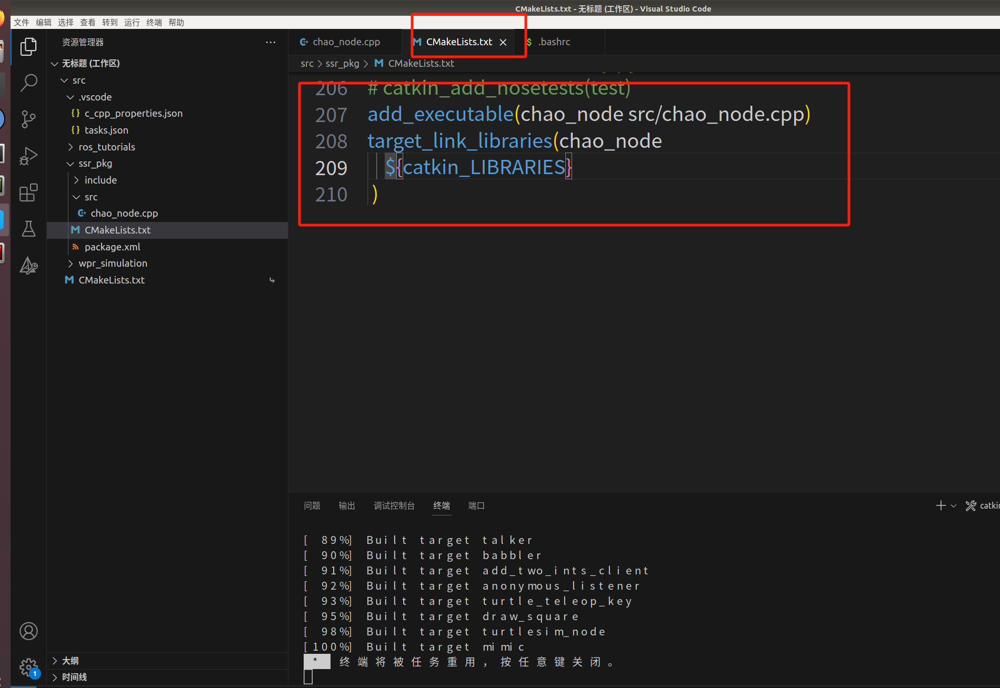

```cmake
# Declare a C++ executable named "chao_node"
add_executable(chao_node src/chao_node.cpp)

# Specify libraries to link a library or executable target against
target_link_libraries(chao_node ${catkin_LIBRARIES})
```

简单来说，这段代码做了两件事：

1. 创建一个名为`chao_node`的程序，它是由`src`文件夹下的`chao_node.cpp`文件编译来的。
2. 把这个程序和ROS的一些库文件链接起来，这样我们的程序就可以使用ROS的功能了。

这段代码的解释如下：

1. `add_executable(chao_node src/chao_node.cpp)`：

   - 这行代码是在告诉CMake，我们要创建一个可执行的程序，我们可以运行的程序，它的名字叫`chao_node`。
   - 这个程序是由一个叫做`chao_node.cpp`的C++源文件编译来的。这个文件在`src`这个文件夹里。

   - `add_executable`命令的第一个参数是可执行文件的名称，这里是`chao_node`。
   - 第二个参数是源代码文件的路径，这里是`src/chao_node.cpp`。

2. `target_link_libraries(chao_node ${catkin_LIBRARIES})`：

   - 这行代码是在告诉CMake，我们需要把一些库文件链接到我们刚才创建的`chao_node`程序上。
   - 这些库文件是ROS系统中的库，它们被存储在`${catkin_LIBRARIES}`这个变量里。这个变量包含了所有我们需要的ROS功能，比如通信、数据处理等。
   - 链接这些库文件后，我们的`chao_node`程序就可以使用ROS提供的功能了。
   - `target_link_libraries`命令的第一个参数是目标名称，这里是`chao_node`。
   - `${catkin_LIBRARIES}`是一个变量，包含了你的项目所依赖的所有ROS包的库文件。当你使用`find_package(catkin REQUIRED COMPONENTS ...)`命令时，CMake会查找这些依赖的ROS包，并设置`catkin_LIBRARIES`变量，其中包含了这些包的库文件路径。

总的来说，这段代码的作用是告诉CMake在构建过程中，首先声明一个名为`chao_node`的可执行文件，它由`src/chao_node.cpp`源代码文件编译而成。然后，将`${catkin_LIBRARIES}`中指定的所有ROS包的库文件链接到这个可执行文件。这样，当`chao_node`运行时，它就可以使用这些库中定义的功能了。

这个命令通常出现在`CMakeLists.txt`文件中，确保在所有的依赖关系和目标都已经定义之后，再进行链接操作。这样可以确保所有的依赖项都已经被正确地解析和配置。

**编译节点步骤**

1. 在visualstudio中，Ctrl+shift+B 编译节点 or  Ctrl+Alt+T，打开终端，

   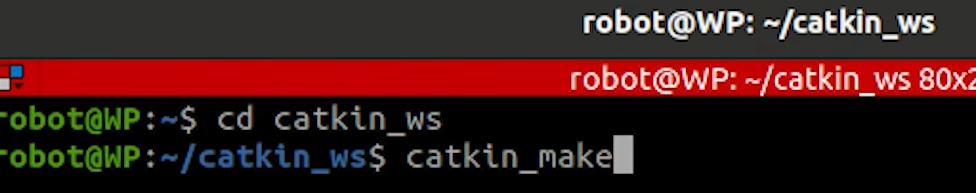

   

**运行节点步骤**

1.Ctrl+Alt+T，打开终端，输入roscore启动ros系统

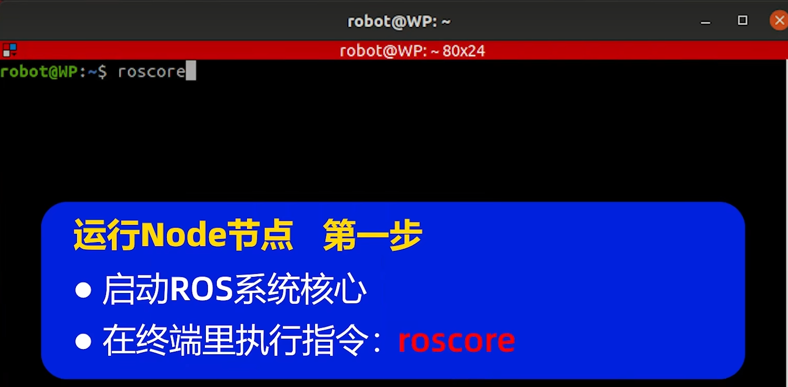

2. Ctrl+shift+o，分出新的终端


这段内容是关于在ROS（Robot Operating System）环境中运行ROS包中的节点的命令行操作。下面是对这些命令的解释：

1. `robot@WP:~$ rosrun ssr pkg chao node`
   - 这是一个命令行指令，用于运行名为`ssr pkg`的ROS包中的`chao`节点。
   - `rosrun`是ROS的一个工具，用于在不预先编译整个工作空间的情况下，直接运行某个包的可执行文件（节点）。
   - `ssr pkg`是ROS包的名称，`chao`是该包中定义的节点名称，`node`是节点的可执行文件名称。
   - 但是，命令执行后出现了错误信息：`[rospack] Error: package 'ssr pkg' not found`，这表示ROS环境中没有找到名为`ssr pkg`的包。

2. `robot@WP:~$ source ~/catkin_ws/devel/setup.bash`
   
   - 这个命令用于为当前shell会话设置环境变量，以便能够找到并使用`catkin_ws`工作空间中的ROS包和节点。
   - `source`命令用于执行指定文件中的命令，这里执行的是`setup.bash`脚本，该脚本位于`catkin_ws/devel`目录下。
   - 这个脚本通常包含了设置ROS环境变量的命令，如`ROS_PACKAGE_PATH`，这样ROS工具（如`rosrun`）就可以找到并使用工作空间中的包。
   
   在ROS（Robot Operating System）中，每个工作空间（workspace）都有一个特定的目录结构，通常包括`src`（源代码目录）、`build`（构建目录）、`devel`（开发目录）等。`catkin_ws`是你的工作空间的名称，它是一个文件夹，里面包含了你的ROS项目。
   
   `source` 是一个bash shell命令，用于在当前shell会话中执行一个脚本文件中的命令。当你在命令行中输入 `source some_script.sh` 时，它会读取 `some_script.sh` 文件中的所有命令，并在当前shell环境中执行它们。
   
   `~/catkin_ws/devel/setup.bash` 是一个脚本文件的路径，其中 `~` 表示当前用户的主目录（home directory）。这个脚本是由 `catkin_make` 命令在构建ROS工作空间时自动生成的，它的作用是设置环境变量，以便ROS工具（如 `rosrun`、`roslaunch` 等）能够正确地找到和使用你的工作空间中的包和节点。
   
   具体来说，`setup.bash` 脚本会做以下几件事情：
   
   1. **设置 `ROS_PACKAGE_PATH` 环境变量**：这个变量告诉ROS在哪里可以找到ROS包。通过添加你的工作空间的 `src` 目录到 `ROS_PACKAGE_PATH`，ROS就可以识别和使用你的自定义包。
   2. **设置其他ROS相关的环境变量**：例如，`ROS_MASTER_URI`、`ROS_IP` 等，这些变量用于配置ROS网络通信和节点发现。
   3. **添加ROS工具到 `PATH` 环境变量**：这样你就可以在任何目录下直接使用 `rosrun`、`roslaunch` 等ROS工具，而不需要指定它们的完整路径。
   4. **设置其他必要的环境变量**：例如，`PYTHONPATH` 用于告诉Python解释器在哪里可以找到ROS包中的Python模块。
   
   通过执行 `source ~/catkin_ws/devel/setup.bash` 命令，你实际上是在告诉shell："嘿，我有一个ROS工作空间，我想在当前的shell会话中使用它。请设置必要的环境变量，以便我可以运行我的ROS节点和使用ROS工具。" 这样，你就可以在当前shell会话中顺利地使用ROS了。
   
   **将source ~/catkin_ws/devel/setup.bash`命令写入.bashrc文件中**
   
   
   
   
   
3. `robot@WP:~$ rosrun ssr pkg chao node`
   - 这是再次尝试运行`ssr pkg`包中的`chao`节点的命令。
   - 在执行了`source ~/catkin_ws/devel/setup.bash`命令之后，当前shell会话的环境变量被更新，使得`rosrun`能够找到并运行`ssr pkg`包中的节点。

总结来说，这段内容描述了在ROS环境中，由于初始环境变量未设置正确导致无法找到ROS包，通过source命令设置环境变量后，再次尝试运行包中的节点的过程。

**6. 编译和运行**

- 使用`catkin_make`在工作空间中编译包。

- 运行节点：

  ```
  rosrun SSR_package sonar_node
  ```

**7. 环境设置**

- 确保工作空间环境变量正确设置。
- 可以将环境变量加载命令添加到`.bashrc`文件。

**8. 调试和错误处理**

- 遇到编译或运行错误时，仔细阅读错误信息。
- 常见问题包括未保存文件、依赖项缺失、语法错误等。

**注意事项**

- 确保所有文件正确保存后再编译。
- 理解`CMakeLists.txt`和`package.xml`的作用。


- 节点的循环条件应使用`ros::ok()`以响应外部信号。


**总结（构建ROS节点文件）**


1. **使用catkin_create_pkg创建一个软件包**

   - 这一步是在终端中执行命令来创建一个新的ROS软件包。

2. **在软件包的src文件夹下创建一个节点的cpp源码文件**

   - 这一步是创建一个C++源文件，比如命名为`chao_node.cpp`。源码文件是你编写节点逻辑的地方。

3. **在节点的源码文件中include包含ROS的头文件**
   - 源码中对应的部分是：
     ```cpp
     #include <ros/ros.h>
     ```
   - 这行代码包含了ROS的核心头文件，使得你可以使用ROS的功能。

4. **构建一个main函数，并在函数的开头执行ros::init()**
   - 源码中对应的部分是：
     ```cpp
     int main(int argc, char* argv[])
     {
         ros::init(argc, argv, "chao_node");
     ```
   - `ros::init()`初始化ROS节点，`"chao_node"`是这个节点的名称。

5. **构建while循环，循环条件为ros::ok()**
   - 源码中对应的部分是：
     ```cpp
     while（ros::ok()）
     ```
     
   - `ros::ok()`函数用于检查节点是否还在正常运行。如果节点没有被关闭，它会返回`true`，因此while循环会一直执行，直到节点被关闭。

   - 循环条件不能是ture，要不然无法响应外部信号
   
6. **在CMakeLists.txt中设置节点源码的编译规则**

   - 这一步是在软件包的`CMakeLists.txt`文件中添加编译指令，告诉编译系统如何编译你的节点。
   - `CMakeLists.txt`是CMake构建系统的配置文件，用于指定如何编译和链接软件包中的源码文件。你需要在其中添加规则，告诉CMake如何编译你的节点。

7. **编译运行**
   - 这一步是使用`catkin_make`命令在终端中编译整个工作空间，然后使用`rosrun <package_name> <node_name>`来运行节点。源码中没有直接体现这一步，但这是运行节点的命令。
   - 在完成以上步骤后，你需要编译你的软件包。在ROS的工作环境（通常是工作空间）中，使用`catkin_make`（或`catkin build`）命令来编译。编译成功后，使用`rosrun`命令来运行你的节点。

你的源码是一个简单的ROS节点实现，它在初始化后进入一个无限循环，并在循环中打印字符串。这个节点没有使用`ros::ok()`来检查节点的状态，也没有发布或订阅任何话题，但它展示了ROS节点的基本结构。


### 12. Topic话题与Message消息

节点不能脱离包独立工作，传感器的信息要发送给马达


**1. 节点间通讯**

- ROS节点通过话题（Topic）和消息（Message）进行通讯。

**2. 话题（Topic）**

- 话题是节点间进行持续通讯的一种形式。
- 一个话题可以有多个发布者（Publisher）和订阅者（Subscriber）。
- 话题名称是建立通讯的关键。

**3. 消息（Message）**

- 消息是话题中传输的数据载体。
- 消息可以持续不断地发送，保证数据的实时性。
- 消息格式多样，满足不同的数据传输要求。

**4. 发布者（Publisher）与订阅者（Subscriber）**

- 发布者是消息的发送方。
- 订阅者是消息的接收方。
- 一个节点可以同时是多个话题的发布者和订阅者。


- 话题Topic是节点间进行持续通讯的一种形式。
- 话题通讯的两个节点通过话题的名称建立起话题通讯连接，
- 话题中通讯的数据，叫做消息Message
- 消息Message通常会按照一定的频率持续不断的发送，以保证消息数据的实时性。
- 消息的发送方叫做话题的发布者Publisher。
- 消息的接收方叫做话题的订阅者Subsciber。


IMU是惯性测量单元（Inertial Measurement Unit）的缩写，它是一种用于测量和报告一个物体的特定力、角速度以及在某些情况下，其相对于参考坐标系的位置的设备。IMU通常用于需要精确运动感测的场合，比如航空、航海、陆地导航、机器人技术、手机、游戏控制和运动追踪等。

IMU的核心组件通常包括：

1. **加速度计（Accelerometer）**：测量物体在特定方向上的加速度，可以确定物体的线性运动。

2. **陀螺仪（Gyroscope）**：测量物体围绕各轴的角速度，可以确定物体的旋转运动。

3. **磁力计（Magnetometer）**：测量地球磁场在物体所在位置的方向和强度，可以用来确定物体的朝向。

这些传感器的数据可以被用来计算物体的绝对或相对位置、速度和方向。IMU可以提供实时、连续的运动数据，但它们通常需要与其他传感器（如GPS）结合使用，以提供更准确的定位信息，因为IMU的数据会受到漂移的影响，尤其是在长时间运行时。

在机器人技术中，IMU可以用来帮助机器人理解其在空间中的姿态和运动，从而进行平衡、导航和路径规划。在智能手机和平板电脑中，IMU是实现屏幕旋转、游戏控制和运动感应等功能的关键组件。在航空领域，IMU是飞行控制系统的重要组成部分，用于提供飞机姿态和速度的实时数据。


**一个话题多个发布者的情况：**


**外延补充：**

1. 一个ROS节点网络中，可以同时存在多个话题。
2. 一个话题可以有多个发布者，也可以有多个订阅者。
3. 一个节点可以对多个话题进行订阅，也可以发布多个话题。
4. 不同的传感器消息通常会拥有各自独立话题名称，每个话题只有一个发布者。
5. 机器人速度指令话题通常会有多个发布者，但是同一时间只能有一个发言人。


**5. 消息类型（Message Types）**

- ROS提供标准消息包（standard messages）。
- 消息类型多样，包括基础类型和复杂类型。
- 复杂消息类型由基础类型嵌套组合而成。


**6. 使用ROS Index查找消息类型**


标准消息类型本身就是依赖项，可以在ROS Index查找消息类型

- ROS Index网站提供了标准消息类型的定义。
- 通过网站可以查看不同版本ROS的消息类型。


**7. 消息类型的结构**

- 消息类型可以像结构体一样包含多个成员。
- 可以层层展开消息类型，了解其携带的数据类型和容量。


**注意事项**

- 传感器节点通常发布自己独立话题的消息。
- 控制类节点可能订阅多个传感器话题，并发布控制指令话题。
- 消息类型应根据数据传输需求合理选择或自定义。


### 13. Publisher发布者的C++实现


**1. 话题发布者概述**

- 话题发布者负责向话题发送消息。
- 通过发布消息，节点之间可以共享数据。

**2. 确定话题名称和消息类型**

- 在网站内确定：https://index.ros.org


- **std_msgs/String Message**：这是ROS中的标准消息类型之一，用于传递字符串数据。
- **File: std_msgs/String.msg**：这表示消息定义文件的名称是`String.msg`，位于`std_msgs`包中。
- **Raw Message Definition**：
  - `string data`：这是消息定义中的一个字段，表示消息中包含一个字符串类型的数据。在原始消息定义中，这个字段被定义为`string data`。
- **Compact Message Definition**：
  - `string data`：在紧凑消息定义中，这个字段同样被定义为`string data`。


- 话题名称："快上车开黑群"（需使用合法字符，避免中文）。
- 消息类型：使用`std_msgs/String`，因为需要发送字符串数据。

**3. 编写发布者节点代码**

注意话题名称不能是中文，“快上车开黑群”需要改成英问，不然运行节点时会报错，下述内容为便于理解，暂不修改


这段代码是一个小机器人程序，它在ROS（机器人操作系统）的环境中运行。这个程序的作用是不断地发送消息，就像在聊天群里发消息一样。

1. 程序一开始，它会告诉ROS系统，它是一个名为"chao_node"的节点。
2. 然后，它会在控制台打印一句很酷的话："我的枪去而复返，你的生命有去无回!"。
3. 接着，它创建了一个"发布者"，这个发布者负责在ROS中的一个话题（可以理解为聊天群）上发送消息。这个话题的名字叫"快上车开黑群"。
4. 在一个循环中，程序会不断地创建一个消息，消息的内容是"国服马超，带飞"，然后通过发布者发送这个消息。
5. 每发送一次消息，程序会等待0.1秒，然后再次发送消息。

    #include <ros/ros.h>
    #include <std_msgs/String.h>
    
    int main(int argc, char* argv[])
    {
        // 初始化ROS节点，节点名为"chao_node"
        ros::init(argc, argv, "chao_node");
        // 在控制台打印一条消息
        printf("我的枪去而复返，你的生命有去无回!\n");
    
        // 创建一个节点句柄
        ros::NodeHandle nh;
        // 创建一个Publisher，发布到"快上车开黑群"话题，消息类型为std_msgs::String，队列大小为10
        ros::Publisher pub = nh.advertise<std_msgs::String>("kuai_shang_che_kai_hei_qun", 10);
        
        // 设置循环频率为10Hz
        ros::Rate loop_rate(10);
        // 进入循环，直到ROS节点关闭
        while (ros::ok())
        {
            // 创建一个消息对象
            std_msgs::String msg;
            // 设置消息内容
            msg.data = "国服马超，带飞";
            // 发布消息
            pub.publish(msg);
            // 等待直到下一次循环开始，保持10Hz的频率
            loop_rate.sleep();
        }
        
        // 返回0，表示程序正常结束
        return 0;
    }
1. 包含头文件：
   - `#include <ros/ros.h>`：包含ROS的核心功能，允许程序使用ROS的节点和通信机制。
   - `#include <std_msgs/String.h>`：包含标准消息类型`std_msgs::String`，这是一个简单的字符串消息类型。
2. 主函数：
   - `int main(int argc, char* argv[])`：程序的入口点，接收命令行参数。
3. 初始化ROS节点：
   - `ros::init(argc, argv, "chao_node");`：初始化一个名为`chao_node`的ROS节点。
4. 打印消息：
   - `printf("我的枪去而复返，你的生命有去无回!\n");`：在控制台打印一条消息，增加程序的趣味性。
5. 创建节点句柄：
   - `ros::NodeHandle nh;`：创建一个节点句柄，用于节点的通信。
6. 创建发布者：
   - `ros::Publisher pub = nh.advertise<std_msgs::String>("快上车开黑群", 10);`：创建一个发布者，发布到名为`快上车开黑群`的话题，消息类型为`std_msgs::String`，队列大小为10。
7. 设置循环频率：
   - `ros::Rate loop_rate(10);`：设置循环频率为10Hz，即每秒执行10次循环。
8. 消息循环：
   - `while (ros::ok())`：进入一个循环，只要ROS节点处于活动状态，循环就会继续。
9. 创建和发布消息：
   - `std_msgs::String msg;`：创建一个`std_msgs::String`类型的消息对象。
   - `msg.data = "国服马超，带飞";`：设置消息的内容。
   - `pub.publish(msg);`：通过发布者发布消息。
10. 控制循环频率：
    - `loop_rate.sleep();`：等待直到下一次循环开始，保持10Hz的频率。
11. 程序结束：
    - `return 0;`：程序正常结束。


**4. 控制消息发布频率**

- 使用`ros::Rate`控制发布频率：

  
  
  ```cpp
  ros::Rate loop_rate(10);
  while (ros::ok()) {
      // 发布消息
      pub.publish(msg);
      loop_rate.sleep();
  }
  ```


**5. 编译和运行节点**

- 确保代码保存后编译节点。

1.执行roscore，运行ROS核心。


2.Ctrl+shift+o分屏，运行节点并检查输出。


**6. 使用ROS命令行工具**


- 使用`rostopic list`查看活跃话题。

  

- 使用`rostopic echo [topic]`查看话题消息。


会发现出现下面这种情况


echo -e查看


发现是这样的

- 使用`rostopic hz [topic]`查看消息发布频率。


**7. 调试和验证**

- 检查消息类型和话题名称是否正确。
- 确保消息发布频率符合预期。

**8. 复制和修改节点**

- 复制现有节点代码以创建新节点。


- 修改新节点的名称、话题名称和消息内容。


运行后检查


**注意事项**

-  话题名称必须合法，不能使用中文。
- 包含正确的消息类型头文件。
- 使用`ros::Rate`对象控制消息发布频率。
- 利用ROS命令行工具进行调试和验证。


### 14. Subscriber订阅者的C++实现

**1. 创建新的ROS软件包**

如果无法自动补全，看这个链接

[vscode c++可以找到声明却无法自动补全-CSDN博客](https://blog.csdn.net/ccSnown/article/details/140300778?spm=1001.2101.3001.6650.1&utm_medium=distribute.pc_relevant.none-task-blog-2~default~YuanLiJiHua~Ctr-1-140300778-blog-104835613.235^v43^pc_blog_bottom_relevance_base1&depth_1-utm_source=distribute.pc_relevant.none-task-blog-2~default~YuanLiJiHua~Ctr-1-140300778-blog-104835613.235^v43^pc_blog_bottom_relevance_base1&utm_relevant_index=2)

软件包创建位置


缓存长度等信息：


**定义回调函数**

在ROS（Robot Operating System）中，**定义回调函数**通常是指创建一个函数，该函数作为响应某个事件或消息到达时的处理器。这种模式在订阅话题（topic）时非常常见，当订阅者节点接收到新的消息时，ROS需要知道如何处理这条消息，这时就会用到回调函数。

```cpp
void 超下划线callback(const std_msgs::String::ConstPtr& msg) {
    printf("%s\n", msg->data.c_str());
}
```


**回调函数的基本概念：**

1. **事件驱动**：回调函数是事件驱动编程的一部分。在这种编程模式中，程序的执行流程不是由程序本身控制，而是由外部事件（如用户输入、消息到达等）触发。
2. **非阻塞**：在ROS中，回调函数通常设计为非阻塞，这意味着它们执行完毕后会立即返回控制权，不会影响主程序的执行。
3. **异步处理**：回调函数允许程序异步处理消息，即在接收到消息时立即处理，而不是等待主程序在某个时间点去检查消息。

想象一下，你在一个餐厅里工作，你的工作是服务员。餐厅里有很多客人，你不能一直站在每个客人面前等着他们叫你，因为你还有其他工作要做。所以，你告诉每个客人，如果他们需要服务，就按一下桌上的服务铃。每次有客人按铃，你就去他们的桌子那里，看看他们需要什么服务。

在这个比喻中：

- 你就像是一个程序。
- 客人就像是一个等待消息的系统。
- 服务铃就像是一个触发回调函数的机制。
- 你听到铃声后去服务客人的动作，就像是回调函数被触发并执行。

所以，当你（程序）订阅了一个话题（等待客人按铃）并提供了一个回调函数（去客人桌子那里），你就告诉了系统（餐厅），如果有人（消息）来了，就执行这个特定的动作（回调函数）。这样，你（程序）就可以继续做其他事情（服务其他客人），直到铃声（新消息）响起。

回调函数的作用就是：

1. **自动化响应**：你不需要时刻检查每个客人是否需要服务，铃声会自动告诉你。
2. **节省时间**：你可以在有需要时立即响应，而不是浪费时间不断检查。
3. **专注于主要任务**：你可以继续做其他工作，直到有客人需要服务。
4. **响应速度快**：客人一按铃，你就能立刻去服务，提高了响应速度。


**2.编辑节点信息**

这段代码是一个ROS节点的C++实现，用于创建一个名为“ma_node”的节点，该节点订阅了一个名为“kuai_shang_che_kai_hei_qun”的话题，并定义了一个回调函数来处理接收到的消息。


这段代码是一个小机器人程序，它在ROS（机器人操作系统）的环境中运行。这个程序的作用是监听一个聊天群，当有人在群里发消息时，程序会读取这个消息并打印出来。

1. 程序一开始，它会告诉ROS系统，它是一个名为"ma_node"的节点。

2. 然后，它创建了一个订阅者，订阅了一个名为"kuai_shang_che_kai_hei_qun"的话题。这个话题就像是一个聊天群，其他机器人或程序可以在这个群里发消息。

3. 当有消息发到这个群时，程序会调用一个名为`chao_callback`的函数来处理这个消息。这个函数会读取消息内容，并在控制台上打印出来。

4. 程序会一直运行，直到ROS节点被关闭。在这个过程中，它会不断地检查是否有新的消息到达，并及时处理。

       #include <ros/ros.h>
       #include <std_msgs/String.h>
       
       // 定义回调函数
       void chao_callback(const std_msgs::String::ConstPtr& msg)
       {
           // 打印接收到的消息
           printf("%s\n", msg->data.c_str());
       }
       
       int main(int argc, char* argv[])
       {
           // 初始化ROS节点，节点名为"ma_node"
           ros::init(argc, argv, "ma_node");
           
       // 创建节点句柄
       ros::NodeHandle nh;
       
       // 创建一个Subscriber，订阅"kuai_shang_che_kai_hei_qun"话题，消息类型为std_msgs::String，队列大小为10，回调函数为chao_callback
       ros::Subscriber sub = nh.subscribe("kuai_shang_che_kai_hei_qun", 10, chao_callback);
       
       // 进入循环，直到ROS节点关闭
       while (ros::ok())
       {
           // 调用ros::spinOnce()来处理回调函数
           ros::spinOnce();
       }
       
       // 返回0，表示程序正常结束
       return 0;
       }
   1. `#include <ros/ros.h>` 和 `#include <std_msgs/String.h>`：

      - 这两行代码包含了必要的头文件，`ros/ros.h` 是ROS的核心头文件，提供了基本的ROS功能。`std_msgs/String.h` 是标准字符串消息类型的头文件，它定义了一种简单的字符串消息格式。

   2. `void chao_callback(const std_msgs::String::ConstPtr& msg)`：

      - 这是一个回调函数，当订阅的话题有新消息到达时，这个函数会被调用。
      - `const std_msgs::String::ConstPtr& msg` 是传递给回调函数的消息对象，它包含了消息的内容。

   3. `printf("%s\n", msg->data.c_str());`：

      - 这行代码将消息内容打印到控制台。`msg->data.c_str()` 获取消息中的字符串数据。

   4. `int main(int argc, char* argv[])`：

      - 这是程序的主函数入口点，接收命令行参数。

   5. `ros::init(argc, argv, "ma_node");`：

      - 这行代码初始化了一个名为“ma_node”的ROS节点。

   6. `ros::NodeHandle nh;`：

      - 创建了一个节点句柄，它用于创建发布者（publisher）和订阅者（subscriber），以及访问ROS参数服务器。

   7. `ros::Subscriber sub = nh.subscribe("kuai_shang_che_kai_hei_qun", 10, chao_callback);`：

      - 这行代码创建了一个订阅者，它订阅了名为“kuai_shang_che_kai_hei_qun”的话题，消息类型为`std_msgs::String`，队列大小为10，回调函数为`chao_callback`。

   8. `while (ros::ok())`：

      - 这是一个循环，它将持续运行直到ROS节点被关闭。

   9. `ros::spinOnce();`：

      - 这行代码告诉ROS在这个节点中处理一次回调。通常，这会在一个循环中调用，以确保程序能够及时响应新的消息。

   10. `return 0;`：

       - 这表示程序正常结束。

       还需要再做一些修改，如下所示

       

1. **设置程序的locale为中文**：这行代码`setlocale(LC_ALL, "zh_CN.UTF-8");`是为了让程序能够正确显示中文字符。就像是告诉电脑：“嘿，我要用中文了，你准备好显示中文哦。”
2. **初始化ROS节点**：`ros::init(argc, argv, "ma_node");`这行代码是告诉ROS系统，你要开始一个新的节点，这个节点的名字叫“ma_node”。节点就像是ROS世界中的一个小程序或者任务。
3. **创建节点句柄**：`ros::NodeHandle nh;`节点句柄就像是控制节点的遥控器，通过它，你的节点可以和其他节点交流。
4. **创建订阅者**：通过`ros::Subscriber sub = nh.subscribe("kuai_shang_che_kai_hei_qun", 10, chao_callback);`这行代码，你的节点开始监听一个特定的话题“kuai_shang_che_kai_hei_qun”。每当这个话题有新消息时，就会调用`chao_callback`这个函数来处理消息。
5. **进入循环**：`while (ros::ok())`这个循环会一直运行，直到ROS系统告诉你可以停止了。在这个循环里，`ros::spinOnce();`会检查是否有新的消息到来，如果有，就处理它们。

    #include <ros/ros.h>
    #include <std_msgs/String.h>
    #include <locale.h> // 包含setlocale函数的头文件
    
    // 定义回调函数
    void chao_callback(const std_msgs::String::ConstPtr& msg)
    {
        // 使用ROS_INFO宏打印消息内容
        ROS_INFO("%s", msg->data.c_str());
    }
    
    int main(int argc, char* argv[])
    {
        // 设置程序的locale为中文，以便正确显示中文字符
        setlocale(LC_ALL, "zh_CN.UTF-8");
        
    // 初始化ROS节点，节点名为"ma_node"
    ros::init(argc, argv, "ma_node");
    
    // 创建节点句柄
    ros::NodeHandle nh;
    
    // 创建一个Subscriber，订阅"kuai_shang_che_kai_hei_qun"话题，消息类型为std_msgs::String，队列大小为10，回调函数为chao_callback
    ros::Subscriber sub = nh.subscribe("kuai_shang_che_kai_hei_qun", 10, chao_callback);
    
    // 进入循环，直到ROS节点关闭
    while (ros::ok())
    {
        // 调用ros::spinOnce()来处理回调函数
        ros::spinOnce();
        // 休眠一小段时间，避免CPU占用过高
        ros::Duration(0.01).sleep();
    }
    
    // 返回0，表示程序正常结束
    return 0;
    }
1. **设置locale**：`setlocale(LC_ALL, "zh_CN.UTF-8");`用于设置程序的区域设置为中文环境，确保程序在输出日志或者错误信息时能够正确处理和显示中文字符。
2. **节点初始化**：`ros::init(argc, argv, "ma_node");`初始化一个名为"ma_node"的ROS节点。这是ROS程序的标准实践，其中`argc`和`argv`是从命令行传递给程序的参数。
3. **节点句柄**：`ros::NodeHandle nh;`创建一个节点句柄对象，它是操作ROS节点的接口，用于订阅话题、发布消息、设置参数等。
4. **订阅话题**：`ros::Subscriber sub = nh.subscribe("kuai_shang_che_kai_hei_qun", 10, chao_callback);`创建一个订阅者对象，订阅名为"kuai_shang_che_kai_hei_qun"的话题。当有消息发布到这个话题时，`chao_callback`函数会被调用。参数`10`指定了消息队列的最大长度。
5. **事件循环**：`while (ros::ok())`是一个事件循环，它保持程序运行并响应ROS系统的消息。`ros::spinOnce();`告诉ROS在这个节点中处理一次回调，而`ros::Duration(0.01).sleep();`则是为了避免程序占用过多的CPU资源，在处理完一次回调后进行短暂的休眠。

写完之后就会有时间戳，而且也不会输出乱码


加上yao_的节点和消息类型


运行发布者yao节点


运行订阅者ma节点


**总结**


**3. 编译和运行订阅者节点**

- 更新`CMakeLists.txt`，添加编译规则。

  

  

  复制上方内容到最后，修改为如下所示

  

- 使用`catkin_make`编译。Ctrl+S保存，Ctrl+shift+B编译

- Ctrl+alt+T启动终端，运行ROS核心：`roscore`


- 运行订阅者节点：

  

**4. 调试和验证**

- 使用`rostopic list`查看活跃话题。
- 使用`rostopic echo [topic]`查看特定话题的消息。
- 使用`rostopic hz [topic]`查看消息频率。

**5. 处理多个话题订阅**


- 为每个话题创建`Subscriber`对象。
- 为每个话题定义相应的回调函数。

**6. 使用ROS工具`rqt_graph`**


- 显示当前系统中节点和话题的通讯关系。

  

  椭圆的是节点，矩形的是话题

- 帮助理解数据流向和处理流程。


**7. 话题的生命周期**

- 话题由ROS系统创建管理。
- 节点通过发布或订阅操作触发话题的创建。

**注意事项**

- 确保话题名称和消息类型正确。
- 回调函数中处理接收到的消息。
- 使用`ros::spin()`或`ros::spinOnce()`在主循环中处理消息。


### 15. launch启动多个ROS节点

**1. 什么是Launch文件**

- Launch文件是一种遵循XML语法的描述文件，用于批量启动ROS节点。
- 它简化了多个节点的启动过程。


**2. 创建Launch文件**

- 在任意软件包内创建`launch`目录。


- 在`launch`目录内创建Launch文件，如`kai_hei.launch`。

**3. 编写Launch文件内容**

- 使用XML语法描述要启动的节点。


这个文件就像是一个控制面板，它允许你一次性启动多个ROS节点。每个节点就像是ROS系统中的一个小程序，它们可以执行特定的任务，比如发送消息、接收消息或者控制机器人。

1. `<launch>`标签定义了这个文件是一个ROS的启动文件。

2. ```
   <node>
   ```

   标签用于启动一个节点。在这个文件中，有三个节点被启动：

   - `yao_node`：这是第一个节点，它属于`ssr_pkg`包。
   - `chao_node`：这是第二个节点，它也属于`ssr_pkg`包。
   - `ma_node`：这是第三个节点，它属于`atr_pkg`包。

3. `pkg`属性指定了节点所属的ROS包。

4. `type`属性指定了节点的可执行文件类型。

5. `name`属性为节点指定了一个名称。

6. `output="screen"`属性确保节点的输出会显示在屏幕上，这样你就可以看到节点的运行情况。这个属性是一个可选的参数，它将节点的标准输出和标准错误重定向到屏幕，方便开发者调试和监控节点的运行状态。

当你运行这个启动文件时，ROS会根据这个文件中的指令启动所有指定的节点。

- 示例：

  ```xml
  <launch>
      <!-- 启动名为yao_node的节点，它属于ssr_pkg包 -->
      <node pkg="ssr_pkg" type="yao_node" name="yao_node" output="screen"/>
      <!-- 启动名为chao_node的节点，它也属于ssr_pkg包 -->
      <node pkg="ssr_pkg" type="chao_node" name="chao_node" output="screen"/>
      <!-- 启动名为ma_node的节点，它属于atr_pkg包 -->
      <node pkg="atr_pkg" type="ma_node" name="ma_node" output="screen"/>
  </launch>
  ```

使用启动文件的好处是，你可以集中管理节点的启动参数，并且可以轻松地修改这些参数，而不需要修改节点的代码。此外，启动文件也使得节点的启动过程更加模块化和可重用。

**4. 启动Launch文件**

- 使用`roslaunch`命令启动：

  ```
  roslaunch [package_name] [launch_file_name]
  ```

- 例如：

  
  
  ```
  roslaunch atr_pkg kai_hei.launch
  ```

在ROS中，`roslaunch`是一个用于启动节点的高级工具，它允许用户通过一个XML格式的`.launch`文件来启动一个或多个节点。这种方式可以简化节点的启动过程，特别是当需要同时启动多个节点时。

1. `roslaunch`：这是执行命令的ROS工具，用于解析`.launch`文件并启动其中定义的节点。
2. `atr_pkg`：这是ROS包的名称，该包中包含了要启动的节点。
3. `kai_hei.launch`：这是`.launch`文件的名称，它位于`atr_pkg`包的`launch`目录下。这个文件定义了要启动的节点及其参数。

当执行这个命令时，`roslaunch`会读取`kai_hei.launch`文件，解析其中的XML内容，并根据这些内容启动节点。这些节点可以是任何可执行文件，包括发布者、订阅者、服务服务器、服务客户端等。

**5. 设置节点输出**

- 使用`output`属性控制节点输出到屏幕或独立终端。
- `output="screen"`：输出到当前终端。
- `launch_prefix="non_terminal"`：在新终端中运行节点。


在上述内容后面加入一下代码，补全后的代码可能如下：

<launch>
    <!-- 使用output="screen"将节点输出到当前终端 -->
    <node pkg="ssr_pkg" type="yao_node" name="yao_node" output="screen"/>
    <!-- 使用launch-prefix为节点创建一个新的终端窗口 -->
    <node pkg="ssr_pkg" type="chao_node" name="chao_node" launch-prefix="gnome-terminal --">
        <!-- 设置终端窗口标题 -->
        <arg>--name</arg>
        <arg>chao_node</arg>
    </node>
    <!-- 输出ma_node节点信息到当前终端 -->
    <node pkg="atr_pkg" type="ma_node" name="ma_node" output="screen"/>
</launch>

1. `output="screen"`：这个指令告诉ROS，当节点运行时，它的输出（比如打印的信息）应该显示在当前的终端屏幕上。
2. `launch-prefix="gnome-terminal --"`：这个指令告诉ROS，当启动名为`chao_node`的节点时，应该先打开一个新的终端窗口（在这里使用的是`gnome-terminal`，这是一个Linux系统中的终端模拟器），然后在新窗口中运行这个节点。这样做的好处是，你可以在不同的窗口中运行不同的节点，方便查看和管理。
3. `<arg>--name</arg><arg>chao_node</arg>`：这两行代码为`gnome-terminal`提供了额外的参数，设置新终端窗口的标题为`chao_node`。

此时会单独给超的节点开一个窗口


节点网络中也没有chao的话题


**6. 使用rqt_graph工具**

- 使用`rqt_graph`可视化节点和话题的通讯关系。


**7. 节点调试**

- 将节点配置为在独立终端中运行，便于调试和观察输出。

**8. 理解Launch文件的重要性**

- Launch文件是软件包的重要入口，有助于理解软件包的功能和结构。

**注意事项**

- 确保Launch文件的语法正确。
- 合理使用`output`和`launch_prefix`属性，便于节点管理和调试。


### 16. Publisher发布者的Python实现

**1. 创建ROS软件包**

- 包名：`SSR_package`
- 依赖项：`std_msgs`
- 终端命令：`cd ~/catkin_ws/src && catkin_create_package SSR_package std_msgs`


回退后编译


1. **创建ROS包**：
   - `catkin_create_pkg ssr_pkg rospy std_msgs`：这个命令创建了一个名为`ssr_pkg`的新ROS包，并指定了它依赖的两个ROS包：`rospy`和`std_msgs`。`rospy`是ROS的Python接口，`std_msgs`是ROS的标准消息类型包。
   - 这个命令会在当前目录（`~/catkin_ws/src`）下创建一个新的文件夹`ssr_pkg`，并在其中生成必要的文件，如`package.xml`和`CMakeLists.txt`，以及一个`src`文件夹。
2. **切换目录**：
   - `cd ..`：这个命令将当前目录切换到上一级目录，即从`~/catkin_ws/src`切换到`~/catkin_ws`。
3. **编译ROS工作空间**：
   - `catkin_make`：这个命令用于编译整个ROS工作空间（`catkin_ws`）。它会查找所有ROS包的源代码，根据`CMakeLists.txt`文件中的指令进行编译，并生成可执行文件和库文件。这步的编译是为了让软件包进入ros的编译节点（新建好软件包后执行一次就可以）

**2. 创建Python节点脚本**

- 在`SSR_package`包内创建`scripts`目录。
- 在`scripts`目录内创建Python脚本，如`chao_node.py`。


**3. 编写Python节点代码**

- 指定Python解释器和编码：

  ```python
  #!/usr/bin/env python3
  # -*- coding: utf-8 -*-
  ```

- 引入ROS库和消息类型：

  ```python
  import rospy
  from std_msgs.msg import String
  ```

- 实现节点功能：

  ```python
  def talker():
      pub = rospy.Publisher('topic_name', String, queue_size=10)
      rate = rospy.Rate(10)  # 10hz
      while not rospy.is_shutdown():
          msg = String()
          msg.data = 'Message content'
          pub.publish(msg)
          rate.sleep()
  ```

- 主函数：

  ```python
  if __name__ == '__main__':
      rospy.init_node('node_name', anonymous=True)
      print("Node initialized.")
      talker()
  ```


从Nodehandle变成rospy


**4. 赋予脚本执行权限**


终端命令：在Linux或类Unix系统的终端中使用的，用于修改文件权限。

robot@WP:~/catkin_ws/src/ssr_pkg/scripts$     chmod +x chao_node.py


1. 文件权限修改：
   - `chmod`是Linux系统中用于改变文件或目录权限的命令。
   - `+x`参数指定了增加执行权限。在Linux系统中，文件权限通常分为读（r）、写（w）和执行（x）。
2. ROS脚本：
   - `chao_node.py`很可能是一个Python脚本，它定义了一个ROS节点。在ROS中，节点是基本的执行单元，可以发布消息、订阅话题或提供服务。
3. 执行脚本：
   - 在给予脚本执行权限后，用户可以在该脚本所在的目录下通过命令`./chao_node.py`来运行这个节点。
   - 如果脚本是作为一个ROS节点编写的，它通常会使用`rospy`库来与ROS通信。
4. 目录结构：
   - 该命令在`~/catkin_ws/src/ssr_pkg/scripts`目录下执行，这是ROS包结构中用于存放可执行脚本的标准位置。

通过这些步骤，你可以确保你的Python脚本在ROS环境中可以被执行，从而作为节点参与到ROS的消息传递和任务处理中。这是ROS开发中常见的操作，用于部署和运行自定义的节点。


**5. 运行Python节点**

- 启动ROS核心：`roscore`


- 运行节点：`rosrun SSR_package 超哥节点.py`


**6. 验证节点运行**

- 查看活跃话题：`rostopic list`


- 查看话题消息：`rostopic echo /topic_name`


**7. 复制和修改节点**

- 复制现有Python脚本并修改内容以创建新节点。


- 修改节点名称、话题名称和消息内容。


这个Python脚本就像是一个自动发消息的机器人。它在ROS系统中运行，不断地向一个叫做“gie_gie_dai_wo”的话题发送消息。这个消息的内容是“求上车+++”。

1. 脚本一开始，它会告诉ROS系统，它是一个名为“yao_node”的节点。
2. 然后，它会创建一个“发布者”（Publisher），这个发布者负责向“gie_gie_dai_wo”话题发送消息。
3. 接着，它进入一个循环，不断地发送消息。每10秒钟，它就会发送一次消息，并且每次发送前都会在控制台打印“我要开始刷屏了”。
4. 消息的内容是“求上车+++”，这就像是机器人在不断地告诉别人：“快上车，跟我一起走！”

**注意事项**

- Python节点不需要编译，可直接运行。
- 确保Python脚本具有执行权限。
- 使用`rosrun`运行Python节点。
- 使用`rostopic`工具验证节点发布的消息。


### 17. Subscriber订阅者的Python实现

**1. 创建ROS软件包**

让新建的软件包进入执行列表（在RO环境中创建一个新的ROS包并编译它）

这个过程是在ROS环境中创建一个新的ROS包并编译它的步骤，这是开始一个新的ROS项目的基础步骤，为后续的开发工作打下基础。通过这些命令，你可以初始化一个新的ROS包结构，生成必要的配置文件，并准备包的源代码目录，最后通过编译整个工作空间来确保新包被正确构建。


1. 进入工作空间的源代码目录：

   - 首先，通过`cd ~/catkin_ws/src/`命令，我们进入了ROS工作空间的`src`目录，这是创建新包的地方。

2. 创建新的ROS包：

   - 使用`catkin_create_pkg atr_pkg rospy std_msgs`命令创建了一个新的ROS包，名字叫`atr_pkg`。这个命令还告诉我们，它为我们生成了一些重要的文件和文件夹，比如`package.xml`和`CMakeLists.txt`，以及一个`src`文件夹。

3. 返回到工作空间目录：

   - 通过`cd ..`命令，我们返回到了`catkin_ws`目录。

4. 编译ROS工作空间：

   - 最后，使用`catkin_make`命令来编译整个工作空间，这会包括我们刚刚创建的新包`atr_pkg`。

   ```
   cd ~/catkin_ws/src/
   catkin_create_pkg atr_pkg rospy std_msgs
   cd ..
   catkin_make
   ```

   **2. 创建Python节点脚本**

- 在`atr_package`包内创建`scripts`目录。
- 在`scripts`目录内创建Python脚本，如`ma_note.py`。


**3. 编写Python节点代码**


```
#!/usr/bin/env python3
# coding=utf-8

import rospy
from std_msgs.msg import String

def chao_callback(msg):
    rospy.loginfo(msg.data)

if __name__ == "__main__":
    rospy.init_node("ma_node")
    sub = rospy.Subscriber("kuai_shang_che_kai_hei_qun", String, chao_callback, queue_size=10)
    rospy.spin()
```

**4. 赋予脚本执行权限**


- 终端命令：`chmod +x ma_note.py`


没有报错，说明运行成功了

**5. 运行Python节点**

- 启动ROS核心：`roscore`


- 运行发布者节点：


运行接受者节点：


在ROS系统中，这段代码涉及到两个主要的概念：发布者（publisher）和订阅者（subscriber）。

1. **发布者**：发布者就像是一个广播站，它会定期发送消息。在这个例子中，消息是“国服马超，带飞”。
2. **订阅者**：订阅者就像是一个收音机，它会监听广播站发出的消息。当它收到消息时，它会记录下来或者做出反应。

**发布消息的代码（Publisher）**

```python
rospy.loginfo("我要开始刷屏了")
msg = String()
msg.data = "国服马超，带飞"
pub.publish(msg)
pub.publish(msg)
rate.sleep()
```

1. `rospy.loginfo("我要开始刷屏了")`：这行代码使用ROS的日志系统输出一条信息，告诉用户程序即将开始发送消息。
2. `msg = String()`：这里创建了一个名为`msg`的变量，它是一个`String`类型的消息对象。
3. `msg.data = "国服马超，带飞"`：这行代码设置`msg`对象的`data`属性，即消息的内容，这里设置为“国服马超，带飞”。
4. `pub.publish(msg)`：这行代码将`msg`对象发布到一个话题上。任何订阅了这个话题的节点都可以接收到这条消息。这里连续调用了两次`pub.publish(msg)`，意味着会发送两次消息。
5. `rate.sleep()`：这行代码让当前线程休眠一段时间。通常，这行代码会与一个`rospy.Rate`对象一起使用，以控制消息发送的频率。例如，`rate = rospy.Rate(1)`表示每秒发送一次消息。

**接收消息的代码（Subscriber）**

```python
def chao_callback(msg):
    rospy.loginfo(msg.data)
```

1. `def chao_callback(msg):`：这行代码定义了一个名为`chao_callback`的函数，它是一个回调函数。当订阅的话题有新消息时，这个函数会被调用。
2. `rospy.loginfo(msg.data)`：在回调函数内部，使用ROS的日志系统输出接收到的消息内容。`msg.data`是接收到的消息对象的`data`属性，即消息的内容。


**6. 查看节点运行**

- 查看活跃话题：`rostopic list`
- 查看话题消息：`rostopic echo /topic_name`

**7. 创建Launch文件**

- 在`atr_package`包内创建`launch`目录。

- 在`launch`目录内创建Launch文件，如`kai_hei.launch`。


- 编写Launch文件内容：

  

  它告诉机器人在开始工作前需要启动哪些程序。每个程序都是一个独立的任务，比如发送消息、接收消息或者执行其他任务。

  ```xml
  <launch>
      <node pkg="ssr_pkg" type="chao_node.py" name="chao_node"/>
      <node pkg="ssr_pkg" type="yao_node.py" name="yao_node"/>
      <node pkg="atr_pkg" type="ma_node.py" name="ma_node" launch-prefix="gnome-terminal --"/>
  </launch>
  ```

在ROS中，启动文件（launch files）用于定义一组节点的启动配置。这些节点可以是单独的程序，也可以是脚本，它们在ROS系统中执行特定的任务。通过`<node>`标签，我们可以指定要启动的节点的包名、类型、名称以及启动前缀。

- `pkg`属性指定了节点所属的ROS包。
- `type`属性指定了节点的可执行文件名。
- `name`属性为节点提供了一个在ROS中的唯一标识。
- `launch-prefix`属性允许我们在启动节点之前执行特定的命令，这在调试时非常有用，因为它可以在新的终端窗口中启动节点，使得输出更加清晰。

**8. 运行Launch文件**

- 启动所有节点：`roslaunch a_tr_package 开黑.launch`


**注意事项**

- Python节点不需要编译，可直接运行。
- 确保Python脚本具有执行权限。
- 使用`rosrun`运行Python节点。
- 使用`roslaunch`启动Launch文件。


### 18. ROS机器人运动控制

**1. 机器人运动控制概述**

- ROS中机器人的运动控制通过话题和消息实现。
- 机器人运动可以分解为线速度（矢量运动or旋转运动）和角速度（旋转运动）。


**2. 线速度和角速度**

- 线速度单位：米每秒（m/s）。
- 角速度单位：弧度每秒（rad/s）。

**3. 坐标系定义**

- 以机器人底盘中心为原点建立三维坐标系。


- X轴：正前方。
- Y轴：正左方。
- Z轴：正上方。


**4. 旋转运动方向**

- 右手法则确定旋转运动方向。
- 滚转（Roll）：绕X轴旋转。


- 俯仰（Pitch）：绕Y轴旋转。


- 自转（Yaw）：绕Z轴旋转。


**5. ROS消息类型**


- `geometry_msgs/Twist`用于描述机器人的运动速度。
- **geometry_msgs**：是一个ROS消息包，包含了几何相关的数据类型，比如点、线、面等。
- 包含线性速度（Linear）和角速度（Angular）两部分。
- 每部分包含X、Y、Z三个分量。


**6. 速度控制话题**

- 话题名称一般为`/cmd_vel`。
- 消息类型为`geometry_msgs/Twist`。

**7. 控制机器人运动**


- 编写节点，向`/cmd_vel`话题发布`geometry_msgs/Twist`消息。
- 消息的线性速度部分控制机器人的前进、后退、左右移动。
- 消息的角速度部分控制机器人的旋转。

这个“速度控制节点”是ROS中用于发送速度控制指令的组件。它通过发布`geometry_msgs/Twist`类型的消息到`/cmd_vel`话题来控制机器人的移动，这是实现机器人基础移动控制的关键部分。


这个“速度控制节点”就像是机器人的遥控器。它使用一种叫做`geometry_msgs/Twist`的特殊消息，这种消息可以告诉机器人怎么动，比如多快向前走、多快向右转等。这个消息通过一个叫做`/cmd_vel`的话题发送给机器人。机器人的核心节点会监听这个话题，一旦收到消息，就会按照消息里的指示来移动机器人。

**8. 示例操作**

- 在ROS环境中搜索`geometry_msgs/Twist`消息类型。
- 查看消息结构，了解如何构造速度控制消息。

**9. 注意事项**

- 确保消息类型正确，以符合ROS系统对机器人运动控制的要求。
- 了解机器人的坐标系和运动方向，以正确控制机器人。


### 19. 机器人运动控制的C++实现

**1. 准备仿真环境**

- 使用`wpr_simulation`开源工程进行机器人和环境的仿真。
- **如果已下载源码，更新至最新版本并重新编译。**


- `cd catkin_ws/src/wpr_simulation/`：这个命令将当前目录更改为`catkin_ws`工作空间下的`src`目录中的`wpr_simulation`包目录。
- `git pull`：这个命令是Git版本控制系统的一部分，用于从远程仓库拉取最新的代码变更并合并到本地仓库。这对于确保你的代码是最新的，以及与团队成员共享代码变更非常重要。


- `cd ~/catkin_ws`：这个命令将当前目录更改为用户的主目录下的`catkin_ws`目录，这是ROS工作空间的标准位置。
- `catkin_make`：这个命令在当前的ROS工作空间中运行，它会查找所有的`package.xml`和`CMakeLists.txt`文件，这些文件定义了包的依赖关系和如何编译源代码。然后，`catkin_make`会使用CMake来配置构建过程，并使用make来编译代码。

- **如果未下载，从GitHub克隆项目并安装依赖。**

Github上搜索


复制项目地址


下载和安装依赖项


重新编译


**2. 运行仿真示例**

- 使用`roslaunch wpr_simulation wpb_simple.launch`启动仿真环境。


- 运行`wpr_simulation`中的运动控制示例程序`demo_vel_ctrl`。


**3. 创建ROS软件包**


- 包名：`vel_pkg`


- 依赖项：`roscpp`,rospy， `geometry_msgs`

**4. 编写速度控制节点**


- 节点名：`vel_node`
- 编写C++代码，实现速度控制节点。


**4.1 包含头文件**

```cpp
#include <ros/ros.h>
#include <geometry_msgs/Twist.h>
```

**4.2 定义发布者节点**

```cpp
int main(int argc, char **argv) {
    ros::init(argc, argv, "will_node");
    ros::NodeHandle n;
    ros::Publisher well_pub = n.advertise<geometry_msgs::Twist>("cmd_vel", 10);
    ros::Rate loop_rate(30);
    while (ros::ok()) {
        geometry_msgs::Twist well_message;
        well_message.linear.x = 0.1;  // 线速度
        well_message.angular.z = 0.0; // 角速度
        well_pub.publish(well_message);
        loop_rate.sleep();
    }
    return 0;
}
```

**5. 编译节点代码**

- 更新`CMakeLists.txt`，添加编译规则。

复制下面红框中的代码到文件末尾，Ctrl+/取消注释


添加代码如下所示，保存后Ctrl+shift+B编译


在ROS中，每个包都有自己的`CMakeLists.txt`文件，它定义了如何编译该包中的代码。当你添加新的节点或库时，你需要更新这个文件以包含新的编译规则。

- `add_executable`：这个命令创建一个可执行文件，它会从指定的源文件中编译代码。
- `add_dependencies`：这个命令添加构建依赖，确保在编译可执行文件之前，必要的代码生成步骤（如消息生成）已经完成。
- `target_link_libraries`：这个命令指定了链接到可执行文件的库，这包括ROS的库和其他你可能需要的自定义库。

使用`catkin_make`命令会触发CMake来处理`CMakeLists.txt`文件，并使用make来编译所有的包和节点。

- 使用`catkin_make`编译整个工作空间。

**6. 运行速度控制节点**

- 启动仿真环境。


- 运行速度控制节点：


**7. 控制机器人运动**

- 修改`well_message`的速度值来控制机器人的运动。
- 线速度（`linear.x`）控制前进后退。
- 角速度（`angular.z`）控制旋转。

**8. 观察仿真效果**

- 观察机器人在仿真环境中的运动状态。
- 调整速度参数，观察不同运动效果。

**注意事项**

- 确保`wpr_simulation`正确安装并能够运行。
- 每次修改C++代码后，需要重新编译。
- 熟悉`geometry_msgs/Twist`消息类型，了解如何控制机器人运动。

**CMakeLists.txt文件讲解**

在ROS中确实需要使用`CMakeLists.txt`文件来编译C++节点代码，因为`CMakeLists.txt`是ROS中用于构建和编译C++代码的核心配置文件。

**为什么需要修改`CMakeLists.txt`来编译ROS中的C++文件？**

1. **CMake是ROS的标准构建工具**：
   - ROS基于CMake进行包的构建和管理，而`CMakeLists.txt`就是CMake的配置文件，用于定义如何编译包中的代码。
   - ROS中的C++节点必须通过`CMakeLists.txt`来告诉编译器如何编译、链接、生成可执行文件。

2. **`CMakeLists.txt`的主要功能**：
   - **添加可执行文件**：通过`add_executable()`指令，指定从哪些源文件（如`.cpp`文件）创建可执行节点。
   - **添加依赖关系**：`add_dependencies()`确保在编译可执行文件之前，所有需要的依赖（如消息生成等）都已准备好。
   - **链接库**：`target_link_libraries()`指令用于链接所需的ROS库以及其他外部库。

**为什么要用`catkin_make`来编译整个工作空间？**

- **ROS的构建方式**：ROS使用Catkin作为其构建系统，它可以在ROS工作空间中同时编译多个包。当你在工作空间中运行`catkin_make`时，它会自动处理所有包的`CMakeLists.txt`文件，并按照定义的规则编译所有节点和库。
- **构建和依赖管理**：`catkin_make`确保各个节点和库的依赖关系得到满足，并生成最终的可执行文件。这样，所有C++节点都能在ROS的环境中正确运行。

**简化理解**

1. **编译是为了生成可执行文件**：C++代码在ROS中需要编译成可执行文件才能运行，而编译的过程是通过`CMakeLists.txt`进行配置的。
2. **通过`catkin_make`编译整个工作空间**：这样所有的ROS节点都会被编译出来并准备好运行。

**小结**

在ROS中使用CMake和`catkin_make`是标准流程，是确保C++节点代码可以正确编译、链接并运行的必要步骤。如果不这样做，C++代码就无法被ROS识别和运行。

**Python文件不需要编译**。在ROS中，C++和Python节点的处理方式不同，主要原因是两者的语言特性不一样。

**1. Python是解释型语言：**

- Python是一种解释型语言，代码在运行时由Python解释器动态执行，不需要像C++那样通过编译器先将源代码编译为可执行文件。
- 因此，Python文件可以直接运行，不需要像C++那样通过`CMakeLists.txt`进行编译配置。

**2. C++是编译型语言：**

- C++是一种编译型语言，它需要先将源代码通过编译器（比如g++）编译成可执行文件才能运行。ROS使用`CMakeLists.txt`文件来配置这个编译过程，确保生成C++的可执行节点。
- 通过修改`CMakeLists.txt`，你可以告诉编译系统哪些C++文件需要编译、如何编译，以及链接哪些库。

**3. ROS中的Python节点：**

- Python节点不需要编译，只需要确保它们的脚本文件可以被ROS找到和执行即可。因此，Python节点主要依赖`catkin_install_python()`这个函数来安装它们，而不涉及编译的步骤。

**4. 不同的工作流：**

- 对于**C++节点**，你必须通过`CMakeLists.txt`配置编译规则，然后运行`catkin_make`来生成可执行文件。
- 对于**Python节点**，只需要编写脚本，然后将脚本指定为可执行文件（在`CMakeLists.txt`中通过`catkin_install_python()`来安装），运行时直接调用脚本即可，无需编译。


### 20. 机器人运动控制的Python实现

**1. 准备仿真环境**

- 使用开源工程`wpr_simulation`进行机器人和环境的仿真。
- 如果已下载源码，更新至最新版本并重新编译。
- 如果未下载，从GitHub克隆项目并安装依赖。

**2. 运行仿真示例**

- 使用`roslaunch wpr_simulation wpb_simple.launch`启动仿真环境。


- 运行`wpr_simulation`中的运动控制示例程序`demo_well_control.py`。


**3. 创建ROS软件包**


新建文件夹与节点文件


选择python解释器和运行环境的编码utf-8


创建main主函数


在ROS（Robot Operating System）中，Python节点的主函数通常遵循一定的结构，以确保与ROS通信和初始化正确。下面是创建一个基本的ROS Python节点的步骤和代码结构：

**创建ROS Python节点的步骤**

1. **导入必要的库**：首先，你需要导入`rospy`，这是ROS的Python客户端库，它提供了与ROS通信的功能。
2. **初始化节点**：使用`rospy.init_node()`函数初始化节点。这个函数需要一个参数，即节点的名称。
3. **定义主函数**：虽然不是必需的，但定义一个`main`函数可以使代码结构更清晰，特别是对于复杂的程序。
4. **编写节点逻辑**：在节点初始化后，你可以添加代码来订阅话题、发布消息、处理数据等。
5. **保持节点运行**：通常，节点需要持续运行并响应ROS系统的消息。这可以通过`rospy.spin()`实现，它会保持程序运行，直到节点被关闭。


- 发布对象：vel_pub
- 调用rospy.Publisher函数发布一个话题，话题名称cmd_vel，话题类型twist，缓存长度为10


消息包 vel_msg

下面这段代码是ROS中用来控制机器人移动的。它首先设置一个速度值（在这个例子中，是向前移动的速度）。然后，它进入一个循环，只要ROS系统没有关闭，就会一直发送这个速度值。这就像是你告诉机器人：“嘿，开始以这个速度向前移动，直到我告诉你停止。”


`vel_msg`是一个消息对象，它包含了机器人的速度信息。`linear.x`属性设置了机器人沿x轴（通常是向前的方向）的线速度。

- `vel_msg.linear.x = 0.1`：这行代码设置了速度消息中的线速度x分量为0.1，这意味着机器人将以0.1米/秒的速度向前移动。
- `while not rospy.is_shutdown():`：这个循环会一直运行，直到ROS系统被关闭。`rospy.is_shutdown()`函数检查ROS系统是否正在关闭。
- `pub.publish(vel_msg)`：这行代码将速度消息发布到之前定义的话题上。任何订阅了这个话题的节点都会接收到这条消息，并据此执行相应的操作（比如控制机器人的移动）。
- `rate.sleep()`：这行代码让当前线程休眠一段时间，以匹配之前设置的循环频率（通常与`rospy.Rate()`一起使用）。


**4. 编写速度控制节点**


这段代码就像是一个遥控器，用来控制机器人的移动。首先，它告诉ROS系统：“嘿，我在这里，我的名字叫demo_vel_ctrl。”然后，它找到了一个叫做`cmd_vel`的话题，这个就像是一个广播频道，所有的机器人都会听这个频道来知道怎么移动。代码中的`vel_msg`就像是一个命令，告诉机器人：“以0.1米/秒的速度向前移动。”然后，它就不停地通过这个频道发送这个命令，直到有人告诉它停止。

```python
#!/usr/bin/env python3
# coding=utf-8

import rospy
from geometry_msgs.msg import Twist

if __name__ == "__main__":
    rospy.init_node("demo_vel_ctrl")
    
    # 发布速度控制话题
    vel_pub = rospy.Publisher("cmd_vel", Twist, queue_size=10)
    
    # 构建速度消息包并赋值
    vel_msg = Twist()
    vel_msg.linear.x = 0.1
    
    # 构建发送频率对象
    rate = rospy.Rate(10)
    
    while not rospy.is_shutdown():
        vel_pub.publish(vel_msg)
        rate.sleep()
```

在ROS中，节点（node）是独立运行的进程，它可以发布（publish）消息到话题（topic）。这段代码中，`geometry_msgs.msg.Twist`是一个标准的消息类型，用于描述机器人在三维空间中的线速度和角速度。

- `rospy.init_node("demo_vel_ctrl")`：这行代码初始化了一个名为`demo_vel_ctrl`的ROS节点。
- `vel_pub = rospy.Publisher("cmd_vel", Twist, queue_size=10)`：这行代码创建了一个发布者对象，用于发布`Twist`消息到`cmd_vel`话题。
- `vel_msg = Twist()` 和 `vel_msg.linear.x = 0.1`：这些代码创建了一个`Twist`消息对象，并设置了其线性速度的x分量为0.1，意味着机器人将以0.1米/秒的速度沿x轴（通常是向前的方向）移动。
- `rate = rospy.Rate(10)`：这行代码创建了一个频率控制对象，设置循环频率为10Hz。
- `while not rospy.is_shutdown():`：这个循环会一直运行，直到ROS系统被关闭。
- `vel_pub.publish(vel_msg)` 和 `rate.sleep()`：这些代码将速度消息发布到`cmd_vel`话题，并根据设定的频率休眠，以控制发布消息的频率。


**4.3 确保脚本可执行**

- 终端命令：`chmod +x will_node.py`


**5. 运行速度控制节点**

- 启动仿真环境。


- 运行速度控制节点：


**6. 控制机器人运动**

- 修改`vel_node.py`中的速度值来控制机器人的运动。
- 线速度（`linear.x`）控制前进后退。
- 角速度（`angular.z`）控制旋转。

**7. 观察仿真效果**

- 观察机器人在仿真环境中的运动状态。
- 调整速度参数，观察不同运动效果。

**注意事项**

- 确保`wpr_simulation`正确安装并能够运行。
- Python脚本不需要编译，但需要确保有执行权限。
- 熟悉`geometry_msgs/Twist`消息类型，了解如何控制机器人运动。


### 21. 激光雷达工作原理

**1. 激光雷达概述**

- 激光雷达是机器人常用的传感器，用于探测周围障碍物。
- 分类：
  - 按维度：单线雷达和多线雷达。
  
  
  
  - 按原理：三角测距雷达和ToF（Time of Flight）雷达。
  
  
  
  - 按工作方式：机械旋转雷达和固态雷达。
  
  

**2. 激光雷达在ROS中的数据格式**

- 尽管激光雷达种类繁多，但在ROS中的数据格式统一。
- 主要差异在于数据的完整度和精度。

**3. ToF激光雷达工作原理**

- 选取ToF激光雷达因其原理直观。
- 雷达安装在机器人底盘中央，包括固定底座和可旋转头部。
- 头部装有红外激光发射器和接收器。


**4. 测量过程**

- 发射器发射红外激光，击中障碍物后反射回来被接收器捕获。


- 通过测量激光发射和接收的时间间隔，计算距离。

**5. 旋转探测**

- 雷达测量一个方向后旋转，继续测量下一个方向。
- 重复过程，直到雷达头旋转一整周（360°）。
- 高频率的探测和快速旋转可实时刷新障碍物分布。

**6. ROS中的激光雷达数据**

- ROS中的激光雷达数据格式描述障碍物轮廓的点阵分布。
- 数据通常以点云的形式表示，每个点包含障碍物的距离和角度信息。

**7. 应用**

- 在ROS中，激光雷达数据可用于障碍物检测、路径规划和导航。


**注意事项**

- 理解和掌握激光雷达的工作原理有助于更好地处理和解释ROS中的传感器数据。
- 在实际应用中，需要根据机器人的具体需求选择合适的激光雷达型号。


### 22. 使用RViz观测传感器数据

**1. RViz简介**

- RViz全称：Robot Visualization Tool。


- 功能：用于可视化ROS中的传感器数据和机器人运算处理的中间结果。

**2. RViz的作用**

- 显示传感器数据，如激光雷达、摄像头数据。


- 显示机器人识别和路径规划结果。


- 实时观测机器人状态的辅助工具。

**3. RViz界面组成**


- 菜单栏：包含文件、编辑、视图等操作。
- 工具栏：常用操作按钮。
- 左侧面板：可视化项目的列表和参数设置。
- 中间窗口：显示三维图形和图像。
- 右侧面板：调整视角位置和参数。
- 状态栏：显示ROS状态数值。


**4. 显示传感器数据**

- 使用`roslaunch`启动`wpr_simulation`仿真环境。
- 打开RViz：`rosrun rviz rviz`。
- 添加机器人模型和激光雷达显示。下图为rviz能显示的数据列表


- 配置激光雷达话题名称。

**5. 保存和加载配置**

- 保存当前RViz配置：`File` > `Save Config`。


- 加载RViz配置：`File` > `Open Config`。

**6. RViz与Gazebo的区别**

- Gazebo：仿真真实机器人发出传感器数据的工具。
- RViz：接收传感器数据并进行显示的工具。
- 两者作用相反，Gazebo负责“发”，RViz负责“收”。


**7. RViz的使用**

- RViz不参与机器人算法运行，仅用于观测。
- 可以根据需要打开RViz进行数据观测和调试。


**8. RViz的进一步学习**

- 随着实验的深入，逐步学习RViz的更多功能。
- 随用随学，使RViz成为得力的辅助工具。


### 23. 激光雷达消息包格式

**1. 激光雷达数据在RViz中的显示**

- 使用`wpr_simulation`仿真环境中的激光雷达数据。


在gazebo中机器人附近堆放障碍物


- RViz中显示为机器人周围的红色点阵，代表激光雷达输出的数据。


**2. 激光雷达消息包的数据格式**

ROS中用于激光雷达传感器的`LaserScan`消息类型。它包含了激光雷达扫描的各种参数，如起始和终止角度、测量间隔、时间戳、坐标系标识、最小和最大测距范围，以及实际的测距值和信号强度。这些信息对于机器人理解其周围环境和进行导航至关重要。简而言之，这个`LaserScan`消息类型用于在ROS中传送激光雷达的扫描数据，帮助机器人“看到”周围的世界。

在ROS Index中搜索传感器的消息格式


- 在ROS中，激光雷达数据通过特定格式的消息包进行描述。
- 消息类型为`sensor_msgs/LaserScan`。


**3. 消息包成员变量**


- `header`：包含时间戳和坐标系ID。


**Header header**：这个消息的头部包含了时间戳（timestamp）和坐标系标识（frame_id）。时间戳表示激光雷达接收到第一束激光反射信号的时间，而frame_id定义了激光雷达数据的参考坐标系。

- `angle_min`和`angle_max`：激光雷达扫描的起始角度和终止角度。
- `angle_increment`：扫描角度增量。

**float32 angle_min**：扫描的起始角度，以弧度为单位。例如，`-3.141590118408203`代表从-π弧度开始扫描，即从激光雷达的正后方开始。

**float32 angle_max**：扫描的终止角度，以弧度为单位。例如，`3.141590118408203`代表扫描到π弧度，即激光雷达的正前方。

**float32 angle_increment**：相邻两次测距的旋转夹角，以弧度为单位。这个值表示激光雷达每次测量之间旋转的角度。例如，`0.01750189438462`弧度的增量意味着激光雷达在每次测量时旋转大约1度。


- `time_increment`：扫描时间增量。
- `scan_time`：一次扫描的持续时间。

**float32 scan_time**：两次扫描的起始时间差，以秒为单位。这个值表示完成一次完整扫描所需的时间。

**float32 range_min**：有效测距范围的最小距离，以米为单位。这是激光雷达能够测量的最小距离。


- `range_min`和`range_max`：雷达测量的有效距离范围。


- `ranges`：包含360个浮点数的数组，表示每度方向的障碍物距离。


**本节最有用的数据值**


### 24. 获取激光雷达数据的C++节点

**1. 准备仿真环境**

- 使用开源工程`wpr_simulation`进行机器人和环境的仿真。


- 如果已下载源码，更新至最新版本并重新编译。
- 如果未下载，从GitHub克隆项目并安装依赖。

**2. 运行仿真示例**

- 使用`roslaunch wpr_simulation wpb_simple.launch`启动仿真环境。


- 运行示例程序`rosrun wpr_simulation demo_lidar_data`查看激光雷达数据效果。


**3. 创建ROS软件包**   


创建软件包


**4. 编写激光雷达数据获取节点**

构建一个用于处理激光雷达（Lidar）数据的ROS C++节点的代码。这个节点订阅了一个名为`/scan`的话题，这个話題通常由激光雷达传感器发布，包含扫描数据。

- 节点名：`lidar_node`


- 编写C++代码，实现激光雷达数据的订阅和处理。


这段代码就像是一个机器人的“耳朵”，它专门用来听激光雷达发来的消息。激光雷达是机器人的“眼睛”，可以帮助它“看”到周围的东西。每当激光雷达发送一条消息，这个代码就会取出消息中的一个特殊部分——中间的测量距离，然后大声说出来：“前方距离是XX米”。

```cpp
#include <ros/ros.h>
#include <sensor_msgs/LaserScan.h>

void LidarCallback(const sensor_msgs::LaserScan::ConstPtr& msg)
{
    // 获取中间的测量距离
    float fMidDist = msg->ranges[180];
    // 打印信息到ROS的日志系统
    ROS_INFO("前方测距 ranges[180]=%f米", fMidDist);
}

int main(int argc, char** argv)
{
    // 设置 locale，确保ROS日志可以正确显示中文（如果需要）
    setlocale(LC_ALL, "");
    // 初始化ROS节点
    ros::init(argc, argv, "lidar_node");
    // 创建节点句柄
    ros::NodeHandle n;
    // 订阅激光雷达数据话题
    ros::Subscriber lidar_sub = n.subscribe("/scan", 10, LidarCallback);
    // 进入循环，等待回调函数处理消息
    ros::spin();
    return 0;
}
```

1. **包含头文件**：

   - `#include <ros/ros.h>`：包含ROS的核心库，提供节点初始化、消息发布和订阅等功能。
   - `#include <sensor_msgs/LaserScan.h>`：包含激光雷达消息类型的头文件，用于处理激光雷达数据。

2. **回调函数 `LidarCallback`**：

   - 参数 `const sensor_msgs::LaserScan::ConstPtr& msg` 是一个指向激光雷达消息的智能指针，它包含了激光雷达的扫描数据。
   - `msg->ranges[180]`：从消息中提取第181个（索引从0开始）测量值，这通常对应于激光雷达正前方的测量距离。
   - `ROS_INFO`：使用ROS的日志系统打印信息，这里打印的是正前方的测量距离。

   

3. **主函数 `main`**：

   - `setlocale(LC_ALL, "");`：设置程序的区域设置，确保可以正确处理本地化数据（如中文）。
   - `ros::init(argc, argv, "lidar_node");`：初始化ROS节点，节点名为`lidar_node`。

   

   - `ros::NodeHandle n;`：创建节点句柄，用于节点的操作。
   - `ros::Subscriber lidar_sub = n.subscribe("/scan", 10, LidarCallback);`：订阅激光雷达数据话题`/scan`，队列大小为10，回调函数为`LidarCallback`。

   

   - `ros::spin();`：进入循环，等待回调函数处理消息。这个函数会阻塞，直到节点被关闭。

   

**5. 编译节点代码**

- 更新`CMakeLists.txt`，添加编译规则。


- 使用`catkin_make`编译整个工作空间。


**6. 运行激光雷达数据获取节点**

- 启动仿真环境。
- 运行节点：`rosrun lidar_package lidar_node`


**7. 观察结果**

- 移动仿真环境中的障碍物，观察终端输出的测距值变化。


**注意事项**

- 确保`wpr_simulation`正确安装并能够运行。
- 每次修改C++代码后，需要重新编译。
- 熟悉`sensor_msgs/LaserScan`消息类型，了解如何获取激光雷达数据。


### 25. 获取激光雷达数据的Python节点

**1. 准备仿真环境**

- 使用开源工程`wpr_simulation`进行机器人和环境的仿真。
- 更新或下载源码包，并在工作空间中重新编译。

**2. 运行仿真示例**

- 使用`roslaunch wpr_simulation wpb_simple.launch`启动仿真环境。
- 运行示例程序`rosrun wpr_simulation demo_lidar_data.py`查看激光雷达数据效果。

**3. 创建ROS软件包**


需要对这个包进行编译


**4. 编写Python节点**

**4.1 包含必要的库**

```python
#!/usr/bin/env python3
# -*- coding: utf-8 -*-
import rospy
from sensor_msgs.msg import LaserScan
```


**4.2 定义回调函数**

```python
def lidar_callback(data):
    distance = data.ranges[180]  # 获取正前方的测距值
    rospy.loginfo("Distance to the obstacle: %f meters", distance)
```


**4.3 主函数**

```python
def main():
    rospy.init_node('lidar_node', anonymous=True)
    rospy.Subscriber("scan", LaserScan, lidar_callback)
    rospy.spin()
```


这段代码就像是一个机器人的“耳朵”，它专门用来听激光雷达发来的消息。激光雷达是机器人的“眼睛”，可以帮助它“看”到周围的东西。每当激光雷达发送一条消息，这个代码就会取出消息中的一个特殊部分——中间的测量距离，然后大声说出来：“前方距离是XX米”。

```
#!/usr/bin/env python3

# coding=utf-8

import rospy
from sensor_msgs.msg import LaserScan

def LidarCallback(msg):
    # 获取中间的测量距离，这里假设数组索引180是中间位置
    dist = msg.ranges[180]
    # 使用ROS的日志系统打印信息
    rospy.loginfo("前方测距 ranges[180]=%f米", dist)

if __name__ == "__main__":
    rospy.init_node("lidar_node")
    lidar_sub = rospy.Subscriber("/scan", LaserScan, LidarCallback, queue_size=10)
    rospy.spin()


```

这段代码是一个ROS节点，使用Python编写。它订阅了`/scan`话题，这是标准的激光雷达数据发布话题。

- `sensor_msgs.msg import LaserScan`：这是一个自定义的消息类型，用于传输激光雷达的扫描数据。
- `LidarCallback`：这是一个回调函数，当新的激光雷达数据到达时，这个函数会被调用。在这个函数中，我们取出了数组中间的测量值（通常对应于正前方的测量距离）。
- `rospy.loginfo`：这是ROS的日志系统，用于打印信息。在这个例子中，它被用来打印正前方的测量距离。
- `if __name__ == "__main__":`：这是Python中的常规用法，确保只有当这个脚本被当作主程序运行时，以下代码才会执行。
- `rospy.init_node("lidar_node")`：初始化ROS节点，节点名为`lidar_node`。
- `rospy.Subscriber("/scan", LaserScan, LidarCallback, queue_size=10)`：订阅激光雷达数据话题，话题名为`/scan`，消息类型为`LaserScan`，回调函数为`LidarCallback`，队列大小为10。
- `rospy.spin()`：进入循环，等待回调函数处理消息。`rospy.spin()`会阻塞，直到节点被关闭。

**5. 添加执行权限**

- 终端命令：`chmod +x lidar_node.py`


**6. 运行Python节点**

- 启动仿真环境。


- 运行节点：`rosrun lidar_package lidar_node.py`


**7. 观察结果**

- 移动仿真环境中的障碍物，观察终端输出的测距值变化。

**注意事项**

- 确保`wpr_simulation`正确安装并能够运行。
- Python脚本不需要编译，但需要确保有执行权限。
- 熟悉`sensor_msgs/LaserScan`消息类型，了解如何获取激光雷达数据。


### 26. 激光雷达避障的C++节点

**1. 实验目的**

- 实现一个节点，它既是发布者也是订阅者。
- 订阅激光雷达数据，发布运动控制指令，实现机器人的运动避障。

**2. 实验步骤**

- 在已有的激光雷达数据获取节点基础上添加运动控制功能。

**3. 编写节点代码**

- 节点名：`lidar_node.cpp`
- 功能：订阅激光雷达数据，根据数据发布运动控制指令。

**3.1 包含必要的头文件**

```cpp
#include <ros/ros.h>
#include <geometry_msgs/Twist.h>
#include <sensor_msgs/LaserScan.h>
```

**3.2 定义全局变量**

- 速度控制话题的发布者对象。

**3.3 定义回调函数**

```cpp
void lidarCallback(const sensor_msgs::LaserScan::ConstPtr& scan) {
    geometry_msgs::Twist cmd;
    if (scan->ranges[180] < 1.5) {
        cmd.angular.z = 0.3;  // 旋转速度
    } else {
        cmd.linear.x = 0.05;  // 直行速度
    }
    well_pub.publish(cmd);
}
```

**3.4 主函数**

```cpp
int main(int argc, char **argv) {
    ros::init(argc, argv, "lidar_node");
    ros::NodeHandle nh;
    ros::Publisher well_pub = nh.advertise<geometry_msgs::Twist>("cmd_vel", 10);
    ros::Subscriber sub = nh.subscribe<sensor_msgs::LaserScan>("scan", 1000, lidarCallback);
    ros::spin();
    return 0;
}
```

**4. 编译和运行节点**

- 更新`CMakeLists.txt`，添加编译规则。
- 使用`catkin_make`编译整个工作空间。
- 启动仿真环境和节点，观察机器人的运动避障效果。

**5. 改进避障程序**

- 增加计数器变量，使机器人在检测到障碍物后旋转一定时间。

**6. 观察和调试**

- 调整代码中的参数，观察机器人的运动反应。
- 使用`rostopic echo`查看话题中的消息。

**注意事项**

- 确保`wpr_simulation`正确安装并能够运行。
- 每次修改C++代码后，需要重新编译。
- 熟悉`geometry_msgs/Twist`和`sensor_msgs/LaserScan`消息类型。

**结束语**

- 通过本节学习，可以掌握在ROS中实现运动避障的方法。
- 理解了如何结合激光雷达数据和运动控制指令来实现机器人的自主避障。


### 27. 激光雷达避障的Python节点

**1. 实验目的**

- 使用Python实现激光雷达数据获取和运动控制，使机器人能够避开障碍物。

**2. 实验步骤**

- 在已有的激光雷达数据获取基础上，添加运动控制功能。

**3. 编写Python节点代码**

- 节点名：`lidar_node.py`

**3.1 包含必要的库**

```python
#!/usr/bin/env python3
# -*- coding: utf-8 -*-
import rospy
from geometry_msgs.msg import Twist
from sensor_msgs.msg import LaserScan
```

**3.2 定义全局变量**

- 速度控制话题的发布者对象和旋转计数器。

**3.3 定义回调函数**

```python
def lidar_callback(scan):
    global turn_counter
    if scan.ranges[180] < 1.5:
        # 紧急左转躲避障碍物
        cmd.angular.z = 0.3
        turn_counter = 50  # 旋转5秒
    else:
        # 继续直行
        cmd.linear.x = 0.05
        cmd.angular.z = 0.0
    if turn_counter > 0:
        turn_counter -= 1
        return
    pub.publish(cmd)
```

**3.4 主函数**

```python
def main():
    rospy.init_node('lidar_node', anonymous=True)
    global pub
    pub = rospy.Publisher('cmd_vel', Twist, queue_size=10)
    rospy.Subscriber('scan', LaserScan, lidar_callback)
    rospy.spin()
```

**4. 运行Python节点**

- 启动仿真环境。
- 运行节点：`rosrun your_package lidar_node.py`

**5. 观察和调试**

- 调整代码中的参数，观察机器人的运动反应。
- 使用`rostopic echo`查看话题中的消息。

**6. 注意事项**

- 确保`wpr_simulation`正确安装并能够运行。
- Python脚本不需要编译，但需要确保有执行权限。
- 熟悉`geometry_msgs/Twist`和`sensor_msgs/LaserScan`消息类型。

**7. 结束语**

- 通过本节学习，可以使用Python实现ROS中激光雷达数据的获取和运动控制。
- 掌握了如何结合激光雷达数据和运动控制指令来实现机器人的自主避障。


### 28. ROS 中的IMU惯性测量单元消息包

**1. IMU传感器简介**

- IMU（Inertial Measurement Unit）是惯性测量单元，用于测量机器人的空间姿态。
- 包括角速度、加速度等数据。

**2. IMU消息格式**

- 在ROS中，IMU数据通过特定格式的消息包进行传递。
- 消息类型为`sensor_msgs/Imu`。

**3. 消息包成员变量**

- `header`：包含时间戳和坐标系ID。
- `orientation`：四元数，描述机器人相对于XYZ轴的旋转。
- `angular_velocity`：角速度，类型为`Vector3`，描述XYZ轴上的旋转速度。
- `linear_acceleration`：线加速度，类型为`Vector3`，描述XYZ轴上速度的变化率。

**4. 斜方差矩阵**

- 每个数据成员都附带一个协方差矩阵，用于表示测量的不确定性。
- 如果协方差数值已知，则填充；如果未知，则置为0或特定值。

**5. 6轴和9轴IMU**

- 基本的IMU包含角速度和加速度，称为6轴IMU。
- 一些IMU还提供磁场计数据，称为9轴IMU。

**6. 四元数（Quaternion）**

- 四元数是一种避免万向锁问题的旋转描述方法。
- 包含四个值：X、Y、Z和W。
- 在ROS中，四元数通常用于旋转变换，但最终结果常转换为欧拉角。

**7. 数据处理**

- 可以直接使用IMU模块输出的`orientation`数据。
- 如果需要，可以根据裸数据自行进行更精确的姿态估计。

**8. 实验操作**

- 后续实验将演示如何在C++和Python中处理IMU数据。

**注意事项**

- 理解IMU数据格式对于处理传感器数据至关重要。
- 熟悉`sensor_msgs/Imu`消息类型，以便在ROS中有效使用IMU数据。

**结束语**

- 通过本节学习，可以了解ROS中IMU传感器数据的格式和含义。
- 后续实验将进一步探讨如何使用这些数据进行机器人的空间姿态估计。


### 29. 获取IMU数据的C++节点

**1. 实验目的**

- 获取IMU（惯性测量单元）传感器的数据，并将其转换为欧拉角。

**2. 实验步骤**

- 编写一个ROS节点，订阅IMU数据话题，处理并显示IMU数据。

**3. 创建ROS软件包**

- 包名：`imu_package`
- 依赖项：`roscpp`, `sensor_msgs`, `tf`

**4. 编写节点代码**

- 节点名：`imu_node.cpp`

**4.1 包含必要的头文件**

```cpp
#include <ros/ros.h>
#include <sensor_msgs/Imu.h>
#include <tf/tf.h>
```

**4.2 定义回调函数**

```cpp
void imuCallback(const sensor_msgs::Imu::ConstPtr& msg) {
    if (msg->orientation_covariance[0] < 0) {
        return;  // 数据不存在
    }
    tf::Quaternion q(msg->orientation.x, msg->orientation.y, msg->orientation.z, msg->orientation.w);
    tf::Matrix3x3 m(q);
    double roll, pitch, yaw;
    m.getRPY(roll, pitch, yaw);
    ROS_INFO("Roll: %f, Pitch: %f, Yaw: %f", roll, pitch, yaw);
}
```

**4.3 主函数**

```cpp
int main(int argc, char **argv) {
    ros::init(argc, argv, "imu_node");
    ros::NodeHandle nh;
    ros::Subscriber sub = nh.subscribe("imu/data", 1000, imuCallback);
    ros::spin();
    return 0;
}
```

**5. 编译和运行节点**

- 更新`CMakeLists.txt`，添加编译规则。
- 使用`catkin_make`编译整个工作空间。
- 启动仿真环境和节点，观察终端输出的IMU数据。

**6. 观察和调试**

- 通过旋转机器人，观察终端输出的欧拉角变化。

**注意事项**

- 确保IMU传感器正确安装并能够运行。
- 每次修改C++代码后，需要重新编译。
- 熟悉`sensor_msgs/Imu`消息类型，了解如何获取IMU数据。

**结束语**

- 通过本节学习，可以掌握在ROS中获取和处理IMU数据的方法。
- 后续实验将探索如何使用IMU数据进行更复杂的机器人应用。


### 30. 获取IMU数据的Python节点

**1. 实验目的**

- 编写Python程序来订阅并获取IMU（惯性测量单元）传感器的数据。

**2. 实验步骤**

- 创建ROS软件包并编写节点，订阅IMU数据话题并处理数据。

**3. 创建ROS软件包**

- 包名：`imu_package`
- 依赖项：`sensor_msgs`, `tf`, `math`

**4. 编写Python节点代码**

- 节点名：`imu_node.py`

**4.1 包含必要的库**

```python
#!/usr/bin/env python3
# -*- coding: utf-8 -*-
import rospy
from sensor_msgs.msg import Imu
import tf
import math
```

**4.2 定义回调函数**

```python
def imu_callback(msg):
    if msg.orientation_covariance[0] < 0:
        return  # 数据不存在
    # 转换四元数到欧拉角
    q = tf.transformations.quaternion_from_msg(msg.orientation)
    roll, pitch, yaw = tf.transformations.euler_from_quaternion(q)
    rospy.loginfo("Roll: %f, Pitch: %f, Yaw: %f", roll, pitch, yaw)
```

**4.3 主函数**

```python
def main():
    rospy.init_node('imu_node')
    rospy.Subscriber('imu/data', Imu, imu_callback)
    rospy.spin()
```

**5. 添加执行权限**

- 终端命令：`chmod +x imu_node.py`

**6. 运行Python节点**

- 启动仿真环境。
- 运行节点：`rosrun imu_package imu_node.py`

**7. 观察和调试**

- 通过旋转机器人，观察终端输出的欧拉角变化。

**8. 注意事项**

- 确保IMU传感器正确安装并能够运行。
- Python脚本不需要编译，但需要确保有执行权限。
- 熟悉`sensor_msgs/Imu`消息类型，了解如何获取IMU数据。

**9. 结束语**

- 通过本节学习，可以掌握在ROS中使用Python获取和处理IMU数据的方法。
- 后续实验将探索如何使用IMU数据进行更复杂的机器人应用。


### 31. IMU航向锁定的C++节点

**1. 实验目的**

- 编写一个ROS节点，实现在订阅IMU数据的同时发布运动控制指令，使机器人能够根据姿态变化进行航向锁定。

**2. 实验步骤**

- 在已有的IMU数据处理节点基础上添加运动控制功能。

**3. 编写节点代码**

- 节点名：`imu_node.cpp`

**3.1 包含必要的头文件**

```cpp
#include <ros/ros.h>
#include <geometry_msgs/Twist.h>
#include <sensor_msgs/Imu.h>
#include <tf/tf.h>
#include <math.h>
```

**3.2 定义全局变量**

- 速度控制话题的发布者对象和目标朝向角。

**3.3 定义回调函数**

```cpp
void imu_callback(const sensor_msgs::Imu::ConstPtr& msg) {
    static ros::Publisher vel_pub = nh.advertise<geometry_msgs::Twist>("cmd_vel", 10);
    double target_yaw = 90.0;  // 目标朝向角
    double current_yaw = tf::getYaw(msg->orientation);
    double diff_angle = fmod(target_yaw - current_yaw + M_PI, 2 * M_PI) - M_PI;

    geometry_msgs::Twist vel_msg;
    vel_msg.angular.z = diff_angle * 0.01;  // 旋转速度与角度差成比例
    vel_msg.linear.x = 0.1;  // 向前的线速度

    vel_pub.publish(vel_msg);
}
```

**3.4 主函数**

```cpp
int main(int argc, char **argv) {
    ros::init(argc, argv, "imu_node");
    ros::NodeHandle nh;
    ros::Subscriber sub = nh.subscribe("imu/data", 1000, imu_callback);
    ros::spin();
    return 0;
}
```

**4. 编译和运行节点**

- 更新`CMakeLists.txt`，添加编译规则。
- 使用`catkin_make`编译整个工作空间。
- 启动仿真环境和节点，观察机器人的运动响应。

**5. 观察和调试**

- 通过改变机器人的姿态，观察终端输出和机器人的运动。
- 调整比例系数和线速度，优化航向锁定效果。

**注意事项**

- 确保IMU传感器正确安装并能够运行。
- 每次修改代码后，需要重新编译。
- 熟悉`sensor_msgs/Imu`和`geometry_msgs/Twist`消息类型。

**结束语**

- 通过本节学习，可以掌握在ROS中实现机器人航向锁定的方法。
- 后续实验将探索更多关于机器人控制和传感器数据处理的应用。


### 32. IMU航向锁定的Python节点

**1. 实验目的**

- 编写一个ROS节点，实现在订阅IMU数据的同时发布运动控制指令，使机器人能够根据姿态变化进行航向锁定。

**2. 实验步骤**

- 在已有的IMU数据处理节点基础上添加运动控制功能。

**3. 编写Python节点代码**

- 节点名：`imu_node.py`

**3.1 包含必要的库**

```python
#!/usr/bin/env python3
# -*- coding: utf-8 -*-
import rospy
from geometry_msgs.msg import Twist
from sensor_msgs.msg import Imu
import tf
```

**3.2 定义全局变量**

- 速度控制话题的发布者对象和目标朝向角。

**3.3 定义回调函数**

```python
def imu_callback(msg):
    global target_yaw, pub
    current_yaw = tf.transformations.euler_from_quaternion(
        [msg.orientation.x, msg.orientation.y, msg.orientation.z, msg.orientation.w]
    )[2]
    # 计算差值
    diff_yaw = target_yaw - current_yaw
    twist = Twist()
    twist.angular.z = diff_yaw * 0.01  # 比例系数
    twist.linear.x = 0.1  # 向前的速度
    pub.publish(twist)
```

**3.4 主函数**

```python
def main():
    rospy.init_node('imu_node')
    global target_yaw, pub
    target_yaw = 90.0  # 目标朝向角
    pub = rospy.Publisher('cmd_vel', Twist, queue_size=10)
    rospy.Subscriber('imu/data', Imu, imu_callback)
    rospy.spin()
```

**4. 添加执行权限**

- 终端命令：`chmod +x imu_node.py`

**5. 运行Python节点**

- 启动仿真环境。
- 运行节点：`rosrun imu_package imu_node.py`

**6. 观察和调试**

- 通过改变机器人的姿态，观察终端输出和机器人的运动。
- 调整比例系数和线速度，优化航向锁定效果。

**7. 注意事项**

- 确保IMU传感器正确安装并能够运行。
- Python脚本不需要编译，但需要确保有执行权限。
- 熟悉`sensor_msgs/Imu`和`geometry_msgs/Twist`消息类型。

**8. 结束语**

- 通过本节学习，可以掌握在ROS中实现机器人航向锁定的方法。
- 后续实验将探索更多关于机器人控制和传感器数据处理的应用。


### 33. 标准消息包 std_msgs

**1. 消息类型的重要性**

- 消息是ROS系统中数据流动的主要形式。

**2. 消息类型的分类**

- ROS消息分为两大类：**Standard Messages** 和 **Common Messages**。

**3. Standard Messages**

- 包含基础的数字类型和数组类型。

**3.1 基础类型**

- 包括 `Bool`, `Byte`, `Char`, `String`, `Int`, `UInt`, `Float`, `Double`, `Empty` 等。

**3.2 数组类型**

- 包括基础类型的数组，如 `Int32[]`, `Float64[]` 等。
- 数组长度可变，适用于数量不确定的数据传输。

**3.3 结构体类型**

- 包括 `ColorRGBA`, `Duration`, `Time`, `Header`, `MultiArrayDimension`, `MultiArrayLayout` 等。
- 用于整合相互关联的数据，简化消息结构。

**4. 使用Standard Messages**

- 可以直接使用Standard Messages中的消息类型。
- 通常用于快速原型开发，但在最终程序中建议定义更明确的新类型。

**5. Common Messages**

- 包含与具体应用密切相关的消息类型，如传感器数据、几何空间描述、定位导航等。

**6. 如何查找消息类型**

- 通过ROS Index网站搜索 `standard messages` 或 `common messages`。
- 访问相应的页面查看所有可用的消息类型。

**7. 消息类型的使用**

- 在发布者和订阅者节点中，可以根据需要选择和使用相应的消息类型。

**8. 注意事项**

- 在大规模节点网络中，建议为消息定义明确的意义，避免使用模糊不清的数组类型。
- 官方节点通常使用Common Messages中的消息类型，因为它们的名称和定义更具体。

**9. 结束语**

- 理解ROS中的消息类型对于开发ROS应用至关重要。
- 通过探索和学习不同的消息类型，可以更好地设计和实现ROS系统。


### 34. 几何消息包 geometry_msgs 和 传感器包 sensor_msgs

**1. Common Messages概述**

- Common Messages是ROS中常用的消息包集合。
- 包含与具体应用密切相关的消息类型。

**2. Common Messages的子包**

- **actionlib_msgs**: 与ROS的action通讯机制配合使用。
- **diagnostic_msgs**: 机器人的自我诊断消息。
- **geometry_msgs**: 几何消息包，如`Twist`类型。
- **nav_msgs**: 导航消息包，用于导航实验。
- **sensor_msgs**: 传感器消息包，如`LaserScan`和`Imu`。

**3. 其他成员包**

- **shape_msgs**: 描述多边形信息。
- **stereo_msgs**: 双目视觉消息包。
- **trajectory_msgs**: 运动轨迹消息包。
- **visualization_msgs**: 图形显示消息包。

**4. geometry_msgs几何消息包**

- 描述物理几何信息，如加速度、惯量、空间点坐标、多边形等。
- 包含空间坐标和空间姿态的消息类型。
- 用于预测和滤波算法的消息类型。

**5. sensor_msgs传感器消息包**

- 包含各种传感器数据的消息类型。
- 激光雷达、超声和红外测距、IMU、彩色相机、立体相机等。
- 温度、湿度、光照强度、压力、GPS、运动关节、控制手柄、电池状态等。

**6. 使用方法**

- 在ROS Index中搜索消息包名称。
- 查找Wiki页面中的消息类型定义。
- 按照定义的消息包结构进行数据装填和读取。
- 发布和订阅相关话题，进行消息包的发送和接收。

**7. 注意事项**

- 不需要了解所有消息类型，根据需要查找和使用。
- 消息类型定义通常包含详细注释，有助于理解变量含义和量纲。

**8. 结束语**

- Common Messages中的消息类型更加具体，与实际应用更贴切。
- 后续实验将频繁使用这些消息类型，加深理解。


### 35. 自定义消息类型

**1. 创建消息包**

- 使用 `catkin_create_package` 命令创建新的消息包。
- 包名：`qq_messages`
- 依赖项：`message_generation`, `message_runtime`, `std_msgs`

**2. 定义新消息类型**

- 在消息包内创建 `msg` 目录。
- 在 `msg` 目录内创建新的消息类型文件，如 `carry.msg`。

**2.1 编写消息类型定义**

- 定义消息结构，例如：

  ```
  string greet  # 段位信息
  int64 star     # 星星数
  string data    # 消息内容
  ```

**3. 更新CMakeLists.txt**

- 确保 `find_package` 包含 `message_generation` 和 `message_runtime`。
- 添加新消息类型到 `add_message_files`。
- 更新 `generate_messages` 依赖项。

**4. 更新package.xml**

- 确保 `build_depend` 和 `exec_depend` 包含 `message_generation` 和 `message_runtime`。

**5. 编译消息包**

- 在工作空间根目录执行 `catkin_make` 编译整个工作空间。

**6. 验证消息类型**

- 使用 `rosmsg show qq_messages/Carry` 命令查看新消息类型结构。

**7. 使用自定义消息类型**

- 在C++和Python节点中使用新定义的消息类型。

**8. 注意事项**

- 确保所有文件正确保存并添加到 `CMakeLists.txt` 和 `package.xml`。
- 编译成功后，新消息类型将可用于整个ROS系统。

**9. 结束语**

- 通过本节学习，可以掌握在ROS中创建和使用自定义消息类型的方法。
- 自定义消息类型有助于满足特定项目的数据传输需求。


### 36. 自定义消息类型在C++节点的应用

**1. 引入自定义消息类型**

- 在C++节点代码中包含自定义消息类型的头文件。
- 例如：`#include "qq_messages/Carry.h"`

**2. 修改发布者节点**

- 替换原来使用的`std_msgs::String`为自定义的`qq_messages/Carry`消息类型。
- 更新发布者节点的编译规则，确保先编译自定义消息包。

**2.1 更新CMakeLists.txt**

- 在`find_package`中添加`qq_messages`。
- 在`add_message_files`中添加自定义消息文件`carry.msg`。
- 在`generate_messages`中添加依赖项`std_msgs`。
- 在`catkin_package`的`CATKIN_DEPENDS`中添加`message_runtime`。

**2.2 更新package.xml**

- 添加`build_depend`和`exec_depend`标签，包含`message_generation`和`message_runtime`。

**3. 修改订阅者节点**

- 同样引入自定义消息类型的头文件。
- 修改回调函数中的消息类型，并根据新结构进行消息读取和解析。

**4. 更新节点的编译规则**

- 在节点的编译指令中添加对自定义消息包的依赖。

**5. 编译和运行**

- 重新编译整个工作空间，确保所有修改生效。
- 运行修改后的发布者和订阅者节点，验证消息传输。

**6. 验证效果**

- 启动ROS核心`roscore`。
- 运行发布者节点和订阅者节点，检查是否能够正确发送和接收自定义消息。

**7. 注意事项**

- 确保自定义消息包正确编译并添加到工作空间。
- 在CMakeLists.txt和package.xml中正确配置依赖项。
- 重新编译整个工作空间以应用修改。

**8. 结束语**

- 通过本节学习，可以在C++节点中使用自定义ROS消息类型。
- 自定义消息类型有助于更精确地描述和传输特定的数据。


### 37. 自定义消息类型在Python节点的应用

**1. 引入自定义消息类型**

- 在Python节点代码中引入自定义消息类型的模块。
- 例如：`from qq_messages.msg import Carry`

**2. 修改发布者节点**

- 替换原来使用的 `std_msgs.String` 为自定义的 `qq_messages.Carry` 消息类型。
- 更新发布者节点的代码，以使用新的消息类型。

**2.1 更新代码**

- 引入自定义消息类型。
- 修改发布者节点的话题发布部分，使用新的消息类型。
- 填充消息内容，包括段位、星星数和发言内容。

**2.2 更新CMakeLists.txt**

- 在 `find_package` 中添加 `qq_messages`。
- 确保 `generate_messages` 包含新的消息类型。

**2.3 更新package.xml**

- 添加 `build_depend` 和 `exec_depend` 标签，包含 `message_generation` 和 `message_runtime`。

**3. 编译和运行发布者节点**

- 重新编译整个工作空间，确保自定义消息包被正确编译。
- 运行发布者节点，检查是否能够发送自定义消息。

**4. 修改订阅者节点**

- 引入自定义消息类型。
- 修改订阅者节点的话题订阅部分，使用新的消息类型。
- 在回调函数中，按照新的消息结构进行消息读取和解析。

**5. 更新订阅者节点的编译规则**

- 确保 `CMakeLists.txt` 和 `package.xml` 文件中包含对自定义消息包的依赖。

**6. 编译和运行订阅者节点**

- 重新编译整个工作空间。
- 运行订阅者节点，检查是否能够接收并正确处理自定义消息。

**7. 验证效果**

- 启动ROS核心 `roscore`。
- 运行修改后的发布者和订阅者节点，验证消息传输是否成功。

**8. 注意事项**

- 确保自定义消息包正确编译并添加到工作空间。
- 在 `CMakeLists.txt` 和 `package.xml` 中正确配置依赖项。
- 重新编译整个工作空间以应用修改。

**9. 结束语**

- 通过本节学习，可以在Python节点中使用自定义ROS消息类型。
- 自定义消息类型有助于更精确地描述和传输特定的数据。


### 38. 栅格地图格式

**1. 地图数据的基本概念**

- 地图数据通常在ROS中以话题形式发布。
- 地图数据用于机器人导航，表示环境中的障碍物分布。

**2. 地图数据的表示**

- 地图数据以栅格形式表示，每个栅格称为一个“cell”。
- 每个栅格包含一个数值，表示障碍物的存在概率。

**3. 地图数据的精细度**

- 栅格尺寸影响地图的精细度和数据量。
- ROS中默认的地图分辨率是0.05米。

**4. 地图数据的数值表示**

- 栅格数值范围通常为0（无障碍物）到100（完全被占据）。
- 未知状态的栅格数值为负一。

**5. 地图消息的数据结构**

- 地图消息类型为 `nav_msgs/OccupancyGrid`。
- 包含头部信息、地图的分辨率、尺寸和原点位置。

**6. 地图消息的成员变量**

- `header`：包含时间戳和坐标系。
- `info`：包含地图的分辨率、尺寸和原点位置。
- `data`：包含地图的数据，按行优先顺序排列。

**7. 查看地图消息的数据结构**

- 访问ROS Index网站，搜索`map_server`节点。
- 查看`nav_msgs/OccupancyGrid`消息类型的定义。

**8. 地图消息的发布**

- 编写节点，发布地图消息到`map`话题。
- 确保节点正确设置地图数据和头部信息。

**9. 地图数据的显示**

- 使用适当的可视化工具（如 RViz）查看地图数据。

**10. 注意事项**

- 选择合适的栅格尺寸以平衡地图的精细度和计算量。
- 确保地图数据的更新和发布与机器人的实时状态同步。

**11. 结束语**

- 通过本节学习，可以了解ROS中地图数据的表示和使用方法。
- 后续实验将探索如何生成和使用地图数据进行机器人导航。


### 39. C++节点发布地图

**1. 规划地图样式**

- 发布一个4x2的地图，两行四列。
- 第一行赋值，第二行保持空白。
- 占据值为100表示障碍物，值为0表示无障碍物，值为-1表示未知状态。

**2. 创建软件包**

- 包名：`map_package`
- 依赖项：`nav_msgs`

**3. 创建节点**

- 节点名：`map_pub_node.cpp`
- 功能：发布地图消息包

**4. 编写节点代码**

- 包含必要的头文件：`#include <nav_msgs/OccupancyGrid.h>`
- 初始化节点和发布者对象。
- 构建地图消息包并赋值。

**4.1 构建地图消息包**

- 设置地图原点、分辨率、尺寸和数据。

**4.2 发布地图消息包**

- 将地图消息包发送到`/map`话题。

**5. 编译规则**

- 更新`CMakeLists.txt`，添加编译规则。
- 确保编译顺序正确。

**6. 编译和运行节点**

- 在工作空间根目录执行`catkin_make`编译。
- 运行节点：`rosrun map_package map_pub_node`

**7. 启动RViz并显示地图**

- 启动RViz：`rosrun rviz rviz`
- 配置RViz，添加地图显示。

**8. 验证地图原点偏移量**

- 修改地图原点的XY偏移量，重新编译和运行节点。
- 观察地图在RViz中的显示变化。

**9. 注意事项**

- 确保地图消息包的数据结构正确。
- 编译前确认依赖项和编译规则设置无误。

**10. 结束语**

- 通过本节学习，可以掌握在ROS中发布自定义地图消息包的方法。
- 后续实验将探索如何使用地图数据进行机器人导航和路径规划。


### 40. Python节点发布地图

**1. 规划地图样式**

- 发布一个4x2（两行四列）的地图。
- 第一行赋值，第二行保持空白。
- 占据值为100表示障碍物，值为0表示无障碍物，值为-1表示未知状态。

**2. 创建软件包**

- 包名：`map_package`
- 依赖项：`nav_msgs`

**3. 创建节点**

- 节点名：`map_pub_node.py`
- 功能：发布地图消息包

**4. 编写节点代码**

- 引入必要的库：`rospy`, `nav_msgs.msg`
- 初始化节点和发布者对象。
- 构建地图消息包并赋值。

**4.1 构建地图消息包**

- 设置地图原点、分辨率、尺寸和数据。

**4.2 发布地图消息包**

- 将地图消息包发送到`/map`话题。

**5. 添加可执行权限**

- 终端命令：`chmod +x map_pub_node.py`

**6. 运行节点**

- 启动ROS核心：`roscore`
- 运行节点：`python map_package/scripts/map_pub_node.py`

**7. 启动RViz并显示地图**

- 启动RViz：`rosrun rviz rviz`
- 配置RViz，添加地图显示。

**8. 验证地图原点偏移量**

- 修改地图原点的XY偏移量，重新编译和运行节点。
- 观察地图在RViz中的显示变化。

**9. 注意事项**

- 确保地图消息包的数据结构正确。
- 确认依赖项和编译规则设置无误。

**10. 结束语**

- 通过本节学习，可以掌握在Python中发布ROS地图消息包的方法。
- 后续实验将探索如何使用地图数据进行机器人导航和路径规划。


### 41. 什么是SLAM

**1. SLAM定义**

- **全称**：Simultaneous Localization and Mapping（同时定位与地图创建）
- **核心内容**：
  - **Localization（定位）**：确定机器人在环境中的位置。
  - **Mapping（建图）**：创建环境的地图。

**2. 定位过程**

- **个人定位类比**：
  - 通过观察周围环境中的显著地标（如红绿灯、车辆等）来确定自己的位置。
  - 忽略细节，只关注关键特征。

**3. 建图过程**

- **地标与参照物**：
  - 使用显著特征（如红绿灯、车辆、垃圾箱等）作为参照物。
  - 通过观察参照物的位置和相互关系来构建地图。

**4. 地图的扩展**

- **观测与记录**：
  - 每次移动到新位置时，记录新参照物的位置。
  - 将新位置的局部地图与之前的地图进行匹配和拼接。

**5. SLAM在实际应用中的例子**

- **自动驾驶与机器人导航**：
  - 通过观测和记录环境特征，构建地图并进行导航。

**6. 激光雷达SLAM**

- **山格地图**：
  - 使用激光雷达扫描环境，将环境栅格化。
  - 初始状态：未知区域（灰色，数值-1）。
  - 扫描过程：激光雷达扫描并标记障碍物（黑色，数值100）和无障碍区域（白色，数值0）。

**7. 地图拼接**

- **特征匹配**：
  - 通过匹配障碍物的排布形状来拼接局部地图。
  - 逐步扩展地图，形成全局地图。

**8. 地图的最终形态**

- **全局地图**：
  - 包含障碍物分布和无障碍区域。
  - 用于导航和路径规划。

**9. 后续应用**

- **导航与路径规划**：
  - 利用构建的地图进行路径规划和导航。

**10. 总结**

- SLAM技术结合了定位和建图，通过观察环境中的关键特征来构建地图，并用于导航和路径规划。在自动驾驶和机器人领域有广泛应用。


### 42. Hector_Mapping初体验

**1. SLAM实现概述**

- **目的**：在ROS（Robot Operating System）中实现SLAM（Simultaneous Localization and Mapping）。
- **方法**：利用ROS的现成SLAM模块，避免从零编写算法。

**2. 功能节点规划**

- **激光雷达驱动节点**：发布雷达数据话题 `scan`。
- **SLAM节点**：
  - 订阅 `scan` 话题获取激光雷达数据。
  - 发布地图数据话题，用于显示地图。

**3. SLAM软件包选择**

- **软件包**：`hector_slam`。
- **特点**：免费且开源，适用于ROS环境。

**4. `hector_slam` 介绍**

- **视频演示**：展示了使用激光雷达进行SLAM的过程，无需额外传感器。
- **功能**：通过激光雷达数据生成地图。

**5. `hector_slam` 的输入输出接口**

- **输入**：
  - 订阅 `scan` 话题（激光雷达数据）。
  - 订阅 `system command` 话题（用于接收重置指令，通常不需要）。
- **输出**：
  - 发布 `map` 话题（包含地图数据）。
  - 发布 `map_meta_data` 话题（地图的描述信息）。
  - 发布原始和矫正后的机器人定位信息。

**6. 安装 `hector_slam`**

- **命令**：`sudo apt-get install ros-noetic-hector-slam`

**7. 运行SLAM节点**

- **启动仿真环境**：`roslaunch wpr_simulation wbstage.sdf.launch`
- **运行SLAM节点**：`rosrun hector_slam hector_mapping`

**8. 地图可视化**

- **使用RViz**：
  - 添加机器人模型。
  - 添加激光雷达扫描点。
  - 添加地图显示。

**9. 机器人控制**

- **使用**：`rqt_robot_steering` 工具控制机器人移动。

**10. 地图构建过程**

- **操作**：通过控制机器人在环境中移动，利用激光雷达数据构建地图。
- **结果**：生成完整的地图，用于后续的导航和路径规划。

**11. 总结**

- **实现**：通过ROS的 `hector_slam` 软件包，实现了SLAM功能，避免了复杂的算法开发。
- **应用**：生成的地图可用于机器人的导航和路径规划。

通过这些步骤，可以在ROS环境中快速实现SLAM功能，为机器人提供导航和路径规划的能力。


### 43. launch启动Hector_Mapping

**1. 概述**

- **目的**：通过创建Launch文件简化SLAM（Simultaneous Localization and Mapping）的运行过程。
- **工具**：ROS（Robot Operating System）。

**2. 创建软件包**

- **命令**：在catkin工作空间的`src`文件夹中创建新的软件包`slam_package`。

  ```bash
  cd ~/catkin_ws/src
  catkin_create_pkg slam_package roscpp std_msgs
  ```

**3. 创建Launch文件夹和文件**

- **操作**：在`slam_package`软件包中创建`launch`文件夹，并在其中创建Launch文件`hector.launch`。

**4. 编写Launch文件**

- **结构**：使用`<launch>`标签定义Launch文件。

- **包含其他Launch文件**：

  ```xml
  <launch>
    <include file="$(find wpr_simulation)/path/to/other/launch/file.launch" />
    <!-- 其他节点 -->
  </launch>
  ```

- **节点运行指令**：

  ```xml
  <node name="hector_mapping" pkg="hector_slam" type="hector_mapping" output="screen" />
  ```

**5. 编译软件包**

- **命令**：在catkin工作空间目录下执行编译命令。

  ```bash
  cd ~/catkin_ws
  catkin_make
  ```

**6. 运行Launch文件**

- **命令**：

  ```bash
  roslaunch slam_package hector.launch
  ```

**7. 使用RViz可视化**

- **步骤**：
  1. 配置RViz以显示SLAM地图。
  2. 保存RViz配置为文件`slam.rviz`。
  3. 在Launch文件中加载RViz配置文件。

**8. 保存RViz配置**

- **操作**：在RViz中配置好显示选项后，保存配置到`slam_package`的`rviz`文件夹中。

**9. 运行带有RViz配置的Launch文件**

- **命令**：

  ```bash
  roslaunch slam_package hector.launch
  ```

**10. 运行实体机器人上的SLAM**

- **方法**：
  - 替换Launch文件中的仿真环境启动指令为实体机器人的启动指令。
  - 或者只启动激光雷达，手动移动机器人进行建图。

**11. 检查和调试**

- **参考**：如果遇到问题，可以查看`wpr_simulation`软件包中的`hector_mapping.launch`文件作为参考。

**12. 总结**

- **成果**：通过编写和运行Launch文件，简化了SLAM的运行过程，实现了快速启动和配置。
- **应用**：这种方法适用于仿真环境和实体机器人，提高了开发和测试的效率。


### 44. Hecotr_Mapping的参数设置

**1. 概述**

- **目的**：学习如何在ROS的Launch文件中为`hector_slam`设置参数。

**2. 查找参数**

- **方法**：在ROS Index中搜索`hector_slam`，进入Wiki页面，查找`3.1.4 Parameters`部分。

**3. 选择参数**

- **参数列表**：参数名、类型、默认值和说明。
- **选择**：选择几个易于观察效果的参数进行设置。

**4. 选定参数**

- **map_update_distance_thresh**：地图更新的距离阈值。
- **map_update_angle_thresh**：地图更新的角度阈值。
- **map_publish_period**：地图发布的时间周期。

**5. 修改Launch文件**

- **工具**：使用VS Code打开并编辑Launch文件。
- **步骤**：
  - 找到`hector_mapping`节点标签。
  - 调整节点标签，添加结束标签。
  - 在节点内部添加`<param>`标签设置参数。

**6. 设置参数值**

- **map_update_distance_thresh**：设置为0.1米（默认0.4米）。
- **map_update_angle_thresh**：设置为0.1弧度（默认0.9弧度）。
- **map_publish_period**：设置为0.1秒（默认2秒）。

**7. 保存并运行**

- **保存**：使用`CTRL+S`保存Launch文件。
- **运行**：在终端中运行修改后的Launch文件。

**8. 观察效果**

- **方法**：通过调整界面和控制器，观察地图更新是否变快。

**9. 对比参数效果**

- **方法**：在同一场景中运行两个`hector_slam`节点，设置不同的参数。
- **步骤**：
  - 打开`wpr_simulation`的Launch文件。
  - 设置不同参数值。
  - 保存并运行Launch文件。

**10. 观察对比**

- **操作**：调整RViz窗口，观察不同参数设置下的地图更新效果。

**11. 实验建议**

- **建议**：尝试设置更多参数，选择不同的数值，对比最终的建图效果。

**12. 应用准备**

- **目的**：通过实验了解每个参数的作用，为将来在实体机器人上应用做准备。

**13. 总结**

- **成果**：通过修改Launch文件中的参数，可以调整SLAM过程中地图的更新频率和发布周期，从而优化建图效果。
- **应用**：这种方法有助于在仿真环境中快速测试和调整SLAM参数，为实体机器人的应用提供参考。


### 45. 初识ROS的TF系统

**1. SLAM与定位信息**

- **SLAM全称**：Simultaneous Localization and Mapping（同时定位与建图）。
- **定位信息描述**：描述机器人相对于地图坐标系原点的空间关系。

**2. 坐标系定义**

- **地图坐标系（map）**：原点在机器人建图初始位置，遵循ROS的右手法则。
- **机器人坐标系（base_link）**：原点在机器人底盘投影到地面的中心位置，遵循右手法则。

**3. 空间关系描述**

- **位置**：通过XYZ轴上的距离偏移量描述。
- **方向**：通过角度偏差值描述，对于地面移动机器人，主要是Z轴的朝向角。

**4. 获取定位数值**

- **TF系统**：Transform，描述两个坐标系之间的空间关系。
- **消息包**：特定ROS节点发布TF关系消息到TF话题。

**5. RViz中的TF显示**

- **操作**：在RViz中添加TF显示项目，查看地图和机器人的相对位置。
- **坐标轴**：修改显示大小，只保留`base_link`和`map`坐标系。

**6. 查看TF具体数值**

- **命令**：`rostopic list` 查看包含TF数据的话题。
- **消息类型**：`rostopic info /tf` 查看TF话题的消息格式。
- **数据结构**：TransformStamped类型数组，包含多个坐标系的空间关系。

**7. TF消息包内容**

- **translation**：XYZ三个浮点数，描述子坐标系在父坐标系中的距离偏移量。
- **rotation**：四元数，描述子坐标系相对于父坐标系的角度偏差。

**8. 查看TF消息**

- **命令**：`rostopic echo /tf` 查看TF话题中的实时消息。
- **TF消息**：包含不同时刻坐标系的空间关系，随机器人移动不断变化。

**9. 理解TF层级关系**

- **工具**：`rosrun rqt_tf_tree rqt_tf_tree` 显示TF树。
- **TF树**：显示坐标系的层级关系，形似倒置的家族族谱。

**10. TF系统的应用**

- **重要性**：对于SLAM建图和导航至关重要。
- **用途**：TF系统的应用不仅限于定位，还有更广泛的用途。

**11. 总结**

- **TF系统**：在ROS中用于描述和查询不同坐标系之间的空间关系。
- **SLAM定位**：通过TF系统获取机器人在地图中的定位信息，对机器人导航和路径规划至关重要。


### 46. 里程计在激光雷达 SLAM 中的作用

**1. TF系统回顾**

- **介绍**：在ROS中，TF系统用于描述和跟踪多个坐标系之间的变换关系。

**2. 坐标系关系**

- **观察**：在运行SLAM时，`map`与`base_link`之间通过`odom`连接，表示里程计输出。

**3. 建图方法对比**

- **方法一**：使用`hector_slam`在直线走廊场景中建图，出现定位问题。
- **方法二**：使用`gmapping`在同一场景中建图，顺利完成任务。

**4. 环境对建图的影响**

- **问题**：在直线走廊中，由于缺少特征点，激光雷达难以检测机器人的移动。
- **解决方案**：通过轮子转动计算机器人的位移，即电机里程计（odometry）。

**5. 电机里程计（Odometry）**

- **定义**：通过电机转速计算机器人位移的算法。
- **应用**：在驱动节点中运行，发布TF消息包到TF话题。

**6. 里程计与SLAM的关系**

- **区别**：里程计提供基于轮子转动的位移信息，而SLAM通过环境特征进行定位。
- **结合**：里程计的位移信息可被SLAM算法用来修正定位误差。

**7. `gmapping`与`hector_slam`的区别**

- **`gmapping`**：主要通过里程计推算位移，激光雷达用于修正误差。
- **`hector_slam`**：不考虑里程计数据，只使用激光雷达与障碍物配准进行定位。

**8. 里程计在SLAM中的作用**

- **重要性**：在特征缺失的环境中，里程计帮助SLAM算法维持连续的定位。

**9. 实际场景测试**

- **测试**：在直线走廊环境中测试两种SLAM算法。
- **结果**：`gmapping`通过里程计修正误差，而`hector_slam`显示里程计误差累积。

**10. 里程计的局限性**

- **问题**：里程计的计算结果可能因轮子打滑而产生偏差。

**11. 定位信息的修正**

- **方法**：使用激光雷达点云与障碍物配准算法修正里程计的误差。

**12. 总结**

- **TF系统**：在ROS中用于跟踪坐标系变换，对SLAM和导航至关重要。
- **里程计**：提供连续的位移信息，有助于在特征缺失环境中维持定位。
- **SLAM算法**：不同算法有不同的处理方式，结合里程计和环境特征进行优化。

**13. 工程实践建议**

- **观察**：在实际应用中注意里程计和SLAM算法的结合使用。
- **总结**：将这些概念应用到自己的项目中，提高机器人系统的稳定性和准确性。


### 47. Gmapping的使用

**1. gmapping简介**

- **节点名**：`slam_gmapping`
- **功能**：一种SLAM（Simultaneous Localization and Mapping）建图方法。

**2. gmapping所需数据**

- **数据来源**：
  - 订阅`scan`话题获取激光雷达数据。
  - 订阅`tf`话题获取坐标系转换关系。

**3. 必需的TF关系**

- **雷达坐标系到底盘坐标系**：`<laser>`到`base_link`的TF。
  - `<laser>`名称需与激光雷达数据包中的`frame_id`一致。
- **底盘坐标系到里程计**：`base_link`到`odom`的TF。

**4. 运行前的检查**

- **步骤**：
  1. 确认`scan`话题存在。
  2. 确认必需的TF关系存在。

**5. gmapping输出**

- **输出话题**：
  1. 地图信息。
  2. 占用网格地图数据。
  3. 机器人定位的置信度。
  4. `map`到`odom`的TF关系。

**6. 运行仿真环境**

- **命令**：`roslaunch wpr_simulation wpb_stage_cup.launch`。
- **场景**：模拟家庭服务机器人比赛场景。

**7. 确认输入数据**

- **操作**：
  1. 通过`rostopic list`确认`scan`话题存在。
  2. 通过`rosrun rqt_tf_tree rqt_tf_tree`确认TF关系存在。

**8. 运行gmapping**

- **操作**：
  1. 启动gmapping节点。
  2. 观察RViz中地图的生成。

**9. RViz配置**

- **添加显示**：
  1. 机器人模型。
  2. 激光雷达测距点。
  3. 地图数据。

**10. 控制机器人移动**

- **工具**：`rosrun wpr_simulation keyboard_teleop`。
- **操作**：
  - 使用键盘控制机器人移动，扫描整个环境。

**11. 完成建图**

- **结果**：成功创建环境地图。

**12. 后续内容预告**

- **预告**：下一节将介绍如何编写Launch文件来启动gmapping建图。

**13. 总结**

- **gmapping**：一种有效的SLAM建图工具，通过订阅激光雷达数据和TF关系，输出地图和定位信息。
- **操作流程**：确认输入数据，运行gmapping，调整RViz配置，控制机器人移动，完成建图。


### 48. launch启动Gmapping建图

**1. 新建软件包**

- **命令**：在catkin工作空间的`src`目录下创建名为`slam_package`的软件包。

  ```bash
  cd ~/catkin_ws/src
  catkin_create_pkg slam_package roscpp rospy std_msgs
  ```

**2. 创建Launch文件夹和文件**

- **操作**：在`slam_package`软件包中创建`launch`文件夹，并在其中创建`gmapping.launch`文件。

**3. 编写Launch文件**

- **步骤**：
  1. 使用`<launch>`标签定义最外层的容器。
  2. 使用`<include>`标签引入`wpr_simulation`的launch文件。
  3. 使用`<node>`标签定义gmapping节点和其他相关节点。

**4. 节点配置**

- **软件包**：`gmapping`
- **节点名**：`slam_gmapping`
- **运行实例名**：`slam_gmapping`

**5. 保存并编译**

- **保存**：使用`CTRL+S`保存`gmapping.launch`文件。
- **编译**：在catkin工作空间目录下执行`catkin_make`进行编译。

**6. 运行Launch文件**

- **命令**：

  ```bash
  roslaunch slam_package gmapping.launch
  ```

**7. RViz配置**

- **添加显示**：
  1. 机器人模型。
  2. 激光雷达测距点。
  3. 地图数据。

**8. 保存RViz配置**

- **操作**：
  1. 在RViz中配置显示选项。
  2. 保存配置到`slam_package`的`rviz`文件夹中。
  3. 文件名为`gmapping.rviz`。

**9. 修改Launch文件以加载RViz配置**

- **步骤**：
  1. 在Launch文件的`<node>`标签中添加`<param>`标签。
  2. 设置参数`arguments`为`--display-config`后跟配置文件的路径。

**10. 运行完整的系统**

- **操作**：
  1. 运行修改后的Launch文件。
  2. 使用键盘控制节点移动机器人进行建图。

**11. 实体机器人上的运行**

- **步骤**：
  1. 替换Launch文件中的仿真环境启动指令为实体机器人的启动指令。
  2. 运行实体机器人上的gmapping。

**12. 后续内容预告**

- **预告**：下一节将介绍如何设置gmapping的建图参数。

**13. 总结**

- **成果**：通过编写和运行Launch文件，实现了gmapping SLAM建图的快速启动。
- **应用**：这种方法适用于仿真环境和实体机器人，提高了开发和测试的效率。


### 49. Gmapping的参数设置

**1. gmapping参数概览**

- **来源**：在ROS Wiki页面查找gmapping的参数列表。
- **分类**：
  1. 接口参数：与机器人坐标系相关的TF坐标系名称。
  2. 性能参数：影响算法性能和资源消耗的设置。
  3. 算法参数：深入调优gmapping算法的设置。

**2. 接口参数**

- **用途**：适配机器人的TF坐标系名称。

**3. 性能参数**

- **地图尺寸**：
  - 地图边界尺寸和分辨率影响内存占用。
- **激光雷达参数**：
  - `max_range`：激光雷达射线的最大有效距离。
  - `max_beams`：激光雷达射线的最大采纳数量。
  - `beam_skip`：扫描射线的跳过处理。
  - `odom_frame`：里程计的TF坐标系名称。
- **地图更新**：
  - `map_update_interval`：地图更新的最小时间间隔。
  - `linear_update`：地图更新的移动距离阈值。
  - `angular_update`：地图更新的旋转角度阈值。

**4. 定位参数**

- **粒子数**：`particles`，滤波器的粒子数，影响算力消耗。
- **重采样阈值**：`resample_threshold`，影响算力消耗。

**5. 参数设置方法**

- **操作**：在gmapping的Launch文件中使用`<param>`标签设置参数。

**6. 示例参数设置**

- **设置激光雷达最大有效距离**：

  ```xml
  <param name="max_range" value="3.0" />
  ```

- **设置地图更新间隔和移动距离阈值**：

  ```xml
  <param name="map_update_interval" value="0.5" />
  <param name="linear_update" value="0.1" />
  ```

**7. 运行修改后的Launch文件**

- **命令**：

  ```bash
  roslaunch slam_package gmapping.launch
  ```

**8. 观察效果**

- **激光雷达建图范围**：限制在设置的最大有效距离内。
- **地图更新频率**：随参数修改而变化。

**9. 后续学习建议**

- **尝试**：课后自行尝试调整其他参数。
- **深入**：后续深入探讨gmapping算法和参数优化。

**10. 总结**

- **gmapping**：通过调整参数可以优化SLAM性能和资源消耗。
- **操作流程**：了解参数分类，设置参数，运行Launch文件，观察效果。


### 50. 地图的保存和加载

**1. 保存地图**

- **软件包**：map_server
- **功能**：将地图保存到磁盘。

**2. 保存地图的步骤**

- **建图**：首先使用SLAM方法（如gmapping或hector_mapping）完成地图的构建。

- **保存命令**：

  ```bash
  rosrun map_server map_saver -f map
  ```

  - `-f` 参数后跟地图文件名前缀。

**3. 地图文件内容**

- **文件格式**：
  - `.map` 文件：包含地图的元数据和参数。
  - `.pgm` 文件：包含地图的图像数据。

**4. 地图文件详解**

- **.map 文件**：
  - `image`：指向地图图片文件（如 `map.pgm`）。
  - `resolution`：地图分辨率（米/像素）。
  - `origin`：地图左下角像素的坐标。
  - `negate`：地图相对于map坐标系的偏转角度。

**5. 加载地图**

- **功能**：将保存的地图文件加载回ROS环境中。

- **加载命令**：

  ```bash
  rosrun map_server map_server map.yaml
  ```

  - `map.yaml` 是保存时生成的地图参数文件。

**6. RViz中查看地图**

- **操作**：
  1. 启动RViz。
  2. 添加地图显示项目。
  3. 调整视角查看地图。

**7. 地图使用**

- **目的**：在后续的导航课程中使用加载的地图进行路径规划和导航。

**8. 注意事项**

- **保留文件**：保存的地图文件应在导航过程中保留，不要删除。

**9. 总结**

- **map_server**：用于保存和加载地图的ROS软件包。
- **操作流程**：完成SLAM建图后，使用map_server保存地图，需要时加载地图，并在RViz中查看。


### 51. Navigation导航系统

**1. 导航系统架构**

- **人类导航类比**：使用地图APP进行定位和路径规划。
- **ROS导航架构**：包括全局规划器、局部规划器、地图服务器、定位器等组件。

**2. 导航过程**

- **获取地图**：从地图服务器下载地图数据。
- **定位**：确定当前位置。
- **路径规划**：设置目的地，生成导航路线。
- **执行**：沿着导航路线移动。
- **避障**：遇到障碍物时，生成临时路线绕过障碍。

**3. ROS导航组件**

- **Global Planner（全局规划器）**：生成全局导航路线。
- **Local Planner（局部规划器）**：控制机器人具体运动。
- **Map Server（地图服务器）**：提供地图数据。
- **AMCL（自适应蒙特卡洛定位器）**：提供机器人的实时定位。
- **Sensors（传感器）**：生成局部地图，用于避障。

**4. 导航中的挑战**

- **临时障碍物**：在移动过程中遇到的未知障碍物。
- **应急机制**：当无法绕过障碍物时，更新全局地图并重新规划路线。

**5. 导航决策流程**

- **主要逻辑**：包括路径规划、执行、避障和应急处理。
- **ROS实现**：下一节课将介绍如何在ROS中实现这一决策流程。

**6. 总结**

- **导航任务**：通过一系列决策和执行步骤，完成从起点到终点的移动。
- **ROS导航系统**：提供了一套完整的工具和算法，用于实现机器人的自主导航。


### 52. move_base节点

**1. 导航架构图解析**

- **组件形状**：
  - 矩形：代表独立节点（node）。
  - 椭圆形：代表内部组件。

**2. 核心组件**

- **move_base**：
  - 软件包名和节点名均为`move_base`。
  - 功能：连接全局规划器和局部规划器，维护两个地图。

**3. 输入数据需求**

- **map_server**：提供地图数据。
- **传感器节点**：仿真机器人自带，不需要额外配置。
- **里程计节点**：仿真机器人自带，不需要额外配置。
- **传感器位置的TF**：仿真机器人自带，不需要额外配置。
- **AMCL节点**：定位模块，需手动运行。

**4. 环境资源配置**

- **仿真环境**：使用`wpr_simulation`项目。
- **机器人驱动源码包**：包含导航参数文件。

**5. 地图准备**

- **使用已有地图**：如果之前已生成地图文件，直接使用。
- **建图操作**：如果没有地图，通过指定指令进行建图。
- **保存地图**：将建好的地图保存为文件。
- **复制地图文件**：将地图文件放入`wpr_simulation`的`maps`文件夹。

**6. 编写Launch文件**

- **创建软件包**：名为`nav_package`，包含导航依赖项。
- **新建Launch文件夹**：在`nav_package`中新建`launch`文件夹。
- **新建Launch文件**：在`launch`文件夹中创建`nav.launch`文件。

**7. 启动核心节点**

- **move_base节点**：设置参数，启动move_base节点。
- **map_server**：加载地图文件。
- **AMCL节点**：启动定位模块。

**8. 运行导航系统**

- **编译软件包**：确保`nav_package`编译无误。
- **运行仿真环境**：启动仿真环境。
- **运行Launch文件**：执行`roslaunch nav_package nav.launch`。

**9. 导航操作**

- **启动RViz**：显示地图和机器人位置。
- **设置目标点**：使用RViz的2D Goal工具设置导航目标点。
- **显示导航路线**：添加Path显示项目，显示机器人的导航路线。

**10. 总结**

- **导航实现**：通过配置环境资源、准备地图、编写并运行Launch文件，实现了ROS中的自主导航。
- **操作流程**：启动仿真环境和导航系统，设置目标点，观察机器人导航至目的地。


### **53. 全局规划器**

**笔记整理：ROS导航系统中的全局规划器设置**

**1. 导航系统与全局规划器**

- **导航架构**：包括导航目标点输入、全局规划器、局部规划器等。
- **全局规划器作用**：生成全局导航路线，类似于手机地图APP。

**2. 规划器选择**

- **多种规划器**：ROS Move Base 提供多种全局路径规划器。
- **算法类型**：
  - 广度优先算法：如Dijkstra算法。
  - 深度优先算法：如A*算法。

**3. ROS中的全局规划器**

- **三种预置规划器**：
  1. `navfn_planner`：早期的规划器，包含Dijkstra和A*算法。
  2. `global_planner`：性能优化版，无已知bug，推荐使用。
  3. `carrot_planner`：简单规划器，较少使用。

**4. 规划器参数设置**

- **设置方法**：在Move Base的Launch文件中设置`global_planner`参数。
- **默认算法**：Dijkstra算法，路径最优且平滑。

**5. 规划器参数详解**

- **资源**：ROS Wiki页面提供全局规划器的详细参数。
- **自定义规划器**：Move Base支持通过plugin接口编写自定义规划器。

**6. 规划器选择建议**

- **常规任务**：使用ROS自带的规划器足够。
- **特殊需求**：考虑自定义规划器，如扫地机器人、无人车路径规划。

**7. 总结**

- **全局规划器**：在ROS导航系统中生成从起点到终点的最优路径。
- **实现方法**：通过配置Move Base节点的参数来选择和设置规划器。
- **推荐规划器**：`global_planner`，性能优良且稳定。


### 54. AMCL定位算法

**1. 定位节点介绍**

- **名称**：AMCL（Adaptive Monte Carlo Localization）
- **功能**：使用粒子滤波在已知地图中进行定位。

**2. 定位原理**

- **粒子滤波**：通过撒出多个粒子（假设的位置和方向），模拟机器人可能的位置。
- **自我纠错**：通过与激光雷达和里程计数据的比对，淘汰不准确的粒子，保留最佳位置估计。

**3. 定位过程**

- **初始位置**：设置机器人的初始位置（推测位置，可能不准确）。
- **粒子分裂**：在机器人移动后，分裂出多个粒子，每个粒子代表一个可能的位置和方向。
- **比对和淘汰**：将激光雷达扫描的障碍物特征与地图比对，淘汰匹配效果差的粒子。
- **位置更新**：选择匹配效果最好的粒子作为新的位置估计。

**4. AMCL参数**

- **参数列表**：在ROS Wiki的AMCL页面中列出了所有参数。
- **设置方法**：可以在VS Code中打开特定的Launch文件进行参数设置。

**5. TF输出机制**

- **AMCL输出**：输出`map`到`odom`的TF。
- **里程计输出**：输出`base_link`到`odom`的TF。
- **组合**：形成`map`到`base_link`的完整TF关系。

**6. 定位效果观察**

- **RViz显示**：在RViz中添加粒子云（particle cloud）显示项目，订阅`particlecloud`话题。
- **粒子颜色**：设置为绿色，观察AMCL撒下的粒子（分身）。

**7. 定位过程中的TF突变**

- **TF突变**：AMCL在切换最佳粒子时，会在`map`到`odom`的TF上产生跳跃突变。
- **连续变化**：里程计输出的`odom`到`base_link`的TF通常保持连续变化。

**8. 后续应用**

- **代价地图生成**：TF突变特征在生成代价地图时会用到。

**9. 总结**

- **AMCL**：一种强大的定位节点，能够在已知地图中准确定位机器人。
- **操作流程**：设置初始位置，撒粒子，比对激光雷达数据，淘汰不准确粒子，更新位置。
- **参数设置**：通过ROS Wiki和Launch文件进行参数配置。
- **观察定位效果**：在RViz中观察粒子云和机器人位置的更新。


### 55. 代价地图 Costmap

**1. 代价地图的作用**

- **定义**：用于表示环境中障碍物的代价，影响机器人的导航路径。
- **组成**：
  - **全局代价地图**（Global Cost Map）：用于全局路径规划，考虑所有障碍物。
  - **局部代价地图**（Local Cost Map）：用于局部路径规划和避障，仅考虑机器人周围的障碍物。

**2. 代价地图的必要性**

- **全局与局部**：全局代价地图用于路径规划，局部代价地图用于实时避障。
- **性能考虑**：局部代价地图更新频率高，全局代价地图更新频率低。

**3. 代价地图的生成**

- **膨胀**：对障碍物进行膨胀处理，生成代价区域。
- **应用**：防止机器人过于靠近障碍物，确保安全。

**4. 观察代价地图**

- **RViz**：在RViz中添加代价地图显示项目，观察全局和局部代价地图。
- **配置**：
  - 全局代价地图：`global_costmap`话题，颜色方案为`cost_map`。
  - 局部代价地图：`local_costmap`话题，颜色方案为`cost_map`。

**5. 代价地图参数**

- **参数文件**：在Move Base的Launch文件中设置代价地图参数。
- **参数影响**：参数设置对导航效果有直接影响。

**6. RViz配置文件**

- **保存**：将RViz的显示配置保存为文件，方便后续使用。
- **加载**：在Launch文件中加载RViz配置文件。

**7. 导航测试**

- **设置目标点**：在RViz中设置导航目标点，测试导航效果。
- **观察**：全局规划器会避开代价区域，规划安全路径。

**8. 后续课程预告**

- **内容**：详细剖析代价地图参数的设置和影响。

**9. 总结**

- **代价地图**：在ROS导航中用于表示障碍物和风险区域，影响机器人的导航决策。
- **参数设置**：通过配置文件设置全局和局部代价地图的参数，以适应不同的导航需求。
- **观察与测试**：在RViz中观察代价地图，测试导航效果，确保机器人安全避障。


### 56. 代价地图的参数设置

**1. 代价地图简介**

- **全局代价地图**（Global Cost Map）：用于全局路径规划。
- **局部代价地图**（Local Cost Map）：用于局部路径规划和避障。

**2. 代价地图参数设置**

- **文件位置**：在Move Base的Launch文件中指定参数文件。

**3. 命名空间（NS）**

- **作用**：区分全局和局部代价地图的参数。
- **应用**：通过命名空间将参数应用到不同的代价地图。

**4. 参数文件内容**

- **`cost_map_common_params.yaml`**：
  - `robot_radius`：机器人半径。
  - `inflation_radius`：膨胀区域半径。
  - `observation_sources`：观测来源，如激光雷达。
  - `obstacle_range`：障碍物检测范围。
  - `raytrace_range`：光线追踪范围，用于清除动态障碍物的阴影。

**5. 观测来源参数**

- **数据类型**：激光雷达的数据类型。
- **话题名称**：激光雷达数据的话题。
- **`marking`**：是否将障碍物添加到代价地图。
- **`clearing`**：是否清除范围内的障碍物。

**6. 全局代价地图参数**

- **`global_cost_map_params.yaml`**：
  - `map_frame`：地图坐标系名称，通常为`map`。
  - `static_map`：是否使用来自Map Server的静态地图数据。
  - `update_frequency`：地图更新频率。
  - `publish_frequency`：地图发布频率。
  - `transform_tolerance`：TF变换容忍延迟。

**7. 局部代价地图参数**

- **`local_cost_map_params.yaml`**：
  - `global_frame`：全局坐标系名称，通常为`odom`。
  - `rolling_window`：局部地图是否随机器人移动。
  - `width`, `height`：局部地图的尺寸。
  - `update_frequency`：局部地图更新频率。

**8. 膨胀区域的作用**

- **`robot_radius`**：确保机器人不会碰撞的区域。
- **`inflation_radius`**：创建一个风险递增的区域，用于避障。

**9. 观测来源的扩展**

- **立体相机**：可以添加立体相机作为观测来源，用于检测桌面等平面障碍物。

**10. 参数设置的注意事项**

- **全局与局部地图**：全局地图用于路径规划，局部地图用于避障和精细控制。
- **性能考虑**：在性能有限的机器人上，适当调整参数以保证导航性能。

**11. 总结**

- **代价地图**：在ROS导航中用于表示障碍物和风险区域。
- **参数设置**：通过配置文件设置全局和局部代价地图的参数，以适应不同的导航需求。
- **观测来源**：可以根据机器人的传感器配置，添加不同的观测来源。


### 57. 恢复行为|Recovery Behaviors

**背景：**
- 机器人在导航时可能遇到动态障碍物，导致无法继续导航任务。
- 为了解决这一问题，引入了“恢复行为”（recovery behaviors）机制。

**恢复行为机制：**
1. **触发条件：** 当导航系统陷入停滞，无法找到有效路径时。
2. **目的：** 刷新障碍物信息，重新进行全局路径规划，以恢复导航。

**导航流程图：**
- **正常导航状态：** 机器人正常导航。
- **保守重置状态：** 清除地图中一定范围的障碍物信息，尝试重新规划导航路线。
  - **成功：** 恢复到正常导航状态。
  - **失败：** 进入旋转清除状态。
- **旋转清除状态：** 机器人原地旋转，用激光雷达扫描周围，刷新障碍物信息。
  - **成功：** 恢复到正常导航状态。
  - **失败：** 进入激进重置状态。
- **激进重置状态：** 清除更大范围的障碍物信息。
  - **成功：** 恢复到正常导航状态。
  - **失败：** 放弃导航任务。

**具体例子：**
- 场景：机器人前半部分区域可被激光雷达扫描，后半部分被遮挡。
- 障碍物：在门口放置障碍物，阻碍导航路线。
- 导航目标：设置导航目标点，尝试导航。

**恢复行为过程：**
1. **保守重置：** 清除3米范围内的障碍物信息，路径规划失败。
2. **旋转清除：** 机器人旋转一圈半，路径规划失败。
3. **激进重置：** 清除1.84米以外的障碍物信息，路径规划失败。
4. **第二次旋转清除：** 成功找到导航路线，脱困。

**问题与改进：**
- 存在的问题：保守重置和激进重置效果不明显，依赖旋转清除。
- 改进方向：可以重新编排恢复行为流程，增加新的行为状态，根据机器人特性和任务需求设计恢复行为机制。

**总结：**
恢复行为机制对于存在激光雷达盲区的机器人尤为重要，通过旋转清除消除盲区内的障碍物残影，找到新的导航路线，帮助机器人顺利脱困。尽管存在一些问题，但整个流程和机制是可以调整和优化的。


### 58. 恢复行为的参数设置

**恢复行为默认流程：**
- 包含两种行为类型：
  - **重置行为** (`clear custom recovery`)
  - **旋转清除行为** (`rotate recovery`)
- 还有一个不常用的行为类型：
  - **mooof slow and clear**（易碰撞障碍物）

**参数设置步骤：**
1. 在VS Code中打开参数文件。
2. 恢复行为主要为全局路径规划服务，参数写在全局代价地图的参数文件中。

**新的恢复行为流程：**
1. **旋转清除**：首先尝试旋转清除。
2. **重置清除**：如果旋转清除失败，则启动重置清除。

**参数设置细节：**
- **Recovery behaviors**：指定参数生效的空间。
- **行为列表**：
  - **Name**：行为的名称，可以自定义。
  - **Type**：行为的类型，从三种预设类型中选择。

**地图的分层结构：**
- **Static地图**：静态地图层。
- **Obstacles地图**：动态障碍物层。
- **Inflation地图**：膨胀层，障碍物边缘设置缓冲区。
- **Master地图**：最终的代价地图，由下三层合并而成。

**重置行为的工作内容：**
- 清除激光雷达过去探测到的障碍物信息。
- 刷新障碍物信息，用于重新路径规划。

**障碍物清除范围：**
- 以机器人为中心，构建一个正方形区域。
- **Reet distance**：正方形的边长，单位是米。

**参数测试：**
- 将清除范围设为0，清除障碍层的所有信息。
- 测试新的恢复行为是否按照设计的流程运行。

**参数设置注意事项：**
- **Layer names**：指定要清除的地图层。
- **默认值问题**：
  - `clear cost map recovery` 的默认层名是 `obstacles`。
  - `map` 的默认层名是 `obstacle layer`。
- 需要确保这两个名称一致，否则重置行为无法正常清除障碍物。

**更多参数信息：**
- 可在ROS的wiki页面搜索 `rotate recovery` 和 `clear cost map recovery` 查看详细参数列表。

**总结：**
- 通过设置参数，可以自定义恢复行为的流程和效果。
- 注意地图层名称的一致性，以确保恢复行为能够正确执行。
- 测试和调整参数，以优化机器人的导航和脱困能力。


### 59. 局部规划器|Local Planner

**局部规划器的作用：**
- 接收全局规划器生成的路线。
- 根据实际路况和机器人底盘的运动特性操纵机器人移动。
- 对导航效果至关重要。

**局部规划器的重要性：**
- 即使有好的全局规划，局部规划器执行不当也可能导致导航失败或机器损伤。

**局部规划器的选择：**
- 可以自行开发或选择现成的开源规划器。
- 开源规划器例子：
  - ROS自带：`trajectory planner` 和 `dwa planner`
  - 第三方：`1BAND planner` 和 `TB planner`
  - 课程使用：`w BH local planner`

**局部规划器的安装与使用：**
- 在`launch`文件中修改`move base`的`base_local_planner`参数。
- 指定`w BH local planner`，使用针对特定机器人优化的局部规划器。

**`w BH local planner`原理：**
- 利用激光雷达采集的障碍点信息。
- 局部规划器内部实现基于A*算法。
- 使用人工势场方法绕过障碍物。
- 控制策略保守，追求运动行为的确定性。

**局限性：**
- 针对特定机器人深度优化，不具备通用性。

**其他局部规划器：**
- `trajectory planner`：ROS默认局部规划器，使用`dwa`算法。
- `dwa planner`：代码质量更高，运行效率更好，常替换`trajectory planner`。
- `1BAND planner`和`TB planner`：
  - `1BAND planner`：考虑实时因素，提供代价地图优化插件。
  - `TB planner`：运动平滑性和执行效率更高。

**后续课程：**
- 体验`dwa`和`TB`局部规划器。
- 通过仿真环境对比优缺点。

**总结：**
- 局部规划器是实现有效导航的关键环节。
- 选择合适的局部规划器可以显著提升导航性能和安全性。
- 通过实际测试和参数调整，可以找到最适合特定机器人的局部规划器。


### 60. DWA规划器

**本节课内容：**
- 深入学习DWA（Dynamic Window Approach）规划器。

**DWA规划器概述：**
- **名称含义**：动态窗口方法。
- **窗口定义**：指机器人运动控制中可能的轨迹和速度的空间。
- **算法目的**：从可能的轨迹和速度中选择最合适的一条来驱动机器人。

**DWA算法核心内容：**
1. **轨迹生成**：
   - 基于当前速度，规划未来运动状态和线路。
   - 考虑速度分量（线速度和角速度）的不同组合。
   - 采样速度值，考虑加速度限制、刹车距离和快速到达终点。
2. **轨迹选择**：
   - 贴合导航路线。
   - 终点与目标点的距离。
   - 轨迹与障碍物的距离。

**DWA算法特点：**
- 轨迹以平滑弧线为主。
- 不一定完全贴合全局路线。

**DWA在ROS中的使用：**
1. 修改`move_base`的`base_local_planner`参数为DWA。
2. 加载DWA参数文件。
3. 保存并运行导航。

**DWA显示设置：**
- 在RViz中添加路径显示项目。
- 调整线条样式和话题名称。

**DWA参数调节：**
- 参数文件通常位于`~/catkin_ws/src/your_project/`目录。
- 参数分为速度参数、目标容差、向前模拟、轨迹评分、防震荡、显示选项等。
- 参数详细说明可在ROS Wiki的DWA页面找到。

**在线调参工具：**
- 使用`rqt_reconfigure`动态调整参数。
- 实时观察调整效果并保存新参数。

**DWA参数细节：**
- **关键参数**：全局路径贴合权重、终点距离权重、障碍物距离权重。
- **争议参数**：最小X方向速度（控制机器人是否倒车）。

**DWA使用注意事项：**
- 考虑机器人的雷达视野，避免在无视野区域倒车。
- 避免机器人进入危险区域。

**总结：**
- DWA规划器通过动态窗口方法生成和选择轨迹。
- 参数调节对导航效果有显著影响。
- 在线调参工具`rqt_reconfigure`提供了便捷的参数调整方式。


### 61. TEB规划器

**本节课内容：**

- 介绍另一个著名规划器：TEB（Time-Elastic Band）。

**TEB规划器原理：**
- **时间弹力带（TEB）**：在全局路径上优化一段路径，像弹力带一样受全局路径吸引力和障碍物排斥力影响。
- **时间预测**：根据机器人速度和加速度预测未来位置，选择运动最快的路线。
- **应用场景**：常用于竞速比赛。

**TEB规划器在ROS中的使用：**
1. TEB规划器不是ROS官方导航组件，需要额外安装。
2. 安装命令：`sudo apt-get install ros-noetic-teb-local-planner`。
3. 修改`move_base`的`base_local_planner`参数为TEB规划器。
4. 修改局部规划器参数文件为TEB的参数文件。

**TEB规划器显示设置：**
- 在RViz中添加显示项目，如局部路径和预测位置。
- 调整线条风格和话题名称以清晰显示。

**TEB规划器特点：**
- 具有强大的脱困能力。
- 适合Ackerman驱动的机器人，不擅长原地旋转。

**TEB规划器参数调节：**
- 参数文件通常位于`~/catkin_ws/src/your_project/`目录。
- 参数包括轨迹生成策略、运动性能、避碰、优化等。
- 参数详细解释可在ROS Wiki的TEB页面找到。

**在线调参工具：**
- 使用`rqt_reconfigure`进行在线调参。
- 调整参数后，可将新数值保存到参数文件中。

**TEB规划器参数细节：**
- 参数众多，与算法细节紧密相关。
- 包含一个`Costmap Converter`插件，可提高规划性能和避障效果。

**总结：**
- TEB规划器提供了强大的路径规划和避障能力。
- 参数调节需要对算法有一定理解，建议阅读相关论文。
- 默认参数适用于简单应用，深入应用需要详细调参。

**建议：**
- 根据需要选择是否深入研究TEB规划器。
- 对于复杂应用，建议深入阅读论文并进行详细调参。


### 62. 导航的Action编程接口

**本节课内容：**
- 探讨如何使用Navigation的导航接口实现自动导航。

**导航接口的必要性：**
- 机器人需要自主导航，而不仅仅是手动设置目标点。

**Navigation导航接口：**
- ROS官方推荐使用**Action接口**实现导航功能。

**Action接口与Topic接口的区别：**
1. **Topic通讯**：
   - 单向消息传输。
   - 从发布者节点到订阅者节点。
2. **Action通讯**：
   - 双向消息传输。
   - 通讯双方分为Server节点和Client节点。
   - 可以实现实时反馈和状态更新。

**Navigation中的Action通讯：**
- 在Navigation系统中，`move_base`作为Server节点。
- 需要编写Client节点向`move_base`发送导航请求。
- 导航请求包括目标点的坐标和姿态。

**Action通讯的特点：**
- 可以持续返回导航进程信息。
- 导航结束时，可以返回完成或失败的消息。

**后续课程计划：**
- 使用C++和Python实现导航Action接口的调用。

**总结：**
- Action接口是实现自动导航的关键。
- 与Topic通讯相比，Action通讯提供了更丰富的交互和反馈机制。
- 通过编写Client节点，可以实现对`move_base`的导航请求和监控。

**行动计划：**
- 学习如何编写Client节点。
- 实践C++和Python在Navigation中的应用。


### 63. 坐标导航的 C++ 编程实现

**课程内容：**
- 使用C++实现Navigation的Action接口进行机器人导航。

**行动计划：**
1. 编写节点代码。
2. 设置编译规则。
3. 编译节点文件。
4. 运行节点文件。

**节点代码编写：**
1. **创建文件**：
   - 文件名：`naclient.cpp`。
2. **包含头文件**：
   - `ros/ros.h`：ROS系统头文件。
   - `actionlib/client/simple_action_client.h`：Simple Action Client头文件。
   - `move_base_msgs/MoveBaseAction.h`：Move Base Action消息包格式。
3. **初始化**：
   - 节点初始化。
   - 创建Action客户端对象，别名为`MoveBaseClient`。
4. **连接Action Server**：
   - 连接`move_base`作为Server。
   - 等待Server启动，最多等待5秒。

**发送导航请求：**
1. **创建导航消息包**：
   - 类型为`move_base_msgs::MoveBaseActionGoal`。
2. **设置目标点坐标和姿态**：
   - 坐标系为`map`。
   - X、Y、Z值。
   - 目标姿态为四元数（Quaternion）。

**处理导航结果：**
1. **发送导航请求**：
   - 使用`send_goal`函数。
2. **等待结果**：
   - 阻塞等待直到收到`move_base`的导航结果。
3. **获取状态**：
   - 检查导航是否成功。
   - 输出结果：`mission complete` 或 `mission failed`。

**编译规则设置：**
1. 打开`CMakeLists.txt`。
2. 添加编译规则，修改节点名称。
3. 保存并编译。

**运行节点：**
1. 启动仿真环境。
2. 启动导航系统。
3. 运行编写的节点。
4. 观察导航结果。

**代码示例**：
```cpp
#include <ros/ros.h>
#include <actionlib/client/simple_action_client.h>
#include <move_base_msgs/MoveBaseAction.h>

typedef actionlib::SimpleActionClient<move_base_msgs::MoveBaseAction> MoveBaseClient;

int main(int argc, char** argv) {
    ros::init(argc, argv, "naclient");
    MoveBaseClient ac("move_base", true);
    ac.waitForServer();

    move_base_msgs::MoveBaseGoal goal;
    goal.target_pose.header.frame_id = "map";
    goal.target_pose.header.stamp = ros::Time::now();
    goal.target_pose.pose.position.x = -3.0;
    goal.target_pose.pose.position.y = 2.0;
    goal.target_pose.pose.position.z = 0.0;
    goal.target_pose.pose.orientation.x = 0.0;
    goal.target_pose.pose.orientation.y = 0.0;
    goal.target_pose.pose.orientation.z = 0.0;
    goal.target_pose.pose.orientation.w = 1.0;

    ac.sendGoal(goal);
    ac.waitForResult();

    if (ac.getState() == actionlib::SimpleClientGoalState::SUCCEEDED)
        ROS_INFO("Mission complete");
    else
        ROS_INFO("Mission failed");

    return 0;
}
```

**总结**：
- 使用Action接口可以实现更复杂的机器人导航功能。
- Action通讯允许客户端和服务端进行双向通信，并实时反馈导航状态。
- 通过编写C++节点，可以实现对Navigation系统的导航请求和结果处理。


### 64. 坐标导航的 Python 编程实现

**课程内容：**
- 使用Python实现Navigation的Action接口进行机器人导航。

**实验步骤：**
1. 编写节点文件。
2. 添加可执行权限。
3. 运行节点文件。

**编写节点文件：**
1. **创建脚本文件夹**：
   - 新建文件夹：`scripts`。
2. **创建Python脚本**：
   - 文件名：`naclient.py`。
3. **脚本内容**：
   - 指定Python版本（根据Ubuntu版本）。
   - 指定编码为UTF-8。
   - 引入ROS Python库。
   - 引入`actionlib`和`move_base_msgs`。

**节点主函数编写：**
1. **初始化节点**：
   - 使用`rospy.init_node`。
2. **创建Action客户端对象**：
   - 使用`actionlib.SimpleActionClient`。
   - 连接到`move_base`。
   - 使用`move_base_msgs/MoveBaseAction`消息包。
3. **等待Action Server**：
   - 使用`client.wait_for_server`。
4. **创建导航目标消息**：
   - 使用`move_base_msgs/MoveBaseGoal`。
   - 设置目标点坐标和姿态。

**发送导航请求：**
1. **设置目标点坐标**：
   - 坐标系：`map`。
   - X、Y、Z值。
2. **设置目标姿态**：
   - 四元数表示，朝向与地图X轴一致。

**处理导航结果：**
1. **发送导航请求**：
   - 使用`client.send_goal`。
2. **等待导航结果**：
   - 使用`client.wait_for_result`。
3. **获取状态**：
   - 检查状态，输出导航成功或失败。

**添加可执行权限：**
1. **进入脚本所在文件夹**。
2. **添加可执行权限**：
   - 使用命令：`chmod +x naclient.py`。

**运行节点：**
1. **启动仿真环境**。
2. **启动导航系统**。
3. **运行Python脚本**：
   - 使用命令：`rosrun your_package naclient.py`。
4. **观察导航结果**。

**示例代码**：
```python
#!/usr/bin/env python
import rospy
import actionlib
from move_base_msgs.msg import MoveBaseAction, MoveBaseGoal

def main():
    rospy.init_node('naclient')
    client = actionlib.SimpleActionClient('move_base', MoveBaseAction)
    client.wait_for_server()

    goal = MoveBaseGoal()
    goal.target_pose.header.frame_id = "map"
    goal.target_pose.header.stamp = rospy.Time.now()
    goal.target_pose.pose.position.x = -3.0
    goal.target_pose.pose.position.y = 2.0
    goal.target_pose.pose.position.z = 0.0
    goal.target_pose.pose.orientation.x = 0.0
    goal.target_pose.pose.orientation.y = 0.0
    goal.target_pose.pose.orientation.z = 0.0
    goal.target_pose.pose.orientation.w = 1.0

    client.send_goal(goal)
    client.wait_for_result()

    if client.get_state() == actionlib.GoalStatus.SUCCEEDED:
        rospy.loginfo("Navigation succeeded")
    else:
        rospy.loginfo("Navigation failed")

if __name__ == '__main__':
    main()
```

**总结**：
- 使用Python编写ROS节点实现Navigation的Action接口。
- 通过编写、设置权限、运行节点文件，实现与`move_base`的通讯。
- 观察并处理导航结果，输出导航成功或失败的信息。


### 65. 航点导航插件介绍

### ROS 航点导航插件使用学习笔记

**课程内容：**
- 介绍如何在ROS中使用开源的航点导航插件。

**插件功能：**
- 允许在地图上设置多个目标航点。
- 通过编写节点代码指定机器人导航至特定航点。

**插件获取与安装：**
1. 从GitHub下载插件源码。
   - 搜索并找到`waterplus_map_tools`。
2. 复制项目地址。
3. 在终端进入catkin工作空间的`src`文件夹，克隆项目。
4. 安装依赖项。
   - 进入项目`scripts`子目录。
   - 根据ROS版本执行依赖项安装脚本。

**编译插件：**
- 编译源码工程。

**运行示例：**
1. 建图并保存地图文件。
2. 执行航点设置程序。
   - `roslaunch waterplus_map_tools waypoint_visualization.launch`。
3. 使用RViz查看地图和设置航点。
4. 保存航点信息到文件。
   - `rosrun waterplus_map_tools wp_saver`。

**航点信息文件：**
- 航点信息保存在`points.xml`文件中。
- 包含航点名称、坐标、姿态等信息。

**使用航点进行导航：**
1. 运行航点导航程序。
   - `roslaunch waterplus_map_tools demo_map.launch`。
2. 观察机器人导航至指定航点。
3. 调整航点位置和朝向。
   - 重新运行航点设置程序进行调整。
4. 保存调整后的航点信息。

**调整后的导航测试：**
1. 退出航点设置程序。
2. 运行航点导航的launch文件。
3. 观察机器人是否正确导航至新的航点位置。

**总结：**
- 使用开源插件可以直观地在地图上设置航点。
- 通过简单的节点代码即可实现航点导航功能。
- 航点信息的调整和保存使得导航更加灵活。

**后续课程预告：**
- 学习如何在launch文件中加载插件。
- 编写节点代码实现指定航点的导航功能。


### 66. 航点导航插件的集成和启动

**课程内容：**

- 介绍如何在ROS导航系统中集成航点导航插件。

**节点网络理解：**
- 核心节点：`move_base`。
- 新增节点：
  - `wp_nav_server`：负责调用`move_base`的导航功能。
  - `wp_manager`：管理航点数据，从`points.xml`文件加载航点信息。

**通讯机制：**
- `wp_nav_server`订阅话题以接收目标航点名称。
- `wp_nav_server`发布话题以报告导航结果。

**集成步骤：**
1. **添加节点启动项**：
   - 在`launch`文件夹中的`nav.launch`文件中添加`wp_nav_server`和`wp_manager`节点的启动项。
2. **修改RViz配置**：
   - 从`waterplus_map_tools`包中复制RViz配置文件。
   - 粘贴到`nav_package`的`rviz`文件夹中。

**具体操作：**
1. **打开`nav.launch`文件**：
   - 在`nav_package`的`launch`文件夹中。
2. **添加节点启动项**：
   - 在文件末尾添加`wp_nav_server`和`wp_manager`的启动配置。
3. **复制RViz配置文件**：
   - 从`waterplus_map_tools`的`rviz`文件夹中复制配置文件。
   - 粘贴到`nav_package`的`rviz`文件夹中。
4. **修改RViz配置文件名**（如有必要）。
5. **保存所有更改**。

**测试功能：**
1. **启动仿真环境**。
2. **运行修改后的`nav.launch`文件**。
3. **运行测试程序**。

**示例指令：**
```bash
# 启动仿真环境
roslaunch your_simulation_package your_simulation_launch_file.launch

# 启动导航系统
roslaunch your_nav_package nav.launch

# 运行测试程序
rosrun your_nav_package your_test_program
```

**后续课程预告：**
- 使用C++和Python编写节点，与`wp_nav_server`节点通讯，控制机器人导航至任意航点。

**总结：**
- 通过在`nav.launch`文件中添加节点启动项和修改RViz配置，集成了航点导航插件。
- 测试表明，机器人能够根据航点导航功能激活并导航至指定航点。
- 后续将学习如何使用编程方式控制航点导航。


### 67. 航点导航功能的 C++ 实现

**课程内容：**
- 使用C++编写节点，实现ROS中的航点导航功能。

**实验步骤：**
1. 编写节点代码。
2. 设置编译规则。
3. 编译节点。
4. 运行节点并测试。

**编写节点代码：**
1. **创建源码文件**：
   - 文件名：`wpnav.cpp`。
2. **包含头文件**：
   - `ros/ros.h`：ROS系统头文件。
   - `std_msgs/String.h`：标准字符串消息包头文件。
3. **主函数编写**：
   - 初始化ROS节点。
   - 定义`NodeHandle`对象。
   - 定义发布者和订阅者。
   - 发布目标航点话题。
   - 订阅导航结果话题。

**话题操作：**
1. **发布话题**：
   - 话题名称：`waypoint_nav_goal`。
   - 用于发送目标航点名称。
2. **订阅话题**：
   - 话题名称：`waypoint_nav_result`。
   - 接收导航结果消息。

**回调函数**：
- 定义`resultCallback`函数。
- 在接收到导航结果时调用。
- 使用`ROS_INFO`显示导航结果。

**发送目标航点：**
- 构建`std_msgs::String`消息包。
- 赋值目标航点名称。
- 发布消息到`waypoint_nav_goal`话题。

**保持节点运行**：
- 使用`ros::spin`保持节点运行。
- 等待接收导航结束的消息。

**编译规则设置：**
1. 打开`CMakeLists.txt`。
2. 添加`wpnav.cpp`的编译规则。
3. 保存并编译。

**运行节点：**
1. 启动仿真环境。
2. 启动导航系统。
3. 运行`wpnav`节点。
4. 观察机器人导航到指定航点。

**示例代码**：
```cpp
#include <ros/ros.h>
#include <std_msgs/String.h>

void resultCallback(const std_msgs::String::ConstPtr& msg)
{
    ROS_INFO("Navigation result: [%s]", msg->data.c_str());
}

int main(int argc, char** argv)
{
    ros::init(argc, argv, "wpnav");
    ros::NodeHandle nh;

    ros::Publisher goal_pub = nh.advertise<std_msgs::String>("waypoint_nav_goal", 1000);
    ros::Subscriber result_sub = nh.subscribe("waypoint_nav_result", 1000, resultCallback);

    ros::Duration(1.0).sleep(); // Wait for the publisher and subscriber to setup

    std_msgs::String goal;
    goal.data = "1"; // Set the target waypoint name
    goal_pub.publish(goal);

    ros::spin(); // Keep the node running

    return 0;
}
```

**总结**：
- 通过编写C++节点，可以控制机器人导航到指定航点。
- 节点通过发布和订阅话题与`waypoint_nav_server`进行通讯。
- 使用回调函数处理导航结果消息。
- 通过修改目标航点名称，可以导航到不同的航点。

**课后思考**：
- 如何让机器人自动沿着多个航点连续导航？


### 68. 航点导航功能的 Python 实现

**课程内容：**

- 使用Python实现ROS中的航点导航功能。

**功能回顾：**
- 发布目标航点话题以通知`wp_nav_server`节点目标航点名称。
- 订阅航点结果话题以接收`wp_nav_server`节点反馈的导航结果。

**具体实现步骤：**
1. **编写节点代码**：
   - 文件名：`wpnode.py`。
2. **包含必要的库**：
   - `rospy`：ROS Python API。
   - `std_msgs.msg`：标准消息类型。
3. **主函数编写**：
   - 初始化ROS节点。
   - 定义发布者和订阅者。
   - 发布目标航点话题。
   - 订阅航点结果话题并设置回调函数。

**话题操作：**
1. **发布话题**：
   - 话题名称：`waterplus_nav_waypoint`。
   - 用于发送目标航点名称。
2. **订阅话题**：
   - 话题名称：`waterplus_nav_result`。
   - 用于接收导航结果。

**回调函数**：
- 定义`nav_result_callback`函数。
- 使用`rospy.loginfo`显示导航结果。

**发送目标航点：**
- 构建`std_msgs.msg.String`类型的消息包。
- 赋值目标航点名称。
- 发布消息到目标航点话题。

**保持节点运行**：
- 使用`rospy.spin`保持节点运行。
- 等待接收导航结束的消息。

**添加可执行权限：**
1. 进入`nav_package/scripts`文件夹。
2. 添加可执行权限：`chmod +x wpnode.py`。

**运行节点：**
1. 启动仿真环境。
2. 启动导航系统。
3. 运行`wpnode.py`节点。
4. 观察机器人导航到指定航点。

**示例代码**：
```python
#!/usr/bin/env python
import rospy
from std_msgs.msg import String

def nav_result_callback(msg):
    rospy.loginfo("Navigation result: %s", msg.data)

def main():
    rospy.init_node('wpnode')
    rospy.sleep(1)  # Wait for the publisher and subscriber to setup

    # Publisher
    pub = rospy.Publisher('waterplus_nav_waypoint', String, queue_size=10)
    # Subscriber
    rospy.Subscriber('waterplus_nav_result', String, nav_result_callback)

    # Send the target waypoint
    target_waypoint = "1"  # Example waypoint
    pub.publish(target_waypoint)

    # Keep the node running
    rospy.spin()

if __name__ == '__main__':
    main()
```

**总结**：
- 使用Python编写ROS节点，实现了航点导航功能。
- 通过发布和订阅话题与`wp_nav_server`进行通讯。
- 使用回调函数处理导航结果消息。

**课后思考**：
- 如何让机器人自动沿着多个航点连续导航？


### 69. ROS 中的相机话题

### ROS 相机数据使用学习笔记

**课程内容：**
- 探讨机器人如何通过相机进行机器视觉感知，并在ROS中获取和处理相机数据。

**机器视觉简介：**
- 机器人使用相机进行视觉感知。
- 相机类型包括普通彩色相机和RGBD相机。
- 应用包括物体识别、定位、3D建模和多模态融合。

**ROS中的相机数据获取：**
- 相机数据通常通过话题发布。
- 相机话题数量较多，包含不同类型的图像数据。

**相机话题详解：**
1. **`/image_raw`**：
   - 发布相机的原始数据（黑白图像）。
2. **`/image_color`**：
   - 发布RGB格式的彩色图像数据。
3. **`/image_color_rect`**：
   - 发布畸变校正后的彩色图像。
4. **`/camera_info`**：
   - 发布相机参数，可用于自行进行畸变校正。

**相机数据的畸变校正：**
- 相机镜头存在畸变，需要校正以获得准确图像。
- 校正后的图像对目标识别和视觉SLAM至关重要。

**ROS中相机图像话题的使用：**
- 通常订阅`/image_color`话题获取校正后的彩色图像。
- 图像消息包的发送频率与相机帧率相关。
- 消息格式为`sensor_msgs/Image`类型。

**图像数据处理：**
- 通常将图像消息转换为OpenCV的`cv::Mat`类型进行处理。
- ROS中的消息格式不需要深入了解，但需要知道转换方法。

**后续课程预告：**
- 将使用C++和Python处理机器人相机数据。
- 通过目标跟踪案例了解ROS中相机图像处理流程。

**总结：**
- 相机是机器人重要的感知设备，ROS提供了丰富的话题获取相机数据。
- 需要理解不同类型的相机话题以及如何进行畸变校正。
- 通过后续实践课程，将学习如何在ROS中处理和应用相机数据。


### 70. 相机图像获取的 C++ 实现

**课程内容：**

- 使用C++从机器人相机获取图像数据，并进行处理。

**实验目标：**
- 从相机话题获取图像数据。
- 使用OpenCV显示相机图像。

**创建软件包：**
1. **包名**：`cv_package`。
2. **依赖项**：`roscpp`, `cv_bridge`, `image_transport`。

**节点代码编写：**
1. **文件名**：`cv_node.cpp`。
2. **包含头文件**：
   - `ros/ros.h`：ROS C++ 头文件。
   - `cv_bridge/cv_bridge.h`：图像格式转换头文件。
   - `sensor_msgs/Image.h`：图像消息类型头文件。
   - `opencv2/opencv.hpp`：OpenCV 头文件。

**程序代码：**
1. **引入命名空间**：
   - 使用`using namespace cv;`简化OpenCV函数调用。
2. **初始化节点**：
   - `ros::init(argc, argv, "cv_node");`
3. **定义`NodeHandle`对象**：
   - `ros::NodeHandle nh;`
4. **定义图像订阅者**：
   - 订阅`/camera/color/rect`话题。
5. **定义回调函数**：
   - `void cameraCallback(const sensor_msgs::ImageConstPtr& msg);`
6. **图像显示窗口**：
   - 创建名为"RGB"的窗口。
7. **使用`ros::spin`保持运行**。

**回调函数实现：**
1. **图像格式转换**：
   - 使用`cv_bridge::CvtColor`将ROS图像消息转换为OpenCV的`cv::Mat`格式。
2. **异常处理**：
   - 使用`try-catch`捕获转换过程中的异常。
3. **图像显示**：
   - 使用`cv::imshow`显示图像。
   - 使用`cv::waitKey`暂停回调函数，以便图像显示。

**编译规则添加：**
1. **打开`CMakeLists.txt`**。
2. **添加`find_package`指令**：
   - 引入OpenCV环境配置。
3. **添加包含目录**：
   - `include_directories(include ${catkin_INCLUDE_DIRS} ${OpenCV_INCLUDE_DIRS})`。
4. **添加库文件列表**：
   - 在`target_link_libraries`中添加OpenCV库。

**编译节点：**
1. **进入工作空间**。
2. **执行`catkin_make`编译**。

**测试节点：**
1. **启动仿真环境**。
2. **运行节点**：
   - 观察名为"RGB"的窗口中显示的相机图像。

**后续课程预告：**
- 实现对图像中物体的识别和定位。

**总结：**
- 成功从相机话题获取图像数据，并使用OpenCV显示图像。
- 学习了如何在ROS中处理相机图像数据。
- 为后续图像处理和计算机视觉任务打下基础。


### 71. 颜色目标识别与定位的 C++ 实现

**课程内容：**
- 使用C++和OpenCV处理ROS中的相机图像数据，进行颜色特征提取和空间定位。

**实验目标：**
- 从相机话题获取图像数据。
- 转换颜色空间从RGB到HSV。
- 对图像进行二值化处理。
- 提取目标物体并计算其在图像中的位置。

**任务分解：**
1. **颜色空间转换**：从RGB转换到HSV空间。
2. **图像二值化**：通过设置阈值提取目标物体。
3. **目标像素统计**：计算目标物体的中心坐标。

**颜色空间转换原因：**
- RGB颜色空间中颜色分布不规律，难以分割。
- HSV空间更容易进行颜色分割，受光照影响小。

**HSV颜色模型：**
- **H**：色调，表示颜色类型。
- **S**：饱和度，表示颜色的鲜艳程度。
- **V**：亮度，表示颜色的明暗程度。

**节点代码编写：**
1. **文件名**：`cvhsv_node.cpp`。
2. **包含头文件**：
   - `ros/ros.h`：ROS C++ 头文件。
   - `cv_bridge/cv_bridge.h`：图像格式转换头文件。
   - `sensor_msgs/Image.h`：图像消息类型头文件。
   - `opencv2/opencv.hpp`：OpenCV 头文件。

**程序代码：**
1. **引入命名空间**：
   - 使用`using namespace cv;`简化OpenCV函数调用。
2. **主函数**：
   - 初始化ROS节点。
   - 订阅相机话题，设置回调函数。
   - 创建用于调节HSV阈值的GUI窗口和滑杆。
   - 创建显示原始图像、HSV图像和二值化图像的窗口。
   - 循环等待新图像并调用回调函数。

**回调函数实现：**
1. **图像格式转换**：
   - 将ROS图像消息转换为OpenCV的`cv::Mat`格式。
2. **颜色空间转换**：
   - 使用`cvtColor`函数将RGB图像转换为HSV图像。
3. **图像二值化**：
   - 使用`inRange`函数根据阈值分割图像。
4. **目标像素统计**：
   - 计算二值化图像中目标物体的中心坐标。
5. **图像显示**：
   - 使用`imshow`函数显示处理后的图像。

**编译规则添加：**
1. **打开`CMakeLists.txt`**。
2. **添加`find_package`指令**：
   - 引入OpenCV环境配置。
3. **添加包含目录**：
   - 添加OpenCV头文件路径。
4. **添加节点编译规则**：
   - 添加节点源文件和链接OpenCV库。

**测试节点：**
1. **启动仿真环境**。
2. **运行节点**：
   - 观察不同窗口中显示的图像和调节阈值的效果。

**后续课程预告：**
- 实现机器人对目标颜色球的跟随运动。

**总结：**
- 成功实现了从相机话题获取图像数据，并使用OpenCV进行处理。
- 学习了如何在ROS中进行图像的颜色空间转换和二值化处理。
- 掌握了计算图像中物体中心坐标的方法，为后续目标跟踪任务打下基础。


### 72. ROS 颜色目标跟随的 C++ 实现

**课程内容：**

- 将机器人控制与视觉处理结合，实现机器人对特定颜色目标的跟随运动。

**实验目标：**
- 利用相机图像数据控制机器人移动，使其跟随特定颜色的目标球。

**实现步骤：**
1. **分析目标球位置**：通过相机图像识别目标球，并确定其在图像中的位置。
2. **计算偏差**：计算目标球位置与图像中心的偏差。
3. **控制机器人移动**：根据偏差调整机器人的速度和方向，实现跟随。

**关键概念：**
- 目标球在图像中的位置与机器人的实际位置是相关联的。
- 通过调整机器人的速度和方向，可以使其对准并跟随目标球。

**节点代码编写：**
1. **文件名**：`cvfollow_node.cpp`。
2. **包含头文件**：
   - `ros/ros.h`：ROS C++ 头文件。
   - `cv_bridge/cv_bridge.h`：图像格式转换头文件。
   - `sensor_msgs/Image.h`：图像消息类型头文件。
   - `opencv2/opencv.hpp`：OpenCV 头文件。
   - `geometry_msgs/Twist.h`：速度控制消息类型头文件。

**程序代码：**
1. **引入命名空间**：
   - 使用`using namespace cv;`简化OpenCV函数调用。
2. **定义全局变量**：
   - 定义速度控制消息和发布对象。
3. **主函数**：
   - 初始化ROS节点和订阅相机话题。
   - 初始化速度发布对象。
   - 创建GUI窗口和滑杆控件用于调节HSV阈值。
   - 创建显示窗口并进入循环，调用`ros::spin`保持节点运行。
4. **回调函数**：
   - 转换图像格式并进行颜色分割。
   - 计算目标球中心坐标。
   - 根据图像中目标球的位置计算机器人的速度（前后移动和旋转）。
   - 发布速度消息控制机器人移动。

**编译规则添加：**
1. **打开`CMakeLists.txt`**。
2. **添加`find_package`指令**：引入OpenCV环境配置。
3. **添加包含目录**：设置OpenCV头文件路径。
4. **添加节点编译规则**：添加节点源文件和链接OpenCV库。

**测试节点：**
1. **启动仿真环境**。
2. **运行节点**：
   - 观察机器人是否能根据相机图像中目标球的位置进行跟随。

**后续课程预告：**
- 进一步优化跟随算法，提高机器人的响应速度和准确性。

**总结：**
- 成功实现了机器人对特定颜色目标的跟随运动。
- 学习了如何结合图像处理和机器人控制来实现复杂任务。
- 为后续更高级的机器人视觉任务打下了基础。


### 73. ROS 人脸检测的 C++ 实现

**课程内容：**
- 学习如何在ROS中使用OpenCV进行人脸检测，并在图像中标注人脸位置。

**实验目标：**
- 从机器人相机图像中检测出人脸，并在图像上标注。

**关键技术：**
- 使用基于Haar特征的级联分类器进行人脸检测。

**Haar特征和级联分类器：**
- Haar特征：表示明暗几何关系的模板，用于特征匹配。
- 级联分类器：多级检测结构，通过一系列Haar特征模板匹配来识别人脸。

**节点代码编写：**
1. **文件名**：`cv_face_detect.cpp`。
2. **包含头文件**：
   - `ros/ros.h`：ROS C++ 头文件。
   - `cv_bridge/cv_bridge.h`：图像格式转换头文件。
   - `sensor_msgs/Image.h`：图像消息类型头文件。
   - `opencv2/opencv.hpp`：OpenCV 头文件。
   - `opencv2/objdetect.hpp`：OpenCV 检测函数头文件。

**程序代码：**
1. **引入命名空间**：
   - 使用`using namespace cv;`简化OpenCV函数调用。
2. **定义全局变量**：
   - `CascadeClassifier`：用于加载人脸检测分类器。
   - `Mat`：存储图像数据。
   - `vector<Rect>`：存放检测到的人脸位置。
3. **主函数**：
   - 初始化ROS节点。
   - 订阅相机图像话题。
   - 加载人脸检测分类器。
   - 创建显示人脸检测结果的窗口。
   - 进入循环，调用`ros::spin`保持节点运行。
4. **回调函数**：
   - 转换图像格式。
   - 转换彩色图像为灰度图像。
   - 进行人脸检测。
   - 标注并显示检测到的人脸。

**编译规则添加：**
1. **打开`CMakeLists.txt`**。
2. **添加`find_package`指令**：引入OpenCV环境配置。
3. **添加包含目录**：设置OpenCV头文件路径。
4. **添加节点编译规则**：添加节点源文件和链接OpenCV库。

**测试节点：**
1. **启动仿真环境**。
2. **运行节点**：
   - 观察图像窗口中是否正确标注了人脸。

**后续课程预告：**
- 进一步探索OpenCV在机器人视觉中的应用。

**总结：**
- 成功实现了在ROS中使用OpenCV进行人脸检测。
- 学习了Haar特征和级联分类器的基本概念。
- 掌握了在ROS节点中调用OpenCV函数进行图像处理的方法。


### 74. ROS 相机图像获取的 Python 实现

**课程内容：**
- 使用Python从机器人相机获取图像数据，并显示在窗口中。

**实验目标：**
- 从相机话题获取图像数据消息包。
- 使用`cv_bridge`将ROS图像消息转换为OpenCV格式。
- 使用OpenCV显示相机图像。

**创建软件包：**
1. **包名**：`image_package`。
2. **依赖项**：`roslib`, `sensor_msgs`, `cv_bridge`。

**节点代码编写：**
1. **文件名**：`cv_image_node.py`。
2. **包含模块**：
   - `roslib`：ROS Python API。
   - `cv_bridge`：图像格式转换库。
   - `sensor_msgs`：传感器消息类型库。
   - `rospy`：ROS Python实现库。

**程序代码：**
1. **初始化节点**：
   - 使用`rospy.init_node`初始化ROS节点。
2. **订阅相机话题**：
   - 订阅相机图像话题，设置回调函数`camera_callback`。
3. **回调函数**：
   - 在回调函数中，使用`cv_bridge`将ROS图像消息转换为OpenCV格式。
   - 使用OpenCV的`imshow`函数显示图像。
   - 使用`waitKey`函数暂停回调函数，以便图像显示。

**添加可执行权限：**
1. 在终端中进入Python节点文件所在的`scripts`文件夹。
2. 添加可执行权限：`chmod +x cv_image_node.py`。

**编译软件包：**
1. 退回到工作空间目录。
2. 执行`catkin_make`编译。

**运行节点：**
1. 启动仿真环境。
2. 运行节点：`rosrun image_package cv_image_node.py`。
3. 观察图像是否实时显示在窗口中。

**后续课程预告：**
- 对图像数据进行处理，实现对物体的识别和定位。

**总结：**
- 成功实现了从相机话题获取图像数据，并使用OpenCV显示图像。
- 学习了如何在ROS中使用Python进行图像处理。
- 为后续图像处理和计算机视觉任务打下了基础。

**代码示例：**
```python
#!/usr/bin/env python
import rospy
from sensor_msgs.msg import Image
from cv_bridge import CvBridge, CvBridgeError
import cv2

def camera_callback(msg):
    bridge = CvBridge()
    try:
        cv_image = bridge.imgmsg_to_cv2(msg, "bgr8")
    except CvBridgeError as e:
        print(e)

    cv2.imshow("RGB", cv_image)
    cv2.waitKey(1)

def main():
    rospy.init_node('image_listener')
    rospy.subscribe("/camera/image", Image, camera_callback)
    rospy.spin()

if __name__ == '__main__':
    main()
```

**注意：**
- 确保在`CMakeLists.txt`和`package.xml`中添加了必要的依赖项。


### 75. ROS 颜色目标识别与定位的 Python 实现

**课程内容：**
- 使用Python和OpenCV处理ROS中的相机图像数据，进行颜色特征提取和空间定位。

**实验目标：**
- 从相机话题获取图像数据。
- 转换颜色空间从RGB到HSV。
- 对图像进行二值化处理。
- 提取目标物体并计算其在图像中的位置。

**任务分解：**
1. **颜色空间转换**：从RGB转换到HSV空间。
2. **图像二值化**：通过设置阈值提取目标物体。
3. **目标像素统计**：计算目标物体的中心坐标。

**颜色空间转换原因：**
- RGB颜色空间中颜色分布不规律，难以分割。
- HSV空间更容易进行颜色分割，受光照影响小。

**HSV颜色模型：**
- **H**：色调，表示颜色类型。
- **S**：饱和度，表示颜色的鲜艳程度。
- **V**：亮度，表示颜色的明暗程度。

**节点代码编写：**
1. **文件名**：`hsv_node.py`。
2. **包含模块**：
   - `rospy`：ROS Python API。
   - `cv_bridge`：图像格式转换库。
   - `sensor_msgs`：传感器消息类型库。
   - `opencv2`：OpenCV库。

**程序代码：**
1. **引入命名空间**：
   - 使用`cv2`简化OpenCV函数调用。
2. **定义全局变量**：
   - 定义HSV颜色分割阈值变量。
   - 定义速度控制消息和发布对象（如果需要控制机器人）。
3. **主函数**：
   - 初始化ROS节点。
   - 订阅相机话题，设置回调函数。
   - 创建GUI窗口和滑杆控件用于调节HSV阈值。
   - 创建显示原始图像、HSV图像和二值化图像的窗口。
   - 进入循环，调用`rospy.spin`保持节点运行。
4. **回调函数**：
   - 转换图像格式并进行颜色分割。
   - 计算目标物体的中心坐标。
   - 使用OpenCV函数在图像中标记目标位置。

**添加可执行权限：**
1. 在终端中进入Python节点文件所在的`scripts`文件夹。
2. 添加可执行权限：`chmod +x hsv_node.py`。

**编译软件包：**
1. 退回到工作空间目录。
2. 执行`catkin_make`编译。

**运行节点：**
1. 启动仿真环境。
2. 运行节点：`rosrun image_package hsv_node.py`。
3. 观察不同窗口中显示的图像和调节阈值的效果。

**后续课程预告：**
- 进一步探索图像处理和机器人控制的结合应用。

**总结：**
- 成功实现了在ROS中使用Python进行图像的颜色空间转换和二值化处理。
- 学习了如何在ROS中进行图像处理和目标物体的空间定位。
- 为后续更高级的机器人视觉任务打下了基础。

**代码示例：**
```python
#!/usr/bin/env python
import rospy
import cv2
from cv_bridge import CvBridge
from sensor_msgs.msg import Image

def camera_callback(msg):
    bridge = CvBridge()
    try:
        cv_image = bridge.imgmsg_to_cv2(msg, "bgr8")
    except Exception as e:
        print(e)
        return

    # Convert to HSV
    hsv_image = cv2.cvtColor(cv_image, cv2.COLOR_BGR2HSV)
    # Thresholding
    mask = cv2.inRange(hsv_image, lower_bound, upper_bound)
    # Calculate centroid
    M = cv2.moments(mask)
    if M["m00"] != 0:
        cX = int(M["m10"] / M["m00"])
        cY = int(M["m01"] / M["m00"])
        cv2.circle(cv_image, (cX, cY), 5, (255, 0, 0), -1)

    cv2.imshow("HSV", hsv_image)
    cv2.imshow("Mask", mask)
    cv2.imshow("Result", cv_image)
    cv2.waitKey(1)

def main():
    rospy.init_node('hsv_node')
    rospy.Subscriber("/camera/image", Image, camera_callback)
    rospy.spin()

if __name__ == '__main__':
    main()
```

**注意：**
- 确保在`CMakeLists.txt`和`package.xml`中添加了必要的依赖项。


### 76. ROS 颜色目标跟随的 Python 实现

**课程内容：**
- 使用Python实现机器人对特定颜色目标的跟随运动。

**实验目标：**
- 利用相机图像数据控制机器人移动，使其跟随特定颜色的目标球。

**实现步骤：**
1. **分析目标球位置**：通过相机图像识别目标球，并确定其在图像中的位置。
2. **计算偏差**：计算目标球位置与图像中心的偏差。
3. **控制机器人移动**：根据偏差调整机器人的速度和方向，实现跟随。

**关键概念：**
- 目标球在图像中的位置与机器人的实际位置是相关联的。
- 通过调整机器人的速度和方向，可以使其对准并跟随目标球。

**节点代码编写：**
1. **文件名**：`follow_node.py`。
2. **包含模块**：
   - `rospy`：ROS Python API。
   - `cv_bridge`：图像格式转换库。
   - `sensor_msgs`：传感器消息类型库。
   - `geometry_msgs`：几何消息类型库，用于速度控制。

**程序代码：**
1. **初始化节点**：
   - 使用`rospy.init_node`初始化ROS节点。
2. **订阅相机话题**：
   - 订阅相机图像话题，设置回调函数`camera_callback`。
3. **发布速度控制话题**：
   - 发布速度控制话题，用于控制机器人移动。
4. **回调函数**：
   - 在回调函数中，使用`cv_bridge`将ROS图像消息转换为OpenCV格式。
   - 使用OpenCV处理图像，识别目标球并计算其位置。
   - 根据目标球位置计算机器人的速度（前后移动和旋转）。
   - 发布速度消息控制机器人移动。

**添加可执行权限：**
1. 在终端中进入Python节点文件所在的`scripts`文件夹。
2. 添加可执行权限：`chmod +x follow_node.py`。

**编译软件包：**
1. 退回到工作空间目录。
2. 执行`catkin_make`编译。

**运行节点：**
1. 启动仿真环境。
2. 运行节点：`rosrun image_package follow_node.py`。
3. 观察机器人是否能根据相机图像中目标球的位置进行跟随。

**后续课程预告：**
- 进一步探索图像处理和机器人控制的结合应用。

**总结：**
- 成功实现了在ROS中使用Python进行目标跟随运动。
- 学习了如何结合图像处理和机器人控制来实现复杂任务。
- 为后续更高级的机器人视觉任务打下了基础。

**代码示例：**
```python
#!/usr/bin/env python
import rospy
from sensor_msgs.msg import Image
from cv_bridge import CvBridge, CvBridgeError
from geometry_msgs.msg import Twist

def camera_callback(msg):
    bridge = CvBridge()
    try:
        cv_image = bridge.imgmsg_to_cv2(msg, "bgr8")
    except CvBridgeError as e:
        print(e)

    # Image processing to find the target
    # Calculate the speed for robot to follow the target
    # Publish the speed command

def main():
    rospy.init_node('follow_node')
    rospy.subscribe("/camera/image", Image, camera_callback)
    rate = rospy.Rate(10)  # 10hz

    while not rospy.is_shutdown():
        # Get the latest values for the HSV thresholds
        # Publish the velocity commands
        rate.sleep()

if __name__ == '__main__':
    main()
```

**注意：**
- 确保在`CMakeLists.txt`和`package.xml`中添加了必要的依赖项。


### 77. ROS 人脸检测的 Python 实现

**课程内容：**
- 使用Python和OpenCV在ROS中实现人脸检测，并在图像中标注人脸位置。

**实验目标：**
- 从机器人相机图像中检测人脸，并在图像上标记。

**关键技术：**
- 使用基于Haar特征的级联分类器进行人脸检测。

**Haar特征和级联分类器：**
- Haar特征：表示明暗几何关系的模板，用于特征匹配。
- 级联分类器：多级检测结构，通过一系列Haar特征模板匹配来识别人脸。

**节点代码编写：**
1. **文件名**：`face_node.py`。
2. **包含模块**：
   - `rospy`：ROS Python API。
   - `cv_bridge`：图像格式转换库。
   - `sensor_msgs`：传感器消息类型库。
   - `opencv2`：OpenCV库。

**程序代码：**
1. **引入命名空间**：
   - 使用`cv2`简化OpenCV函数调用。
2. **定义全局变量**：
   - 定义人脸检测分类器。
   - 定义图像格式转换器`CvBridge`。
3. **主函数**：
   - 初始化ROS节点。
   - 订阅相机话题，设置回调函数`camera_callback`。
   - 使用`rospy.spin`保持节点运行。
4. **回调函数**：
   - 转换图像格式并进行人脸检测。
   - 在检测到的人脸周围绘制矩形框。
   - 显示标注了人脸的图像。

**添加可执行权限：**
1. 在终端中进入Python节点文件所在的`scripts`文件夹。
2. 添加可执行权限：`chmod +x face_node.py`。

**编译软件包：**
1. 退回到工作空间目录。
2. 执行`catkin_make`编译。

**运行节点：**
1. 启动仿真环境。
2. 运行节点：`rosrun image_package face_node.py`。
3. 观察图像窗口中是否正确标注了人脸。

**后续课程预告：**
- 探索更多的OpenCV图形库功能和机器视觉应用。

**总结：**
- 成功实现了在ROS中使用Python进行人脸检测。
- 学习了Haar特征和级联分类器的基本概念。
- 掌握了在ROS节点中调用OpenCV函数进行图像处理的方法。

**代码示例：**
```python
#!/usr/bin/env python
import rospy
import cv2
from cv_bridge import CvBridge
from sensor_msgs.msg import Image

def camera_callback(msg):
    bridge = CvBridge()
    try:
        cv_image = bridge.imgmsg_to_cv2(msg, "bgr8")
    except Exception as e:
        print(e)
        return

    gray_image = cv2.cvtColor(cv_image, cv2.COLOR_BGR2GRAY)
    face_cascade = cv2.CascadeClassifier('path_to_haarcascade_frontalface_default.xml')
    faces = face_cascade.detectMultiScale(gray_image, scaleFactor=1.1, minNeighbors=5)

    for (x, y, w, h) in faces:
        cv2.rectangle(cv_image, (x, y), (x+w, y+h), (255, 0, 0), 2)

    cv2.imshow("Face Detection", cv_image)
    cv2.waitKey(1)

def main():
    rospy.init_node('face_detection_node')
    rospy.Subscriber("/camera/image", Image, camera_callback)
    rospy.spin()

if __name__ == '__main__':
    main()
```

**注意：**
- 确保在`CMakeLists.txt`和`package.xml`中添加了必要的依赖项。
- 替换`path_to_haarcascade_frontalface_default.xml`为正确的Haar特征文件路径。