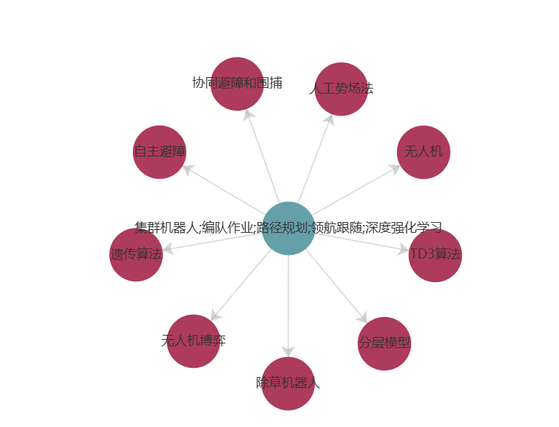

**摘要：**

**引用格式：**

**可用到内容：**

**大概内容：**

# 编队作业场景下集群机器人协同路径规划研究

## 毕业设计任务书

#### **一、学生姓名：**段宏伟       **学号：**U202141170

#### **二、题目：**编队作业场景下集群机器人协同路径规划研究

#### **三、题目来源：**真实  √  自拟  □ 

#### **四、结业方式：**论文  √  设计  □

#### **五、主要内容：**

1. **集群机器人微缩平台的设计与实现：** 设计并构建基于麦克纳姆轮的全向移动机器人，集成激光雷达、深度相机、IMU等多种传感器，实现高精度的环境感知和定位功能，为后续算法研究提供硬件基础。
2. **机器人集群通信、建图和导航模块的开发：** 基于ROS平台，开发机器人集群的通信框架，实现跨平台的多机通信与协同工作；构建共享地图，支持集群机器人的协同建图与导航功能，提升整体环境感知与路径规划能力。
3. **领航-跟随算法的研究与实现：** 研究领航-跟随算法的原理，解决机器人之间的通信、定位和协同控制问题；开发稳定的队形控制算法，实现集群机器人在复杂环境中的有序编队运动，增强协同作业能力。
4. **路径规划算法的部署与创新：** 在实车平台上部署传统路径规划算法（如A*算法），评估其在实际应用中的性能；提出基于深度强化学习算法的路径规划方法，提高路径规划的效率和适应性，提升机器人在动态环境中的自主导航能力。
5. **算法的仿真与实物验证：** 利用Gazebo仿真平台和实际机器人平台，对领航-跟随、队形控制、路径规划算法进行全面的仿真与实验验证，评估算法的有效性和鲁棒性，为算法的实际应用提供支持。

#### **六、主要（技术）要求：**

1. **掌握关键技术：** 熟练掌握ROS系统的使用，熟悉Python和C++编程语言；深入理解深度强化学习和Transformer模型在路径规划中的应用，能够将其有效地融合到机器人路径规划算法中。
2. **基于ROS的多机器人通信框架：** 熟悉ROS多机通信机制，能够构建稳定高效的多机器人通信框架，实现机器人之间的数据共享与协同工作。
3. **熟悉多种传感器的集成与使用：** 熟练使用激光雷达、深度相机、IMU等传感器，具备传感器数据处理和融合的能力，实现高精度的环境感知和自主定位。
4. **领航-跟随算法的研究与实现：** 研究领航-跟随算法的原理，解决机器人之间的通信、定位和协同控制问题；开发队形控制算法，实现集群机器人稳定的编队运动，提高集群机器人在复杂环境下的协同能力。
5. **开发并优化路径规划算法：** 掌握传统路径规划算法的原理与实现，能够在实际应用中进行有效部署；能够结合深度强化学习方法，开发高效的路径规划算法，适应复杂动态环境下的机器人导航需求。

## 参考文献分析

毕业设计中心主题是“集群机器人，编队作业，路径规划，领航跟随，深度强化学习”。从中延伸出多个相关概念，显示了这些概念与中心主题的关联。具体来说：

1. **协同避障和围捕** - 可能指的是机器人在执行任务时如何避免相互碰撞以及如何合作围捕目标。
2. **人工势场法** - 一种用于机器人路径规划的算法，通过构建势场来引导机器人避开障碍物。
3. **无人机** - 一种常见的集群机器人，可以用于多种任务，如监控、运输等。
4. **TD3算法** - 一种深度强化学习算法，用于解决连续动作空间中的决策问题。
5. **分层模型** - 可能指的是在机器人系统中使用的分层控制架构，以处理不同层次的决策和控制问题。
6. **除草机器人** - 一种专用机器人，可能用于农业中的自动除草任务。
7. **无人机博弈** - 可能指的是无人机在执行任务时的策略选择和对抗性决策。
8. **遗传算法** - 一种启发式搜索算法，常用于优化和搜索问题，包括机器人路径规划。
9. **自主避障** - 机器人独立识别和避开障碍物的能力。

这些概念共同构成了集群机器人在执行编队作业、路径规划和领航跟随任务时可能涉及的技术和方法。深度强化学习作为一种先进的机器学习方法，可能被用来优化这些任务中的决策过程。

## **研究综述**

#### 集群机器人系统**特性评价**研究综述

**摘要：**集群机器人系统是群体智能的一个重要应用研究领域,也是机器人系统未来发展的重要方向之一.集群机器人系统特性评价是一个极具挑战性的关键技术与理论问题,对于集群机器人系统的研究与发展具有重要意义.首先,给出了对集群机器人系统基本概念的理解,并且从多种不同角度作出了分类.其次,梳理了多个关键的集群机器人系统期望特性;在此基础上,分别从评价标准、评价指标体系和评价方法三方面对已有集群机器人系统特性评价研究成果进行了比较全面的评述.最后,分析总结了当前集群机器人系统特性评价研究工作的不足,并对未来发展方向进行了展望.

**引用格式：**[1]武文亮,周兴社,沈博,等.集群机器人系统特性评价研究综述[J].自动化学报,2022,48(05):1153-1172.DOI:10.16383/j.aas.c200964.

**可用到内容：**集群机器人系统概念、分类、优势、特性

**大概内容：**

- 首先介绍了集群机器人系统的概念，包括其组成和典型系统，以及从控制方法、协作机制等多种属性进行分类的方式。
- 接着梳理了集群机器人系统的期望特性，如自主性、智能性、协同性、灵活性、鲁棒性、可扩展性等。
- 然后详细阐述了系统自主性评价标准和系统智能性评价标准，列举了不同机构或学者提出的相关标准。
- 还比较了多种系统自主性评价指标体系。
- 之后说明了集群机器人系统特性评价的基本方法和自主性等特性的综合评价方法。
- 最后分析总结了当前研究工作的不足，并对未来发展方向进行了展望。

#### 机器人集群**路径规划**技术研究现状

**摘要：**受社会型生物群体行为启发,群体智能得到日益广泛的关注,机器人集群作为群体智能的重要承载者得到了大量研发和广泛应用。机器人集群路径规划技术作为一项核心关键技术也得到快速发展。为此全面深入地调研了机器人集群路径规划的技术发展现状,创新性地归纳了适用于不同集群规模、可扩展性要求、通信需求以及算法要求的集群规划基础计算架构,包括冗余计算架构、分布计算架构和分层计算架构。从可扩展性和适用性角度,分类梳理了最适用于机器人集群的路径规划方法,包括仿生学方法、人工势场法、几何学方法、经典搜索法和进化学习法,并为集群仿真验证研究提供了七款可免费下载或开源的机器人集群仿真验证平台。

**引用格式：**[1]高明,唐洪,张鹏.机器人集群路径规划技术研究现状[J].国防科技大学学报,2021,43(01):127-138.

**可用到内容：**机器人集群路径规划概念、

**大概内容**

1. **机器人集群概述**：受社会型生物群体行为启发，机器人集群应运而生，展现出群体智能，具备自组织和分工特征。其应用广泛，涵盖聚合、编队、运输等多种任务。机器人集群路径规划是实现导航和协调任务的关键，相比单个机器人路径规划，存在维度高、计算复杂等难点 。
2. 集群分布计算架构
   - **冗余计算架构**：将同一规划算法复制到每个机器人规划器，依赖输入状态信息一致性，适用于特定算法和小规模集群在理想通信条件下，工程中需采取措施确保信息一致 。
   - **分布计算架构**：完全分布式计算，对通信即时可靠性要求低，但对带宽要求高，适用于多种分布式算法和中等规模集群在复杂通信条件下，规模过大时规划算法收敛困难。
   - **分层计算架构**：全局集中、局部分散，对通信可靠性和带宽要求低，适用于多种算法和大规模集群在复杂通信条件下，但集群密度不能超出环境容限。
3. 集群路径规划方法
   - **仿生学方法**：受生物行为启发，如蚁群算法、鱼群算法、鸽群算法、萤火虫算法等，具有分布式、自组织、可扩展优势，但存在易陷入局部最优等问题，已有多种改进算法。
   - **人工势场法**：将工作空间定义为势场，计算简单，适用于大规模集群，但存在局部最小值和复杂环境规划难题，已有结合其他方法的改进算法 。
   - **几何学方法**：利用几何曲线生成或平滑路径，如杜宾斯曲线法、贝塞尔曲线法、毕达哥拉斯曲线法等，因模型复杂，仅适用于小规模集群。
   - **经典搜索法**：包括概率路标图、经典路径寻优法（如迪杰斯特拉算法）、启发式搜索（如算法）等，部分方法在处理大规模集群时存在可扩展性问题 。
   - **进化学习法**：包括监督学习、基于遗传算法的进化方法、强化学习等，以及基于教学 - 学习的优化算法等，用于克服传统方法的缺点。
4. **机器人集群验证平台**：介绍了 StarLogo、Webots、Swarm、Breve、Player/Stage、SwarmFare、ARGoS/Buzz 七款可免费下载或开源的仿真验证平台，各平台在功能、适用场景和支持系统等方面各具特点 。
5. **研究结论与展望**：全面梳理了机器人集群路径规划技术，包括计算架构、规划方法和仿真平台。未来将拓展至机器人集群运动规划和任务规划领域，为科研和教学提供更科学的指导。

## 学位论文

#### 基于**ROS**的**机器人集群**虚实协同**导航**系统研究与实现

**摘要：**[基于ROS的机器人集群虚实协同导航系统研究与实现 - 中国知网](https://elib.ustb.edu.cn/https/77726476706e69737468656265737421fbf952d2243e635930068cb8/kcms2/article/abstract?v=loqPUsRAn-KNpqjmKwzvHRGSPQ8dqXkXsYCTLoAT1S4hmnY8rFi9bdqdwXgCB4Yf6D6JDGBU75IvOlgPAyPYf6YftrYjEHJi7XPahNfJPG4of2CQyCLeE7F8hgt773sTxnI-By4S0rULxD_A3odRljLJkxoLBlQwhaABZShsOZ_QpQAIDSr_yzTJqmb-Rki47x2xjqyfz28=&uniplatform=NZKPT&language=CHS)

**引用格式：**

[1]林炽杰.基于ROS的机器人集群虚实协同导航系统研究与实现[D].哈尔滨工业大学,2021.DOI:10.27061/d.cnki.ghgdu.2021.003191.

**可用到内容：**

- **在撰写毕业设计论文大纲及正文之前，强烈建议回顾并深入研读该参考文献**
- **第1章：**国内外研究现状 室内机器人导航技术：
  - 总结了室内机器人导航的关键技术和研究进展。 
  - 多机器人路径规划技术：分析了多机器人协同路径规划的现状和挑战，适合用于背景介绍。
- **第2章：**关键技术介绍 **(可以参考这种写作方式)**
  - ROS系统：深入浅出地介绍ROS通信机制（节点、话题、服务），适合初学者了解ROS基础。 
  - SLAM技术：讲解了Gmapping和Cartographer两种SLAM算法，适合用于建图和定位。 
  - 定位算法：介绍蒙特卡罗定位（MCL）和自适应蒙特卡罗定位（AMCL），适合用于机器人定位模块。
- **第5章：**机器人集群虚实结合平台
  - 阐述了如何基于ROS构建多机器人通信框架 
  - 系统架构设计：展示虚实结合平台的总体架构，适合参考集群机器人系统的层次化设计。 
  - 虚实机器人协同：介绍虚实机器人之间的通信和数据融合，适合用于设计协同控制模块。 
  - 实验验证：提供虚实结合平台的实验案例，适合参考算法验证和系统测试。

**大概内容：**

1. 研究背景与现状
   - **研究背景**：机器人技术与人工智能发展迅速，应用广泛。多机器人协同工作优势明显，如系统容错性高、可完成复杂任务，成为研究重点。
   - **研究现状**：室内机器人导航技术涵盖定位、建图和路径规划，相关算法众多，但传统算法存在计算复杂度高、动态性差等问题。多机器人路径规划研究取得一定成果，但动态场景下的交通拥堵和局部冲突死锁问题仍待解决。
2. 关键技术介绍
   - **ROS 机器人操作系统**：对底层硬件封装，提供便捷通信方式、开源工具和先进算法。具有跨平台通信、松散耦合、工具丰富、功能库多样等优势，其核心概念包括节点、消息与话题、服务与参数、ROS 管理器。
   - **室内建图与导航**：SLAM 用于解决位姿与地图未知时的定位和建图问题，介绍了 FastSLAM、Gmapping 和 Cartographer 算法。分层代价地图以栅格形式构建，用于机器人导航。里程计标定可减少导航误差，扩展卡尔曼滤波用于融合里程计和 IMU 数据，提高位姿计算精度。
3. 机器人的定位与导航算法研究
   - **室内定位算法**：蒙特卡罗定位算法利用粒子模拟机器人位姿，自适应蒙特卡罗定位算法在此基础上改进，通过注入随机粒子和动态调整粒子数，解决定位失败无法恢复的问题。
   - **路径规划算法**：介绍 Dijkstra、Best First Search 和 A\*算法，通过仿真实验对比，A*算法结合启发式函数，能在静态地图快速找到近似最优解，被选作全局规划算法。
4. 基于时间窗的多机器人融合路径规划算法
   - **基于时间窗的 A \* 算法**：针对多机器人协同工作场景，提出基于时间窗改进的 A * 算法，为节点分配时间窗，避免路径冲突，修改启发函数考虑多种成本因素，经仿真实验验证有效。
   - **融合路径规划算法**：采用 DWA 算法作为局部规划算法，与 A\*算法融合。A*算法规划全局路径，DWA 算法根据局部信息调整，融合算法减少路径重规划次数，提高任务完成率。
5. 机器人集群虚实结合平台与实验
   - **虚实结合平台**：以 Gazebo 为虚拟仿真平台，构建虚拟机器人仿真模型。实际机器人采用差分驱动小车，基于 ROS 话题通信搭建分布式控制系统。
   - **平台设计与实验**：搭建虚实结合平台，进行虚实结合实验和机器人集群导航实验。结果表明，基于时间窗改进的 A * 算法可提高系统整体性能，但仍存在机器人冲突问题。
6. 研究总结
   - **研究贡献**：提出 A\*与 DWA 融合的路径规划算法；提出基于时间窗改进的 A*算法；搭建虚实结合平台，实现虚实机器人协同工作。
   - **研究不足**：基于时间窗的 A * 算法预估时间存在误差，局部规划器处理冲突能力有待提高，现实与虚拟平台数据存在差异。

#### **集群移动机器人**中的**避障算法**研究

**摘要：**[集群移动机器人中的避障算法研究 - 中国知网](https://elib.ustb.edu.cn/https/77726476706e69737468656265737421fbf952d2243e635930068cb8/kcms2/article/abstract?v=loqPUsRAn-If9cId_Ql7QoJsJkCJRjwueEAxRbocdujloWKr3uTqDHp-YzeRISe9zazMXr7tPGNit4KfAVE4Y9hDLoSXduKGHUbg4tv9BsvxzFJV8O6keZA_vjg3IXGZ9H1GJzPdrGxB79jWA_deE59-FK4Fu0SVmEBDdEhA1tIbIxhnaeWkfc43iVLkisERbJbbSPjJ16A=&uniplatform=NZKPT&language=CHS)

**引用格式：**[1]吴万强.集群移动机器人中的避障算法研究[D].沈阳大学,2022.DOI:10.27692/d.cnki.gsydx.2022.000315.

**可用到内容：**

- 文件的整体结构和写作思路（如绪论、平台设计、算法研究、仿真验证、总结与展望等）
- 国内外研究现状、研究意义（国内外多机器人编队控制和路径规划的研究现状、研究意义进行了详细分析）
- 实验验证方法：对实验验证的描述（如运动轨迹对比、误差曲线分析等）可以作为你进行实物验证的参考。主要是进行了对比实验（人工势场算法和优化后的DWA算法在避障效果上的差异）
- 领航-跟随算法的研究与实现：算法原理（包括如何分配角色（领航者和跟随者）、如何计算相对位置和速度等。）；队形控制（队形控制方法（如三角形、菱形编队）和通信拓扑结构（如邻接矩阵））
- ROS系统搭建、传感器集成等硬件平台设计

**大概内容：**

1. **研究背景及意义**：移动机器人应用广泛，在复杂任务场景下，多移动机器人系统应运而生。多机器人编队控制技术成为研究重点，其中集群避障和路径规划是关键技术，对推动多机器人系统在物流运输等领域的应用具有重要意义。
2. 移动机器人编队平台设计
   - **移动机器人系统设计**：选择 ROS 系统搭建移动机器人平台，介绍 ROS 分布式设计、多语言支持、架构精简、工具包丰富等特点及文件系统层、计算图层、开源社区层组成的架构。
   - **机器人硬件平台设计**：设计以麦克娜姆轮为主体的全向移动智能机器人，包括运动底盘和智能控制器。介绍机器人主控制器树莓派、底层驱动器各模块及基于 ROS 的激光雷达的功能和工作原理。
   - **基于 PID 的运动控制器**：在移动机器人底盘设计中采用 PID 控制系统，通过比例、积分、微分环节对电机转动补偿，实现对机器人位置的准确控制。
   - **卡尔曼滤波器设计**：利用卡尔曼滤波器对机器人传感器数据进行滤波，降低噪声影响，提高数据有效性，为集群控制和避障提供可靠数据。
3. 构建集群编队控制模型
   - **集群编队控制算法研究现状**：分析基于行为法、虚拟结构法、人工势场法、领导跟随法等编队控制算法的原理、优缺点及研究发展趋势。
   - **机器人编队运动学模型**：假设机器人编队组成，设定机器人运行速度和转向速度，通过监测领航者与跟随者的距离和速度，调节跟随者速度和旋转角度，实现编队队形控制，介绍常见编队布局类型。
   - **编队拓扑图论**：使用图论描绘编队通信拓扑结构，介绍图的基本概念、分类，以及邻接矩阵在存储节点边信息中的应用，区分无向图和有向图的邻接矩阵特点。
   - **基于领航跟随的系统模型建立**：将移动机器人编队分为领航者和跟随者，介绍领航者跟随者算法的工作原理，建立协同编队的一阶连续系统模型，给出领航者和跟随者的控制算法公式。
4. 移动机器人避障方法研究
   - **移动机器人避障算法研究现状**：介绍路径规划中全局规划与局部规划融合的策略，分析 Bug 算法、人工势场算法、DWA 算法等常见局部规划算法的原理和优缺点。
   - **基于人工势场算法模型建立**：建立人工势场模型，制定引力函数和斥力函数，通过合力使移动机器人向目标点行驶，介绍模型数学表达式。
   - **基于 DWA 算法的系统模型建立**：DWA 算法通过设计动态速度窗，在局部环境中采样速度、模拟轨迹，利用评价函数选取最优轨迹，介绍算法模型、速度采样和位置更新公式及评价函数组成。
   - **针对 DWA 算法的优化**：提出栅格评价函数，将地图栅格化计算代价值，避免算法陷入局部最优；引入编队完整性评价函数，通过计算机器人位置差值，使集群编队在避障时保持队形。
5. 系统编队仿真
   - **多机器人编队控制仿真**：在 MATLAB 环境下，对领航者跟随者算法进行仿真，设定机器人初始位置、速度等参数，仿真结果表明该算法可有效控制集群编队，使跟随者跟随领航者完成编队运动。
   - **多机器人避障仿真**：设置机器人初始位置和障碍物坐标，对比传统 DWA 算法和优化后 DWA 算法的避障效果，结果显示优化后算法在编队约束性、避障后队形恢复速度和轨迹平滑度上更优。
   - **多机器人编队避障对比仿真**：使用人工势场算法和优化后 DWA 算法进行避障对比实验，结果表明优化后 DWA 算法在避障效果、轨迹平整度和对障碍物及目标点选取的适应性上优于人工势场算法。

## 中文期刊

#### 基于策略融合及Spiking DRL的移动机器人路径规划方法

**摘要：**[基于策略融合及Spiking DRL的移动机器人路径规划方法 - 中国知网](https://elib.ustb.edu.cn/https/77726476706e69737468656265737421fbf952d2243e635930068cb8/kcms2/article/abstract?v=loqPUsRAn-L_hpz20aeMF1oMy-aEktETry7CPRmog9NDQOYkmN3Le6yGhuyL7opD5I2rlVlzeSVD4P4IMABOkwVE5ufYMTEwP4-fe8QJM-7S-ZlydC3vSoE7jIUxn5noXY61hzO6K6gXBJHn3P5jNFq6LyqOgDrdlxUwGKSmW6uukqKgOx1tJ0MEdfv136j8&uniplatform=NZKPT&language=CHS&rp=ZKAI)

**引用格式：**[1]安阳,王秀青,赵明华.基于策略融合及Spiking DRL的移动机器人路径规划方法[J].计算机科学,2024,51(S2):69-79.

**可用到内容：**

**大概内容：**
